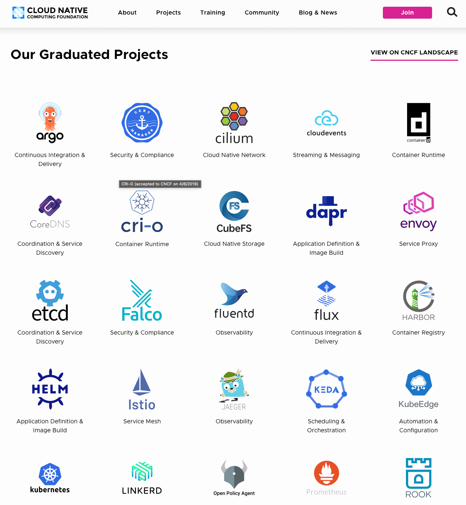
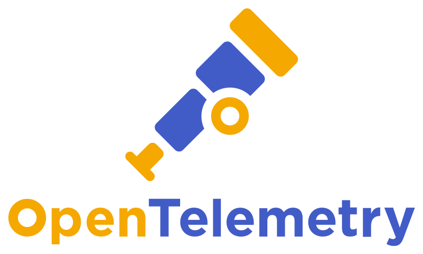
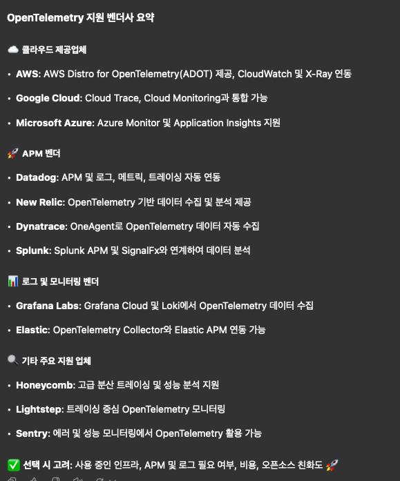
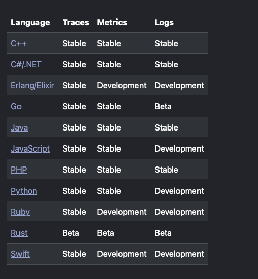
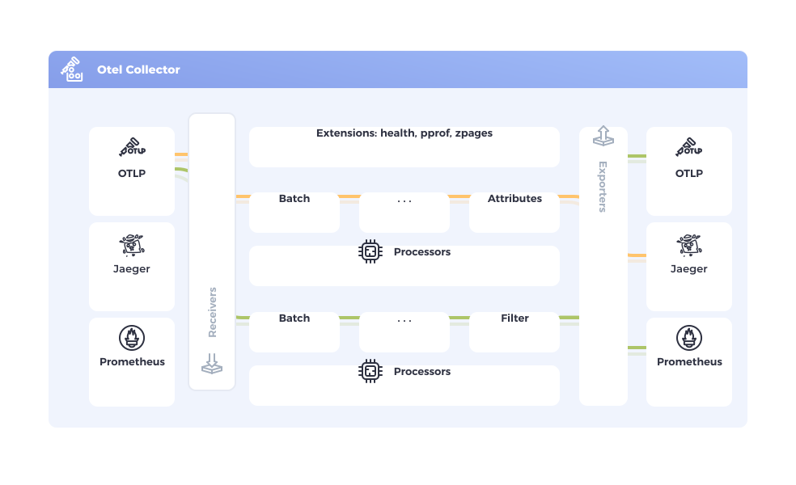

# Open-Telemetry 톺아보기

최근, 사내 Observability 개선을 위한 Session을 진행했다.

[발표 자료](https://youtu.be/opg7cx1TlYo)

세션의 내용은 "왜 Observability가 중요한가?" 에 대한 내용이었는데,

그 게시글에서 중요히 다뤘던 'Open-Telemetry는 무엇인가? 어떻게 해야하는가?' 에 대해서는 시간 관계 상 전달할 수 없었다.

이번 게시글은 Open-Telemetry의 개념과 간단한 활용을 소개한다.

Open-Telemetry가 정말 쉬운 주제임을 모두가 알 수 있도록, 노력해보겠다.

---

# 사전지식 : Observability
Open-Telemetry를 쓰는 이유는 Observability를 쉽고 유연하게(확장 가능하게) 사용하기 위함이다.

그렇다면, Open-Telemetry를 알기 전, Observability에 대해 먼저 알면 좋다.

Observability는 시스템의 상태와 성능을 효과적으로 모니터링하고 문제를 진단할 수 있도록 하는 개념이다.

단순한 로깅이나 모니터링을 넘어, 시스템이 예상치 못한 상태에 빠졌을 때도 원인을 분석할 수 있도록 하는 것을 목표로 한다.

Observability에 대해 깊게 설명하면, 아마 이 Open-Telemetry 글보다 길어질 것이다.

DevOps를 공부하며 근래 본 게시글 중 Observability를 가장 잘 표현한 것 같은 글을 공유한다.

아래 게시글을 통해, Observability의 80% 정도는 이해할 수 있었다. 궁금하면 가보길 바란다.

[DevOps 측면에서 Observability와 Monitoring 의미](https://insight.infograb.net/blog/2023/05/26/observability/)

# 사전지식 : Cloud native Computing Foundation(CNCF)

Session 때도 질문을 받았었는데, CNCF에 대한 검증이 어느정도 필요했다.

CNCF(Cloud Native Computing Foundation)는 클라우드 네이티브 기술의 발전과 도입을 촉진하는 오픈소스 재단이다. 

2015년 리눅스 재단(Linux Foundation) 산하에 설립되었으며

컨테이너화(Containerization), 마이크로서비스(Microservices), 오케스트레이션(Orchestration), CI/CD 등

여러 클라우드 네이티브 기술을 표준화하고 확산시키는 목표를 도모한다.

글만 이렇게 늘어놓지 말고, 사진으로 예시를 들겠다.

사진은 CNCF에서 공식으로 선정된 Cloud native 기술 스택의 나열 중 일부이다.

내가 아는 거 위주로 봐도,

ArgoCD, Containerd, cri-o, fluentd, HELM, Istio, Jaeger, KEDA, k8s, Prometheus

머리아플 정도로 많은 것들이 보인다.

### CNCF에서 인증받는다는 것은 

해당 프로젝트가 Cloud Native 표준을 준수하며 안정성과 신뢰성을 갖춘 오픈소스 프로젝트로 인정받았다는 뜻이다.

CNCF는 인증 대상 프로젝트를 Sandbox -> Incubating -> Graduated의 3단계로 관리하는데, 

이 과정에서 프로젝트의 완성도와 사례를 검증한다.

각 프로세스가 가지는 의미는 아래와 같다.

**1. Sandbox**
- 초기 단계로, 혁신적인 프로젝트지만 아직 검증되지 않음
- 커뮤니티에서 관심을 받으면 Incubating 단계로 이동 가능

**2. Incubating**
- 일정 수준의 실사용 사례가 있고, 코드 품질과 보안이 검증됨
- 커뮤니티에서 활발히 사용되고 있으며, 유지보수팀이 있음

**3. Graduated**
- 안정적이고 널리 사용되며, 보안, 문서화, 커뮤니티 활동 등 모든 기준을 충족
- 과 스타트업에서 운영 환경에서 실제로 사용됨

이번 글에서 소개할 Open-Telemetry는 Incubating 단계의 Project로, gRPC, cortex, Thanos, keycloak와 동일한 등급에 속해있다.

# Open-Telemetry : 정의

### [Open-Telemetry](https://opentelemetry.io)

흔히 O-Tel이라고 줄여 부르는 Open-Telemetry는 Observability 데이터를 수집하고 전송하는 오픈소스 프로젝트다.

간단히 말해, Open-Telemetry는 Telemetry 업계의 표준을 정의하려고 만든 프레임워크라고 할 수 있다.

업계 표준이라고 하는 게 빈말은 아닌게, 실제로 대부분의 벤더에서 O-Tel을 사용하여 연동할 수 있다.

### 대부분의 벤더?

이걸 어떻게 정리할까 하다가, ChatGPT에게 물어봤다.

모두를 알려주진 않았지만, 우리가 알고, 사용하는 대부분의 벤더사는 다 들어있는 거 같다.

### 연동은 어떻게?

또한 많은 사용을 도모하기 위함인지, 여러 언어 및 프레임워크에서 O-Tel을 사용하기 위한 라이브러리나 SDK 등 쉬운 연동이 가능하게끔 구성되어 있다.

위 사진은 Open-Telemetry의 Docs 일부를 가져왔다.

Open-Telemetry를 이용하기 위해, 여러 언어에서 개발된 프로젝트에 붙여야 하는데, 각 언어 별 SDK나 Library를 제공하고 있다.

### 기존 모니터링 시스템과 다른 점

O-Tel과 기존 모니터링 도구들을 어느정도 비교하자면 아래 표와 같다.

| 비교 항목  | Open-Telemetry             | 기존 APM 도구 (New Relic, Datadog 등) |
|--------|----------------------------|----------------------------------|
| 표준화    | ✅ OTel 표준 제공               | ❌ 각 벤더마다 데이터 형식 다름               |
| 벤더 종속성 | ✅ 없음                       | ❌ 특정 벤더 종속                       |
| 확장성    | ✅ 다양한 언어 및 환경 지원           | ⭕ 일부 제한 있음                       |
| 데이터 통합 | ✅ Metrics, Logs, Traces 통합 | ❌ 대부분 별도 관리                      |
| 비용     | ✅ 오픈소스 무료                  | ❌ 대부분 유료                         |

# Open-Telemetry : 구성요소

Open-Telemetry는 다음과 같은 주요 구성 요소로 이루어져 있다.

그림을 정리하자면

## 첫 번째로, 모니터링을 하기 위한 '대상'이다.
이는 Application이 될 수도 있고, Database, 혹은 장비 그 자체가 될 수도 있다.

아쉽게도, 장비에 아무런 짓을 하지 않고도 상태를 알 수 있는 방법은 아니지만

각 장비에 맞는 agent를 구성할 경우, 웬만하면 zero-code 상태로 내 Application의 상태를 전달할 수 있다.

Open-Telemetry에서는 이를 조금 더 쉽게 전달하기 위해, 여러 언어에서 사용할 수 있게끔 API 형태와 SDK 형태의 연동 방식을 제공한다.

## 두 번째로, 모니터링 Application에 전달하기 위한 '중간 관리자'이다.
내 데이터를 여러 모니터링 Application에 전송하려면, 구성이 필요할 뿐더러 모니터링 솔루션이 변경될 경우 모든 Service에 접근하여 수정할 소요가 발생한다.

이를 줄여주고, 내가 모니터링 Application을 '몰라도 괜찮도록' 구성하려면 중간 관리자가 필요하다.

이가 Open-Telemetry Collector이다.

개인적으로 Open-Telemetry Collector가 Open-Telemetry의 핵심 구성요소라고 생각하는데, 이는 따로 Section을 빼서 자세히 설명하겠다.

## 세 번째로, 모니터링 한 데이터를 받아, 관리하기 위한 '목적지' 이다.
데이터를 Collector에서 받음으로써 끝나는 것이 아니라, 데이터를 원하는 모니터링 Application으로 전달해야 한다.

이는 모니터링 Application 또한 O-Tel을 받아들일 준비가 되어 있어야한다는 것인데,

O-Tel에서는 이 역할을 Exporter라고 한다.

사실 내가 개발하는 것은 아니라, 여러 오픈소스에서 이미 활발히 개발되어 있다.

필요하다면 개발하겠지만, 아직 한 번도 개발해본 적은 없다.

# Open-Telemetry Collector
아까 제일 중요하다고 했던 Open-Telemetry Collector이다.

위 단락의 '중간 관리자'에 해당하는 Agent인데

O-Tel Collector를 사용할 경우
- 각 벤더사의 agent가 아닌 O-Tel Collector를 사용하므로, 벤더의 교체가 있더라도 큰 이슈 없이 교체가 가능하고
- 여러 source에서 들어오는 데이터를 모아 가공 후 전송할 수 있고
- 데이터 필터, 샘플링, 마스킹 등의 변경을 할 수 있으며
- 배치 전송을 통해 네트워크 대역 이슈 발생률이 줄어들 수 있다.

## Open-Telemetry Collector : 구성요소
O-Tel Collector는 크게 Receiver, Processor, Exporter, Extensions 라는 요소로 구성된다.

### Receiver
Application에서 데이터를 수집하는 역할을 한다.

다양한 Receiver가 이미 제공되고 있으며, 원하는 경우 커스터마이징 또한 가능하다.

### Processor
수집된 데이터를 가공하고 최적화하는 역할을 한다.

자유도가 높은 기능인데, 이 부분은 사용자의 커스터마이징이 가능하다.

간단히 데이터를 모아서 전송하는 기능, 데이터 필터링, 데이터 추가/수정, 데이터 가공 등 여러 부분에서 활용할 수 있다.
### Exporter
가공된 데이터를 최종 목적지로 전송하는 역할을 한다.

각각의 모니터링 Application에 전송하는 방법을 제공할 수 있다.

### Extensions
Collector의 기능을 확장하는 부가적인 모듈이다.

Health-Check, Pprof(Collector 메모리, CPU 모니터링), fileLog 등 구현되어 있지 않을 것 같은 많은 로직들이 위 Section에 해당한다.

이를 그림으로 나타내면 

대충 이런 느낌이 된다.

개인적으로, Spring Cloud Dataflow라던가, Spring Batch같은 아이들과 비슷하게 받아들일 수 있을 것 같다.

# Open-Telemetry : 적용

[모니터링 Application Docker Compose](https://github.com/adszzz11/monitoring-integration)

개인 Repository에 이전에 작성했던 Docker Compose 파일을 담았다.

현재 최신 버전이 아니므로 동작이 원활히 되지 않을 수 있으나

이런 식으로의 구성에서 벗어나지 않으므로 최신 문서와 레포지토리 상 내용을 보면 쉽게 구성할 수 있을 것이다.

# Cons.
Open-Telemetry를 사용한다는 것은 사실

모니터링 Application이 뭘로 바뀔지 모르니까, 다 대비해줄게! 하는 것과 비슷하다.

JSON처럼, 하나의 약속된 프로토콜 정도라고 생각하고 있다.

실제 사용기나 우여곡절을 겪었으면 더 자세하고 맛있는 글이 되었을텐데, 그건 앞으로 겪어볼 예정이지 않을까 한다.