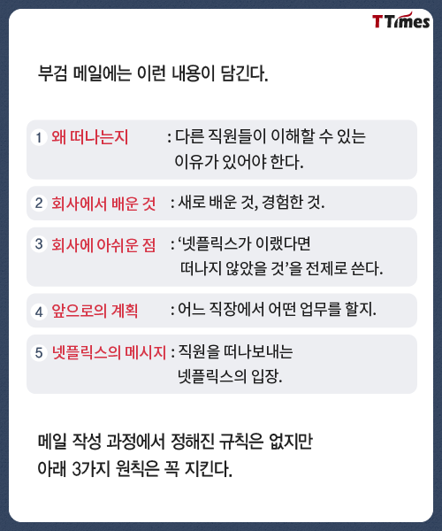
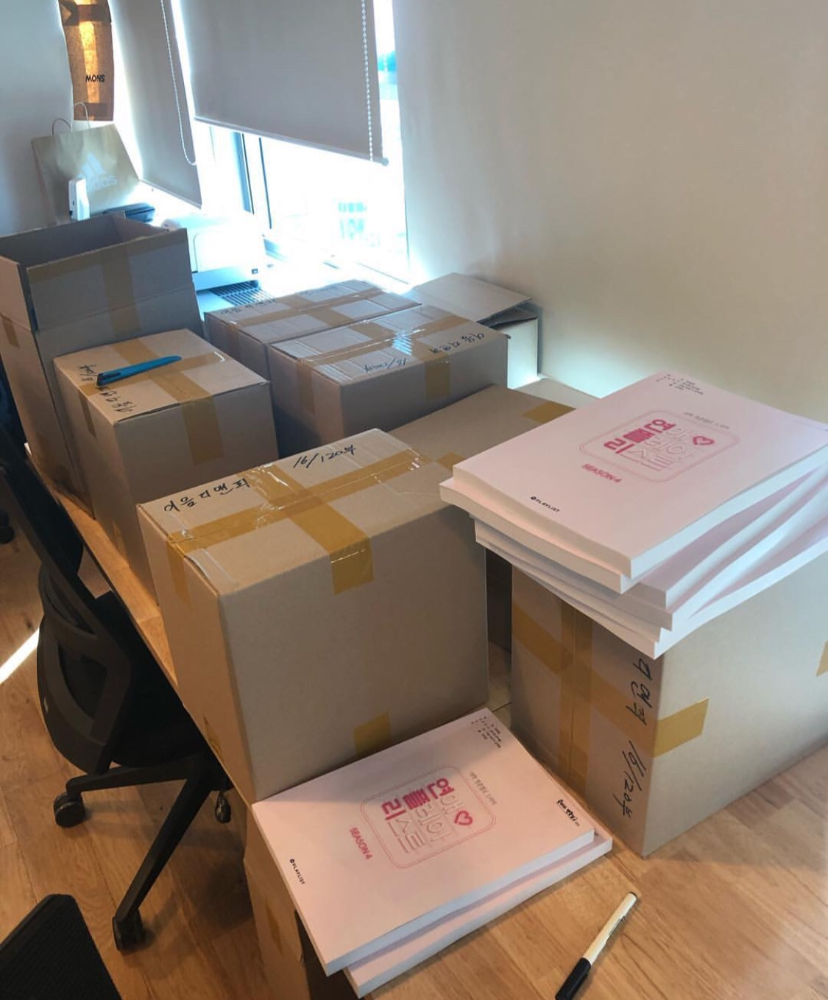
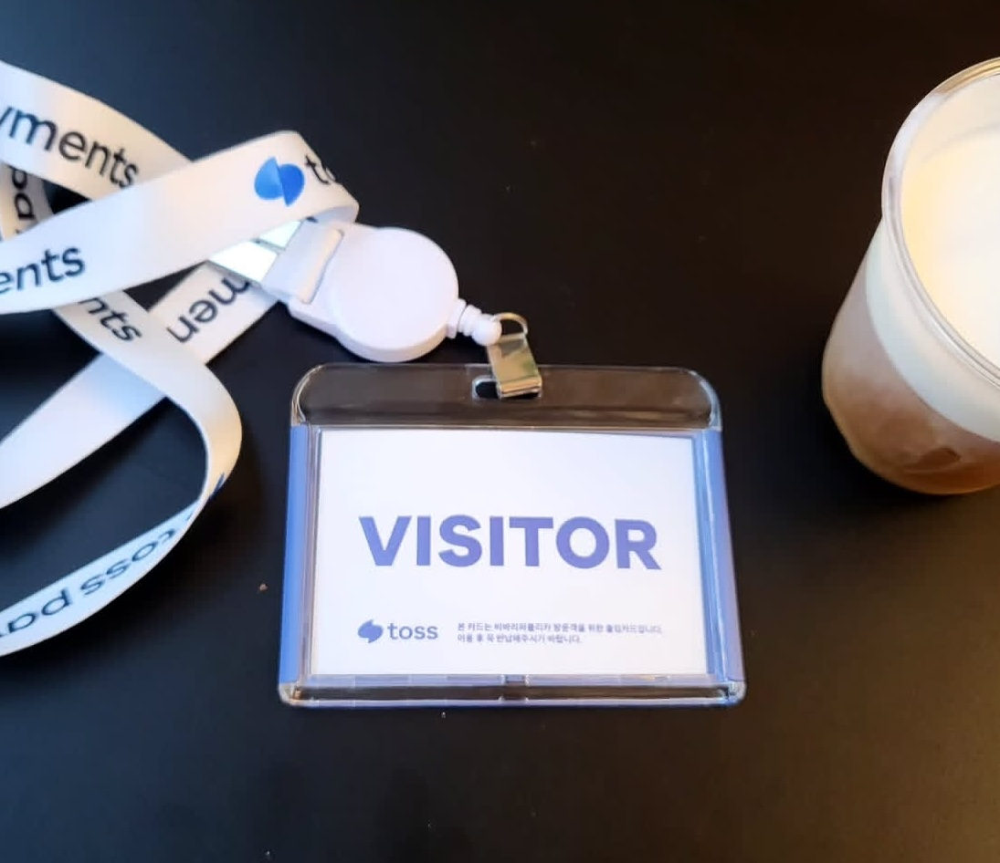
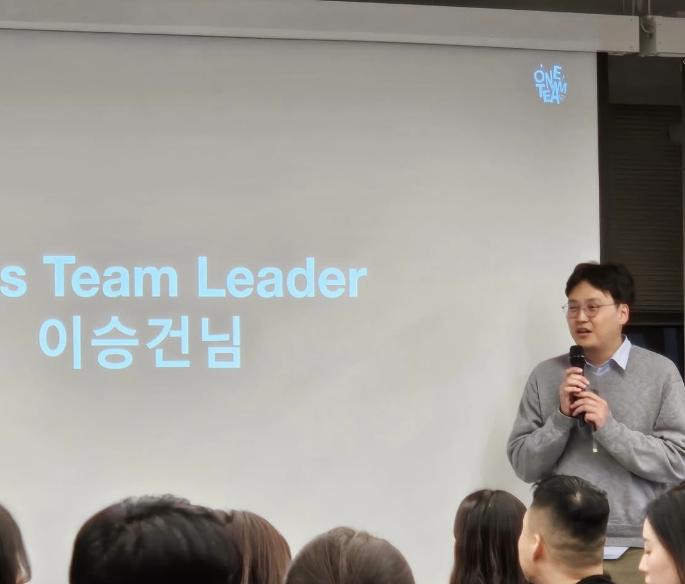
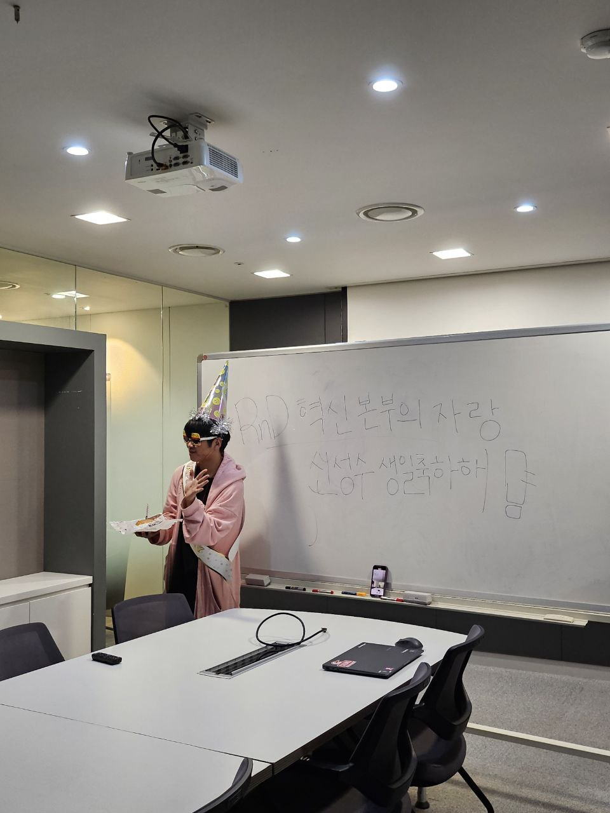
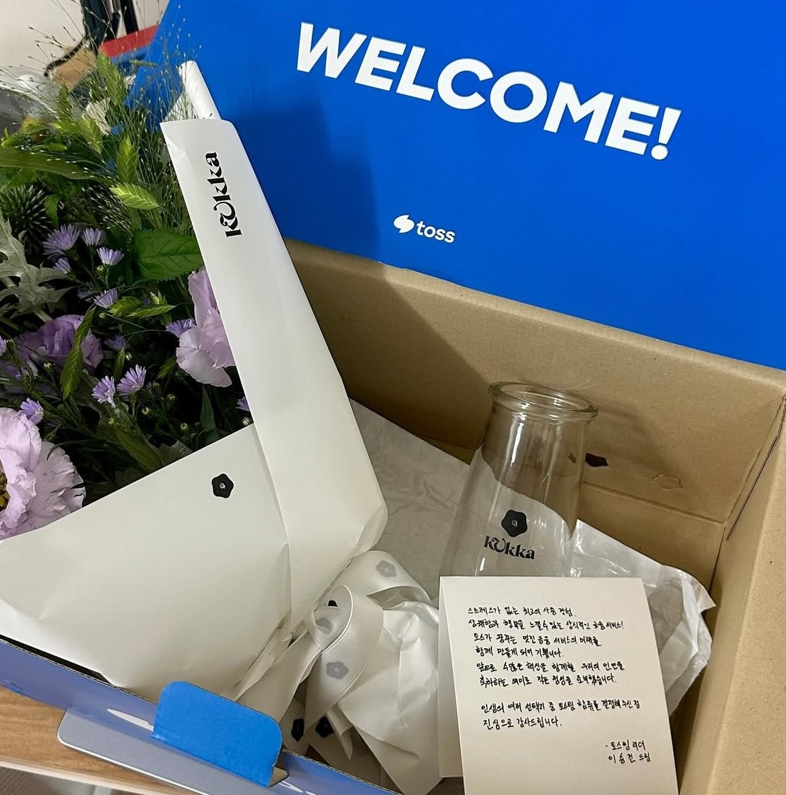
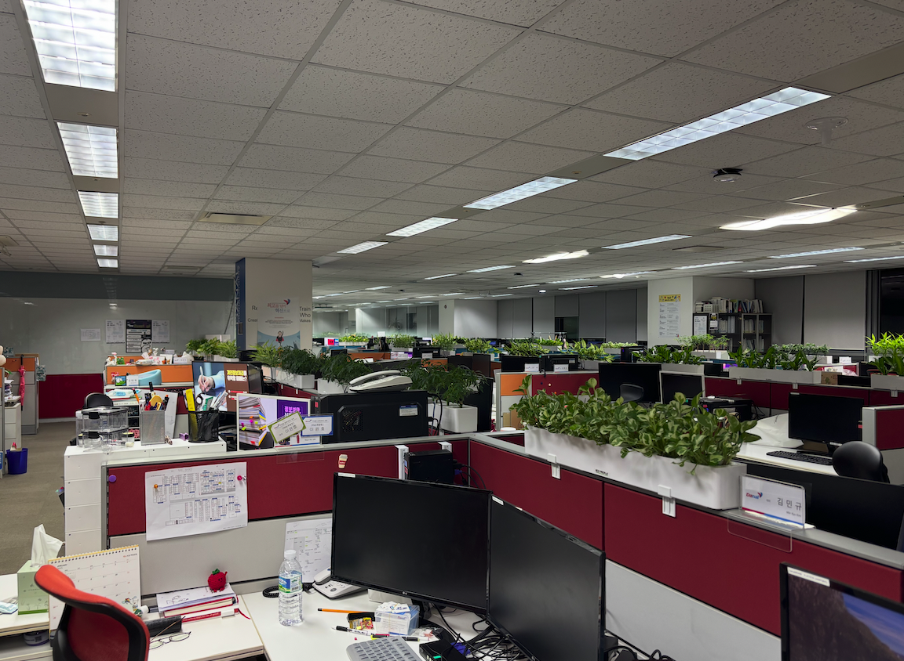

# 3000시간의 여정

안녕하세요, 오랜만에 글을 쓰게 된 S개발팀 신성수입니다.

이번 글은 아쉽게도 회사에서 쓰게될 마지막 글을 써보려고합니다.

## 음... 어떻게 얘길 시작해야 할까?

다날을 떠납니다.

늘 그렇듯, 만남은 쉽고 이별은 어렵습니다.

입사를 처음 했을 때, 개발팀 모두 방배로 가 있었고, 다모음팀이 반겨주던게 어제 일어 났던 일처럼 생생하게 떠오르네요.

지금까지 만나온 동료들이 너무 좋았고, 현재 팀에서 해결하려는 문제들도 흥미로웠으며, 다날의 여러 모습들이 여전히 흥미롭습니다.

제가 속한 S개발팀은 결제 전반적인 기능들을 만들고 운영을 하기 떄문에, 다른팀들과 소통하는 과정도 참 즐거웠습니다.

지금도 이 선택이 최선인가 하는 생각이 맴돌다가, 글로 정리를 해볼려고합니다.

## 넷플릭스 퇴사 문화

넷플릭스의 퇴사 문화로 부검 메일이라는게 있습니다.

회사를 떠나는 직원이 퇴사 당일 통료들에게 아래의 내용을 담아서 보내는 메일입니다.

이 글 주에서 이 글에서는 아래 4자에 대해서만 다뤄볼 예정입니다.

1. 왜 떠나는지
2. 회사에서 배운 것
3. 앞으로의 계획

## 왜 떠나는지

사실 저는 웹드라마 PD로 처음으로 돈을 벌기 시작했습니다.

잘하고 있던 와주에 개발자로 전향을 한 이유는, 학교에서 배운것도 써보고 샆었고, PD로서의 일만으로는 변화를 만들어 간다는 느낌이 들지 않았기 떄문입니다.

개발자로 처음 시작할때는 SI 업체에서 일하면서, 내가 원하는 것보다는 고객이 원하는 기능을 만드는 일이 대부분이였습니다.

언젠가 내가 원하는걸 만들 기회가 오면 잘할 수 있도록, 주말에 교육이나 카페에서 공부하는 일이 일상이 되었습니다.

하지만 이렇게 개발 공부만 하면서 기업이나 개발 의뢰 건들을 소화하는데 급급하다 보면, 결국 단순한 코더가 되어버리지 않을까? 하는 고민을 많이 하게 되었습니다.

그래서 제가 정한 목표는 **결제 전문가가 되자**였습니다.

그래서 지금 하는 통합결제창 업무가 정말 재밌었고, 더 잘하고 싶은 욕심도 많이 생겼습니다.

또한, 이상철 본부장님께서 말씀하신 PG업계의 표준이 되는것을 위 최선을 다하고 싶었습니다.

이번 프로젝트의 목표인 토스라는 회사에 요청을 하게 되었고 고맙게도 도움을 많이 주었습니다.

> 자세한 내용은 [프로젝트를 준비하는 개발자의 삶](https://danal.atlassian.net/wiki/spaces/CRAF/pages/12255256)을 참고해주세요

3일정도 토스측에서 교육을 해주었고, 마지막날에 우연히 토스 대표님 이야기를 나누게 되었습니다.

"사외 직원같은데 무슨일로 오셨나요?" 첫 마디에 최대한 불쌍한 말로 말을 답변을 했다.

"다날에서 왔는데 토스처럼 만들고 싶어서 고객센터에 문의하고 교육받으러 왔습니다."  
제가 말을 마치자마자, 옆에 있던 개발자분들과 대표님이 웃음을 지으셨습니다.

그때 대표님께서 "시간 괜찮으시면, 이번에 사내 발표가 있는데 같이 들어보는 건 어떠세요?"라고 제안해 주셨고, 덕분에 회사 직원들 사이에서 발표를 들을 기회를 얻게 되었습니다.

개발적인 내용이 아니라 처음에는 큰 흥미가 없었지만, 마지막 멘트가 아직도 기억에 남아 있습니다.

"자랑스러운 회사를 만들고, 오래 함께 일할 수 있도록 열심히 뛰겠습니다."  
이 한마디로 발표가 마무리되었습니다.

발표가 끝난 후, 저에게 티타임을 요청하셨고, 토스가 추구해야 할 목표와 제가 중요하게 생각하는 가치관에 대해 서로 이야기를 나누다 보니, 시간 가는 줄도 몰랐습니다.

그리고 마지막으로, 토스에서 함께 일해 보자는 제안을 먼저 주셨습니다.

그 순간, 앞에서 고민하던 말들이 떠오르며 이직을 결심하게 되었습니다.

## 회사에서 배운 것

당연한 이야기지만, 다양한 서비스를 경험하다 보면 여러 가지 환경을 직면하게 됩니다.

지난 1년 동안 느꼈던 점을 이야기해 보려고 합니다.

### 나무를 보지말고 숲을 봐라

많은 사람들이 모이다 보면 충돌이 생기기 마련입니다.

스파크 튀는 순간, 여러 재미있는 일들이 일어나고 그게 곧 모임의 경쟁력이 됩니다.

이 모임이 잘되기 위해서는 충돌이 갈등으로 이어지지 않기 위해 상호신뢰가 전제되어야 합니다.

초기에 의사소통을 할때는 여기 문화를 받아들이기 보다는 기존의 방향을 고수를 하다보니, 의사소통구조가 왜곡이 되었다.

상대방이 어떤 사람이고 어떤 상황에 처했는지 등의 정보가 부족하고 교류가 적으니 당연한 결과였습니다.

그 당시엔 배려였던 선한 의도가 곡해되고 오해가 쌓이면 어느샌가 불편한 감정들이 남게되었습니다.

그렇지만, 상황이 복잡할수록 풀어가는 재미는 역시 쏠쏠합니다. 언제나 그래왔듯, 위기는 누군가에게 기회입니다. 두려움을 용기로 바꾸는 기회를 배웠었습니다.

### 기술적인 면

개발자는 배움을 놓으면 안되는 직업이라고 합니다.

매일매일 치열하게 업무와 공부를 병행하며 살아갈 순 없어도 개발자 라이프싸이클 내에서 크게 본다면 학습을 게을리 해서는 안되는 것은 분명합니다.

저 역시 같은 생각이기에, 개발 서적을 읽고, 사이드 프로젝트를 진행하며, 개인적으로도 다양한 활동을 하고 있습니다.

올해에는 회사에서 지원해 준 여러 기회들이 있었습니다.

작년 초에는 GDG(Google Developer Groups)나 해커톤 참여를 위해 추가 휴가를 제공받았는데, 이는 다른 회사에서는 선택적으로 지원하는 부분일 것입니다.

이 경험을 통해 저는 도전하는 사람들의 차이를 배우게 되었고, 그런 기회를 준 회사에 감사한 마음을 갖게 되었습니다.

### 무엇보다 좋은 동료들

최고의 복지는 동료라는 말이 있습니다.

사실 이 말을 좋아하지 않았습니다.

"복지는 복지고 동료는 동료지 그게 무슨 상관이야?"
저에게는 높은 연봉이나 좋은 복리후생이 더 좋은 복지라고 생각되었습니다.

그런데, 3~4년 동안 일을 하다 보니 이 말이 괜히 나온 게 아니구나 하고 깨닫게 되었습니다.

물론 돈과 조건도 중요하지만, 회사는 결국 사람이 모여 있는 곳이기에 동료들과의 관계를 피할 수 없습니다.

그런데 인격적으로나 역량적으로 훌륭한 동료들이 주변에 있고, 내가 그들과 적절하고 긍정적인 유대 관계를 맺으며 상호 신뢰할 수 있다는 것은 회사 생활을 하면서 가장 큰 심리적 버팀목이 되었습니다.

또한, 기술적으로나 인격적으로 나를 서포트해 줄 수 있는 동료가 있다는 것, 그리고 나 역시 누군가를 도울 수 있다는 믿음은 단순히 이슈 해결을 통한 성취감을 넘어서, 다른 방식으로도 긍정적인 영향을 주고 성취감을 느끼게 해주었습니다.

심리적 압박 속에서 일하는 것과 안정적인 상태에서 일하는 것은
분명 업무적으로 큰 차이를 만들어냅니다.

그리고 이러한 작은 차이가 쌓여 결국 조직과 회사의 성과로 이어지게 되었습니다.

## 잘못된 사람을 뽑으면 잘하는 사람들이 퇴사한다.

개발을 잘하고, 일에 진심인 사람들에게는 참을 수 없는 부분이 있습니다.

저는 그 부분을 건드리지 않도록 항상 신경을 쓰려고 노력했습니다.

우리 회사는 코딩 테스트 없이, 면접을 통해서만 인재를 채용하고 있습니다.

그렇기 때문에 애매한 지원자가 들어오면 가능하면 선발하지 않으려고 했습니다.

회사에서 화려한 기술 스택을 쌓은 사람, 개인적으로 스택을 쌓아온 사람 등 다양한 개발자를 보았지만, 결국 회사가 원하는 것은 한 명의 슈퍼 개발자가 아니라, 팀과 함께 일할 때 시너지를 낼 수 있는 사람입니다.

저는 이곳에 적응하기도 전에 면접관 역할을 맡게 되었고, 그 과정에서 어떤 기준으로 사람을 뽑아야 할지 깊이 고민하는 계기가 되었습니다.

## 앞으로의 계획

저는 토스페이먼츠로 이직합니다.

저에게 있어 일의 최저 기준은 "나를 필요로 하는가", "내가 그 일에 흥미가 있는가", "합리적 보상이 있는가" 입니다.  
그리고 인생의 어떤 중요한 결정을 할 때는 "이런저런 상상이 되고 설렘이 있는가", "사회에 선한 영향을 주는가", "잘 할 수 있다는 확신이 있는가" 를 토대로 생각을 해봅니다.

금융 플랫폼중에 혁신이라는 단어를 제일 많이 사용한것이 이 회사라고 느꼈었고 지금 내가 가진 경력으로 어디까지 할 수 있을지에 대한 궁금증이 많았습니다.

# Outro

제가 회사 생활을 하면서 능력을 인정받거나 프로젝트가 성공했던 경우를 돌아보면, 그것이 단순히 조직의 역량이나 스마트함, 혹은 개인의 네트워크 때문만은 아니었습니다.

안타깝지만, 대부분의 성공은 운에 의해 좌우되는 경우가 많았습니다.

하지만 저는 성공하고 싶고, 성장하고 싶으며, 세상에 유의미한 변화를 만들고 싶습니다. 그런데 이 모든 것이 운에 달려 있다니... 그래서 더욱 끈기가 중요하다고 생각합니다.

끈기를 가지고 버티다 보면, 결국 운이 찾아오는 순간이 올 것입니다.

다음으로 가는 회사에 대해서도 좋지 않은 소문이 많아 걱정하는 분들이 있을 것입니다.

하지만 저는 이를 부정적으로만 보지 않고, 운이 찾아올 때까지 기다리는 하나의 여정이라고 생각하려 합니다.
