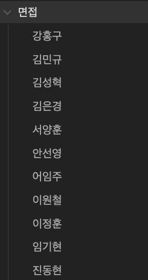

# 3000시간의 여정

안녕하세요, 오랜만에 글을 쓰게 된 S개발팀 신성수입니다.

이번 글은 아쉽게도 회사에서 쓰게될 마지막 글을 써보려고합니다.

## 음... 어떻게 얘길 시작해야 할까?

다날을 떠납니다.

늘 그렇듯, 만남은 쉽고 이별은 어렵습니다.

입사를 처음 했을 때, 개발팀 모두 방배로 가 있었고, 다모음팀이 반겨주던게 어제일어 났던 일 처럼 생생하게 생각이나네요.

지금껏 만나온 동료들이 너무 좋고, 현재 팀에서 풀어내려는 문제들도 흥미롭고 다날의 여러 모습들이 여전히 흥미로운점이 많았습니다.

제가 속한 S개발팀은 결제 전반적인 기능들을 만들고 운영을 하기 떄문에 다른팀들과 소통하는 과정도 참 즐거웠습니다.

지금도 이 선택이 최선인가 하는 생각이 맴돌다가, 글로 정리를 해볼려고합니다.

## 넷플릭스 퇴사 문화

넷플릭스의 퇴사 문화로 부검 메일이라는게 있습니다.

회사를 떠나는 직원이 퇴사 당일 통료들에게 아래의 내용을 담아서 보내는 메일입니다.

이 글 주에서 이 글에서는 아래 4자에 대해서만 다뤄볼 예정입니다.

1. 왜 떠나는지
2. 회사에서 배운 것
3. 앞으로의 계획

## 왜 떠나는지

사실 저는 웹드라마 PD로 돈을 만지기 시작하였습니다.

잘되고 있는 와중에, 개발자로 전향을 한 이유는 학교에서 배운것도 써보고 싶고, 일을 하면서 변화시킨다는 생각은 들지 않았습니다.

개발자로 처음 시작할때는 SI업체에서 지내다보니, 내가 원하는 것보다는 고객이 원하는 기능을 만드는 일이 많았습니다.

언젠가 내가 원하는걸 만들 기회가 오게 되면, 잘 할 수 있도록 주말에 교육이나 카페에서 공부하는 일이 일상이 되었습니다.

계속 이런식으로 개발에 대한 공부만 하면서 요청 오는 기업이나 개발건들을 쳐내는거에 급급하면 코더로 전향이 되지 않을까? 라는 생각을 많이 하게 되었습니다.

그래서 제가 정한 목표는 **결제 전문가가 되자**였습니다.

그래서 지금 하는 일이 정말 재밌었고, 욕심도 많이 났습니다.

이번 프로젝트를 하면서 동종업계 회사에 교육을 받게 되다가 대표님게 눈에 띄게 되었습니다.

티타임을 잠시 가지게 되고 목표와 생각했던 미래에 대해 얘기해 주었고, 나를 설득하는데에는 부족함이 없는 시간이였다.  
그래서 이번에 떠나게 되었습니다.

## 회사에서 배운 것

당연한 이야기겠지만, 여러 서비스를 겪다보면 다양한 환경을 직면하게 됩니다.

지난 1년동안 느꼈던 점을 말해볼까 합니다.

### 나무를 보지말고 숲을 봐라

많은 사람들이 모이다 보면 충돌이 생기기 마련입니다.

스파크 튀는 순간, 여러 재미있는 일들이 일어나고 그게 곧 모임의 경쟁력이 됩니다.

여기서 출돌이 갈등으로 이어지지 않기 위해 상호신뢰가 전제되어야 합니다.

초기에 의사소통을 할때는 여기 문화를 받아들이기 보다는 기존의 방향을 고수를 하다보니, 의사소통구조가 왜곡이 되었다.

상대방이 어떤 사람이고 어떤 상황에 처했는지 등의 정보가 부족하고 교류가 적으니 당연한 결과였습니다.

그 당시엔 배려였던 선한 의도가 곡해되고 오해가 쌓이면 어느샌가 불편한 감정들이 남게되었습니다.

그렇지만, 상황이 복잡할수록 풀어가는 재미는 역시 쏠쏠합니다. 언제나 그래왔듯, 위기는 누군가에게 기회입니다. 두려움을 용기로 바꾸는 기회를 배웠었습니다.

### 기술적인 면

개발자는 배움을 놓으면 안되는 직업이라고 한다. 매일매일 치열하게 업무와 공부를 병행하며 살아갈 순 없어도 개발자 라이프싸이클 내에서 크게 본다면 학습을 게을리 해서는 안되는 것은 분명하다.

저도 그렇게 생각하기 때문에 개발 서적을 읽기도 하고, 사이드 프로젝트도 하고 개인적으로 하는 일들이 많았었다.

이번년도에는 회사에 지원을 해준 상황들이 있었다.

작년 초기에는 GDG(Google Developer Groups)나 해커톤에서 휴가를 추가로 준것도 다른 회사에는 지원하는게 선택적일 것이다.

이때 회사에서는 도전하는 사람들의 차이을 배우게 되었다. 그런 점에서 회사에게 감사하였다.

### 무엇보다 좋은 동료들

최고의 복지는 동료라는 말이 있습니다.

사실 이 말을 좋아하지 않았습니다.

복지는 복지고 동료는 동료지 그게 무슨 상관이야? 높은 연봉이나 좋은 조건의 복리후생이 좋은 복지가 아닐까 싶었는데 3 ~ 4년 일을 하다보니 저 말이 괜히 있는 말이 아니구나라는걸 느꼈습니다.

돈과 조건 모두 다 중요하지만 회사 또한 사람들이 모인 곳이기에 사람들끼리 부대끼는 것을 피할 수 없는데, 인격적으로든 역량적으로든 훌륭한 동료들이 주변에 있고 내가 그들과 적절하고 긍정적인 유대관계를 가지면서 상호 신뢰할 수 있다는 것은 회사 생활을 하면서 내게 가장 큰 심리적인 동아줄로 작용했습니다.

기술적으로, 인격적으로 나를 서포팅해줄 수 있는 사람들이 있다는 것, 나 또한 누군가를 그렇게 도와줄 수 있다는 믿음은 이슈 해결을 통한 성취감이 아닌 다른 방식으로도 성취감과 긍정적인 영향을 주었습니다.

심리적 프레셔을 받으면서 일하는 것과 안정적인 상태로 일하는 것은 분명 업무적으로 큰 차이를 낼 것이고 이것이 하나둘 쌓여서 조직이나 회사의 성과로 이어질 것입니다.

## 잘못된 사름을 뽑으면 잘하는 사람들이 퇴사한다.

개발을 잘하고, 일에 진심인 사람들은 참을 수 없는 부분이 있는데, 이 부분을 건들지 않게 하려고 노력을 했습니다.

우리는 코딩 테스트도 없고, 거의 면접으로만 인재를 채용하고 있습니다. 그렇기 때문에 애매한 사람들이 들어오면 사실 잘 안뽑으려고 했습니다.

회사에서 화려하게 기술 스택을 쌓은 케이스, 개인 스택을 쌓고 온 케이스 여러 사람들을 봤지만, 회사에서 원하는건 한명의 슈퍼 개발자 보다는 같이 일을 할때 시너지가 잘 나올 것같은 사람입니다.  
여기 회사에 적응을 하기도 전에 면접관으로 들어갔고 사람을 뽑을때 어떤 식으로 뽑아야할지 많은 생각을 하는 계기가 되었습니다.

## 앞으로의 계획

저는 토스페이먼츠로 이직합니다.

저에게 있어 일의 최저 기준은 "나를 필요로 하는가", "내가 그 일에 흥미가 있는가", "합리적 보상이 있는가" 입니다.  
그리고 인생의 어떤 중요한 결정을 할 때는 "이런저런 상상이 되고 설렘이 있는가", "사회에 선한 영향을 주는가", "잘 할 수 있다는 확신이 있는가" 를 토대로 생각을 해봅니다.

금융 플랫폼중에 혁신이라는 단어를 제일 많이 사용한것이 이 회사라고 느꼈었고 지금 내가 가진 경력으로 어디까지 할 수 있을지에 대한 궁금증이 많았습니다.

# Outro

제가 회사 생활을 하면서 능력을 인정받거나 프로젝트가 잘되는경우는 조직의 능력이나 스마트함 혹은 그 사람이 가지고 있는 네트워크로 이루어지는 것은 아니였습니다.

매우 안타깝지만, 대부분의 성공은 운으로 이루어져있습니다.

저는 성공을 하고 싶고, 성장을 하고 싶고 세상의 유의미한 변화를 만들고 싶은데, 이게 다 운이라니 그래서 끈기가 중요한것같습니다.

그래서 끈기를 통해서 운이 올 때까지 하는것입니다.

다음으로 가는 회사에도 안좋은 소문을 들리는게 많이 있어 안 좋아하겠지만, 좋게 말하면 운이 올때까지 기다리는 하나의 여정이라고 생각이듭니다.
