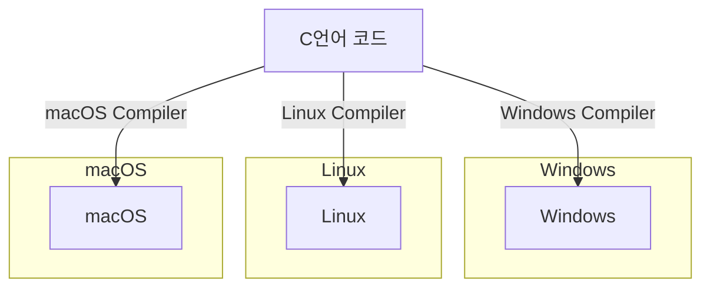
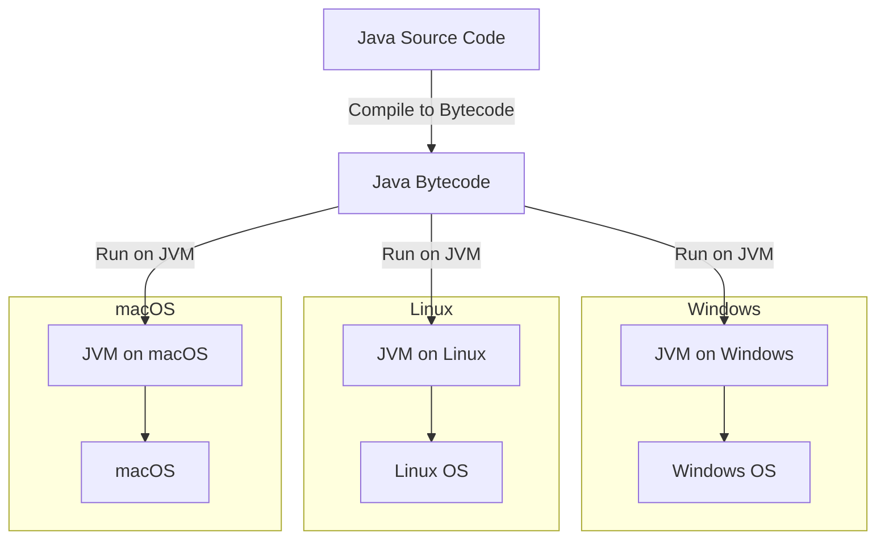
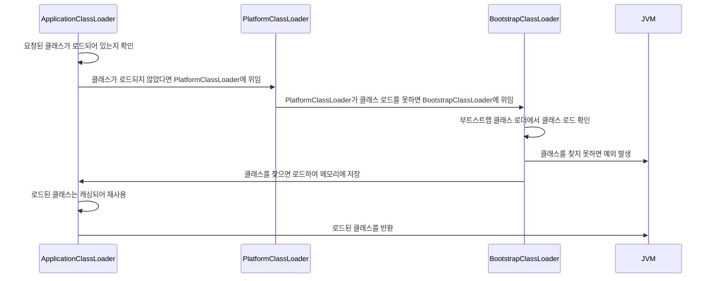

# JVM 이야기 - 배경과 구조
> JVM의 역사와 구조를 알아보고, 자바 프로그램이 어떻게 실행되는지 알아봅니다.
> 나아가 메모리를 생각하며 코드를 작성하는 방법에 대해서도 고민해봅니다.

### 👤 대상 독자
- java를 사용하는 개발자
- 메모리의 흐름을 이해하고 싶은 분

### ⏳ 읽는 데 걸리는 시간 
 - 10분

### 🔍 목차 (TOC)

- [1. Intro - 익숙하지만 낯선 JVM](#1-Intro-익숙하지만-낯선-JVM)
- [2. JVM은 무엇인가요?](#2-JVM은-무엇인가요)
    - [2-1. JVM의 정의](#2-1-JVM의-정의)
    - [2-2. JVM은 왜 필요한가요?](#2-2-JVM은-왜-필요한가요)
- [3. AI 없이도 경쟁력이 있을까?](#3-ai-없이도-경쟁력이-있을까)
    - [3-1. AI 없이도 경쟁력을 유지할 수 있는 경우](#3-1-ai-없이도-경쟁력을-유지할-수-있는-경우)
    - [3-2. AI 도입이 시급한 경우](#3-2-ai-도입이-시급한-경우)
- [4. 다날에 AI를 적용한다면?](#4-다날에-ai를-적용한다면)
    - [4-1. 다날에 적합한 AI 적용 사례](#4-1-다날에-적합한-ai-적용-사례)
    - [4-2. AI 도입을 위한 현실적인 접근법](#4-2-ai-도입을-위한-현실적인-접근법)
- [5. Outro - 앞으로의 방향성](#5-Outro---앞으로의-방향성)

---

# 1. Intro 익숙하지만 낯선 JVM
JVM은 Java를 사용하다보면 항상 따라오는 개념중 하나입니다.
하지만 JVM이 정확히 무엇인지, 어떻게 동작하는지에 대해 자세히 알기 보다는 
**그런게 있다** 라고만 생각하고 넘어갔던 경우가 많다고 생각해요. 
배경과 구조를 알아보고 최종적으로는 어떻게 코드에 도입하면 효율적으로 메모리를 사용할 수 있을지도 알아봅니다.

---

# 2. JVM은 무엇인가요?

## 2-1. JVM의 정의

자바 가상 머신(JVM, Java Virtual Machine)은 자바 프로그램을 실행하는 데 필요한 가상 컴퓨터입니다.
- 특징
    - 자바 프로그램이 다양한 플랫폼(window, 리눅스등 다양한 os)에서 동일하게 실행될 수 있도록 환경을 제공합니다.
    - 자바 코드를 실행시키기 위해서 반드시 필요한 프로그램입니다.
    - 메모리 관리, 스레드 관리, 바이트 코드 실행 등의 기능을 수행합니다.

## 2-2. JVM은 왜 필요한가요?

Java가 다양한 플랫폼(OS)에 종속적이지 않고 동작할 수 있도록 하기 위해서는,
그 위에서 java를 실행시킬 역할을 할 수 있는 것이 필요했습니다.
그것이 바로 JVM입니다.

### c언어와 java의 비교
C언어의 경우, 컴파일러가 소스코드를 기계어(바이너리 코드)로 변환하여 실행파일을 만들어내는 방식이었습니다. 
그러나 바이너리 코드는 특정 OS(ex : 리눅스, mac등)나 CPU구조에 따라서 컴파일이 다르게 된다는 특징이 있었습니다. 
그래서 OS에 따라서 프로그램을 따로 만들어야 하는 문제가 있죠.(ex: 리눅스용, 윈도우용) 

이렇게 컴파일러가 OS마다 달라서 일일이 프로그램을 만들어야 하는 문제를 해결하기 위해 JVM이 등장합니다. 

java의 경우, OS로 바로 실행하는 것이 아닌, JVM을 통해서 OS와 상호작용합니다. 
JVM의 존재만으로 OS를 고려하지 않고도 프로그램을 실행시킬 수 있게 된 것이죠. 
그래서 C언어처럼 다양한 OS에 맞춰진 컴파일러가 이해할 수 있게 코드수정을 하지 않아도 됩니다.

단, JVM 자체는 **OS에 종속적입니다.** 그래서 OS에 맞는 JVM 설치는 필요합니다.  
그러면 java도 OS에 의존적인건 다름 없지 않느냐 라고 생각할 수도 있습니다만,  
`한번만 코드를 작성하고 OS에 맞는 JVM 각각설치하기` vs `OS마다 코드 작성하기`를 생각해본다면 전자가 더 효율적이다고 볼 수 있는 것이죠.

### JVM 동작 과정

>    1. 자바 컴파일러가 자바로 작성된 파일을 `자바 바이트 코드` (JVM이 이해할 수 있는 코드)로 컴파일합니다.

> 2. JVM은 이 바이트 코드를 `기계어`(바이너리 코드)로 변환합니다.

> 3. jvm에 의해 컴파일된 기계어는 OS별 CPU에서 실행되어 사용자에게 서비스를 제공해줍니다.

     

# 3. JVM의 구조는 어떻게 되어있을까요?

JVM의 구조는 java 버전이 변경되면서 변화해왔습니다.  
우선 가장 기본적인 java 7에서의 JVM 구조를 알아보겠습니다.

### 구성
1. 클래스 로더(Class Loader)
2. 실행 엔진(Execution Engine)
   - 인터프리터
   - JIT 컴파일러
   - 가비지 컬렉터
3. 런타임 데이터 영역(Runtime Data Area)
    - 메서드 영역(Method Area)
    - 힙 영역(Heap Area)
    - 스택 영역(Stack Area)
    - PC Register
    - 네이티브 메서드 영역(Native Method Stack)

## 3-1. 클래스 로더
클래스를 필요할때만 JVM내부 메모리(Runtime Data Area)에 동적으로 로딩하고, 초기화하는 역할을 합니다.

로딩 순서 : 로딩 -> 링크 -> 초기화

### 부트스트랩로더
JVM 시작시 가장 먼저 실행되는 클래스 로더입니다.

## 3-1. 실행 엔진
## 3-1-1. 인터프리터
자바 바이트 코드를 한줄씩 읽고 한줄씩 기계어로 해석하는 역할을 합니다.

> 📝 인터프리터 vs 컴파일러 차이점
> 
>| 구분        | **인터프리터 (Interpreter)** | **컴파일러 (Compiler)**         |
>|------------|-------------------------|-----------------------------|
>| **실행 방식** | 한 줄씩 해석하며 즉시 실행됩니다.     | 전체 코드를 한 번에 기계어로 변환 후 실행합니다 |
>| **속도**    | 시작은 빠르지만 실행 속도는 느립니다.   | 시작은 느리지만 실행 속도가 빠릅니다.       |
>| **오류 처리** | 오류 발생 시 즉시 중단 후 알려줍니다.  | 모든 코드 분석 후 오류를 한 번에 알려줍니다.  |
> 📌 정리
>- **인터프리터**: 실행 속도보다 **빠른 실행 시작**이 중요할 때 사용합니다.
>- **컴파일러**: 실행 속도를 높이고 싶을 때 사용합니다.
>- **Java**는 **JVM에서 인터프리터 + JIT 컴파일러**를 함께 사용하여 장점을 조합합니다.

> ### 왜 JVM에서는 굳이 인터프리터를 사용했을까요?
> 1. java는 wora(Write Once, Run Anywhere)라는 플랫폼에 독립적으로 동작하려는 패러다임을 가지고 있습니다. 이때 인터프리터를 사용하면 플랫폼에 독립적인 장점을 가져갈 수 있습니다. 
> 2. 한줄씩 실행하므로 메모리 사용량이 적습니다.

## 3-1-2. JIT 컴파일러
실행중에 자바 바이트 코드를 네이티브머신 코드로 변환하여 성능을 최적화하는 기술입니다.  
프로그램의 실행패턴을 분석해서 자주 실행되는 메서드(HotSpot)을 중심으로 최적화합니다.  
처음 호출되었을 때는 바로 컴파일 되지는 않고, 호출 횟수를 체크하여 컴파일합니다.
그 후, 동일한 메서드가 컴파일되면 이 컴파일된 메서드를 해석하지 않고 그대로 호출되도록 하여 성능을 최적화합니다.

# 4. 다날에 AI를 적용한다면?

AI를 다날과 같은 결제 시스템에 도입한다면 가장 효과적인 활용 분야는 어디일까요?  

> AI는 단순히 ‘도입하면 좋을 것 같은 기술’이 아니라, 실질적인 비용 절감, 보안 강화, 서비스 최적화와 연결되어야 합니다.

## 4-1. 다날에 적합한 AI 적용 사례

- 🚨 이상 거래 탐지 시스템  
    결제 시스템에서 가장 중요한 것 중 하나는 이상 거래 탐지 및 사기 방지입니다.  
    다날이 AI를 활용한다면, 머신러닝 기반의 이상 거래 탐지 시스템(FDS, Fraud Detection System)을 강화할 수 있습니다.  
  - AI 모델이 거래 패턴을 학습하여 의심 거래를 실시간으로 감지
  - RAG 기반 검색 + 머신러닝 분석을 결합해 의심 거래에 대한 정밀한 판단
  - 카드사, 은행, 핀테크 서비스와 연동된 데이터 분석을 통한 사기 방지 강화

- 🛍️ 초개인화 결제 UX 제공  
    고객 경험(UX)은 결제 서비스의 핵심 요소입니다.  
    AI를 활용하면 고객 데이터를 분석해 개인 맞춤형 결제 추천 및 사용자 편의성 개선이 가능합니다.
  - 고객의 거래 패턴을 분석하여 맞춤형 결제 옵션 추천
  - AI 기반의 결제 UX 최적화 (예: 자주 쓰는 결제 방법을 자동 추천)
  - 음성 인식, 챗봇 기반의 AI 인터페이스를 통해 결제 접근성을 높이기

- 🤖 고객 응대 자동화  
    결제 시스템에서는 고객 문의가 끊이지 않습니다.  
    AI 챗봇을 활용하면 고객 상담을 자동화하면서도 사용자 만족도를 높일 수 있습니다.
  - 실시간 결제 오류 해결 지원 (AI가 문제 해결 가이드 제공)
  - 자연어 처리(NLP)를 활용한 고객 문의 분석 및 자동 응답
  - AI 콜센터 솔루션을 활용한 24/7 고객 지원 구축

- 📊 리스크 분석 및 신용 평가  
    핀테크 기업에서 사용자 신용 평가는 AI가 가장 잘 활용될 수 있는 분야 중 하나입니다.
  - AI가 고객의 금융 데이터를 분석하여 신용 점수 자동 산출
  - 금융 사기 및 연체 가능성 예측
  - 심사 시간을 단축하고, 보다 정확한 리스크 평가 제공

### 🚀 요약

> ✅ **이상 거래 탐지 및 사기 방지를 위한 AI 모델 고도화**  
> ✅ **초개인화된 결제 UX 제공으로 고객 편의성 강화**  
> ✅ **AI 챗봇을 통한 자동화된 고객 응대 시스템 구축**  
> ✅ **AI 기반 신용 평가 및 리스크 관리 시스템 운영**

## 4-2. AI 도입을 위한 현실적인 접근법
AI를 도입하는 것은 한 번에 모든 것을 바꾸는 것이 아닙니다.  

작은 파일럿 프로젝트부터 시작하여 단계적으로 AI를 도입하는 것이 가장 현실적인 접근법입니다.  
예를 들어, 이상 거래 탐지 AI 모델을 먼저 도입하고 이후 고객 UX 최적화 AI 모델을 추가하는 방식으로 진행할 수 있습니다.

---

# 5. Outro - 

다른 사람들의 글을 참고하고 정리해 볼수록, 알고 있다고 생각한 것들이 사실 잘 설명이 되지 않는 경우가 많은 것 같습니다.  
그럼에도 늦기전에 한걸음씩 정리해보는게 좋다고 생각합니다.

---
reference
- https://inpa.tistory.com/entry/JAVA-%E2%98%95-JDK-JRE-JVM-%EA%B0%9C%EB%85%90-%EA%B5%AC%EC%84%B1-%EC%9B%90%EB%A6%AC-%F0%9F%92%AF-%EC%99%84%EB%B2%BD-%EC%B4%9D%EC%A0%95%EB%A6%AC#jvm_java_virtual_machine
- https://yeon-kr.tistory.com/118
- https://ko.wikipedia.org/wiki/JIT_%EC%BB%B4%ED%8C%8C%EC%9D%BC
- https://riptutorial.com/java/example/18231/overview
---

|Profile| Link                                                                                        | Bio                       |
|--|---------------------------------------------------------------------------------------------|---------------------------|
| | [github](https://github.com/bk100km)   [LinkedIn](https://www.linkedin.com/in/bk100km/) | **"모든 것은 변한다. 그러니 우리는"** |

