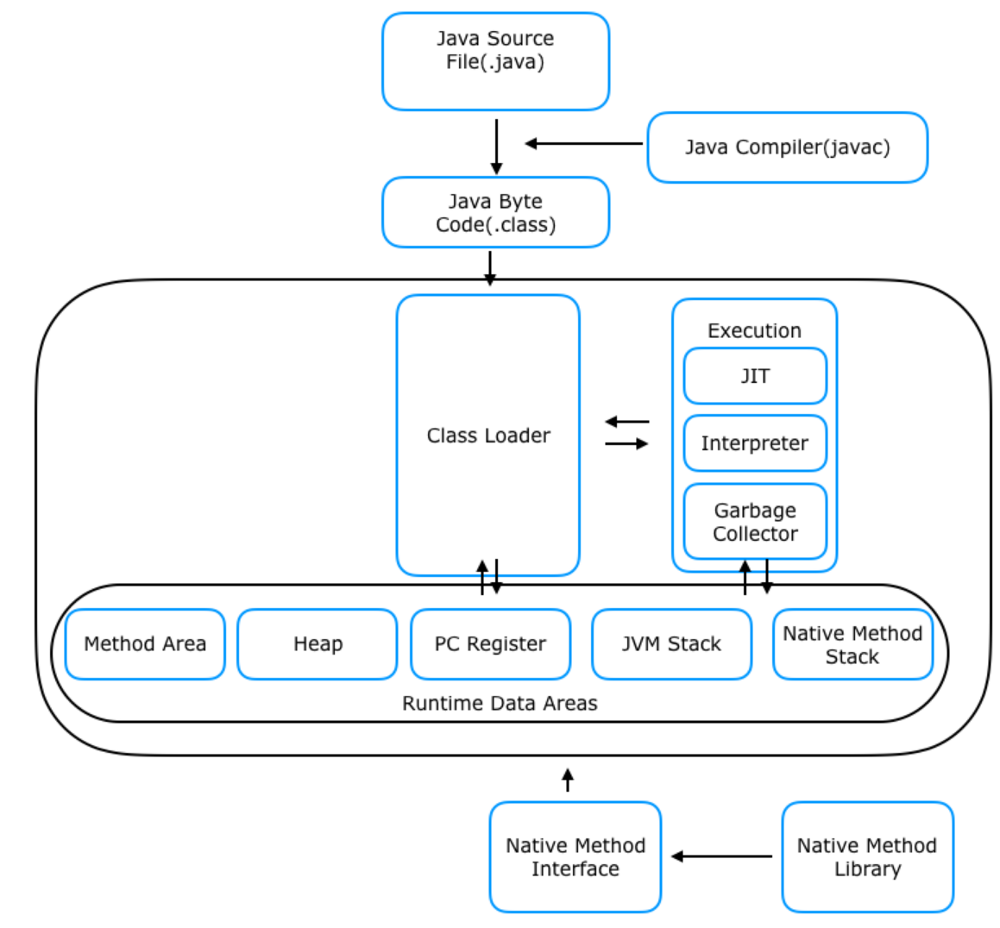

# JVM 이야기 - 배경과 구조
> JVM의 역사와 구조를 알아보고, 자바 프로그램이 어떻게 실행되는지 알아봅니다.
> 나아가 메모리를 생각하며 코드를 작성하는 방법에 대해서도 고민해봅니다.

### 👤 대상 독자
- java를 사용하는 개발자
- 메모리의 흐름을 이해하고 싶은 분

### ⏳ 읽는 데 걸리는 시간 
 - 10분

### 🔍 목차 (TOC)

- [1. Intro - 익숙하지만 낯선 JVM](#1-Intro-익숙하지만-낯선-JVM)
- [2. JVM은 무엇인가요?](#2-JVM은-무엇인가요)
    - [2-1. JVM의 정의](#2-1-JVM의-정의)
    - [2-2. JVM은 왜 필요한가요?](#2-2-JVM은-왜-필요한가요)
- [3. AI 없이도 경쟁력이 있을까?](#3-ai-없이도-경쟁력이-있을까)
    - [3-1. AI 없이도 경쟁력을 유지할 수 있는 경우](#3-1-ai-없이도-경쟁력을-유지할-수-있는-경우)
    - [3-2. AI 도입이 시급한 경우](#3-2-ai-도입이-시급한-경우)
- [4. 다날에 AI를 적용한다면?](#4-다날에-ai를-적용한다면)
    - [4-1. 다날에 적합한 AI 적용 사례](#4-1-다날에-적합한-ai-적용-사례)
    - [4-2. AI 도입을 위한 현실적인 접근법](#4-2-ai-도입을-위한-현실적인-접근법)
- [5. Outro - 앞으로의 방향성](#5-Outro---앞으로의-방향성)

---

# 1. Intro 익숙하지만 낯선 JVM
JVM은 Java를 사용하다보면 항상 따라오는 개념중 하나입니다.
하지만 JVM이 정확히 무엇인지, 어떻게 동작하는지에 대해 자세히 알기 보다는 
**그런게 있다** 라고만 생각하고 넘어갔던 경우가 많다고 생각해요.<br/>
배경과 구조를 알아보고 최종적으로는 어떻게 코드에 도입하면 효율적으로 메모리를 사용할 수 있을지도 알아봅니다.

---

# 2. JVM은 무엇인가요?

## 2-1. JVM의 정의

자바 가상 머신(JVM, Java Virtual Machine)은 자바 프로그램을 실행하는 데 필요한 가상 컴퓨터입니다.
- 특징
    - 자바 프로그램이 다양한 플랫폼(window, 리눅스등 다양한 os)에서 동일하게 실행될 수 있도록 환경을 제공합니다.
    - 자바 코드를 실행시키기 위해서 반드시 필요한 프로그램입니다.
    - 메모리 관리, 스레드 관리, 바이트 코드 실행 등의 기능을 수행합니다.


## 2-2. JVM은 왜 필요한가요?

Java가 다양한 플랫폼(OS)에 종속적이지 않고 동작할 수 있도록 하기 위해서는,
그 위에서 java를 실행시킬 역할을 할 수 있는 것이 필요했습니다.
그것이 바로 JVM입니다.

### c언어와 java의 비교
C언어의 경우, 컴파일러가 소스코드를 기계어(바이너리 코드)로 변환하여 실행파일을 만들어내는 방식이었습니다.<br/>
그러나 바이너리 코드는 특정 OS(ex : 리눅스, mac등)나 CPU구조에 따라서 컴파일이 다르게 된다는 특징이 있었습니다.<br/>
그래서 OS에 따라서 프로그램을 따로 만들어야 하는 문제가 있죠.(ex: 리눅스용, 윈도우용)<br/>


이렇게 컴파일러가 OS마다 달라서 일일이 프로그램을 만들어야 하는 문제를 해결하기 위해 JVM이 등장합니다.<br/>

java의 경우, OS로 바로 실행하는 것이 아닌, JVM을 통해서 OS와 상호작용합니다.<br/>
JVM의 존재만으로 OS를 고려하지 않고도 프로그램을 실행시킬 수 있게 된 것이죠.<br/>
그래서 C언어처럼 다양한 OS에 맞춰진 컴파일러가 이해할 수 있게 코드수정을 하지 않아도 됩니다.


단, JVM 자체는 **OS에 종속적입니다.** 그래서 OS에 맞는 JVM 설치는 필요합니다.  
그러면 java도 OS에 의존적인건 다름 없지 않느냐 라고 생각할 수도 있습니다만,  
`한번만 코드를 작성하고 OS에 맞는 JVM 각각설치하기` vs `OS마다 코드 작성하기`를 생각해본다면 전자가 더 효율적이다고 볼 수 있는 것이죠.


### JVM 동작 과정

>    1. 자바 컴파일러가 자바로 작성된 파일을 `자바 바이트 코드` (JVM이 이해할 수 있는 코드)로 컴파일합니다.


> 2. JVM은 이 바이트 코드를 `기계어`(바이너리 코드)로 변환합니다.

> 3. jvm에 의해 컴파일된 기계어는 OS별 CPU에서 실행되어 사용자에게 서비스를 제공해줍니다.


     

# 3. JVM의 구조는 어떻게 되어있을까요?

JVM의 구조는 java 버전이 변경되면서 변화해왔습니다.  
우선 가장 기본적인 java 7에서의 JVM 구조를 알아보겠습니다.



### 구성
1. 클래스 로더(Class Loader)
2. 실행 엔진(Execution Engine)
   - 인터프리터
   - JIT 컴파일러
   - 가비지 컬렉터
3. 런타임 데이터 영역(Runtime Data Area)
    - 메서드 영역(Method Area)
    - 힙 영역(Heap Area)
    - 스택 영역(Stack Area)
    - PC Register
    - 네이티브 메서드 영역(Native Method Stack)


## 3-1. 클래스 로더
클래스를 필요할때만 JVM내부 메모리(Runtime Data Area)에 동적으로 로딩하고, 초기화하는 역할을 합니다.

로딩 순서 : 로딩 -> 링크 -> 초기화


### 부트스트랩로더
JVM 시작시 가장 먼저 실행되는 클래스 로더입니다.


## 3-2. 실행 엔진
## 3-2-1. 인터프리터
자바 바이트 코드를 한줄씩 읽고 한줄씩 기계어로 해석하는 역할을 합니다.

> 📝 인터프리터 vs 컴파일러 차이점
> 
>| 구분        | **인터프리터 (Interpreter)** | **컴파일러 (Compiler)**         |
>|------------|-------------------------|-----------------------------|
>| **실행 방식** | 한 줄씩 해석하며 즉시 실행됩니다.     | 전체 코드를 한 번에 기계어로 변환 후 실행합니다 |
>| **속도**    | 시작은 빠르지만 실행 속도는 느립니다.   | 시작은 느리지만 실행 속도가 빠릅니다.       |
>| **오류 처리** | 오류 발생 시 즉시 중단 후 알려줍니다.  | 모든 코드 분석 후 오류를 한 번에 알려줍니다.  |
> 📌 정리
>- **인터프리터**: 실행 속도보다 **빠른 실행 시작**이 중요할 때 사용합니다.
>- **컴파일러**: 실행 속도를 높이고 싶을 때 사용합니다.
>- **Java**는 **JVM에서 인터프리터 + JIT 컴파일러**를 함께 사용하여 장점을 조합합니다.

> ### 왜 JVM에서는 굳이 인터프리터를 사용했을까요?
> 1. java는 wora(Write Once, Run Anywhere)라는 플랫폼에 독립적으로 동작하려는 패러다임을 가지고 있습니다. 이때 인터프리터를 사용하면 플랫폼에 독립적인 장점을 가져갈 수 있습니다. 
> 2. 한줄씩 실행하므로 메모리 사용량이 적습니다.


## 3-2-2. JIT 컴파일러
* 실행중에 자바 바이트 코드를 네이티브 코드로 변환하여 성능을 최적화하는 기술입니다.  
* 프로그램의 실행패턴을 분석해서 자주 실행되는 메서드(HotSpot)을 중심으로 최적화합니다.  
* 처음 호출되었을 때는 바로 컴파일 되지는 않고, 호출 횟수를 체크하여 컴파일합니다.
그 후, 동일한 메서드가 컴파일되면 이 컴파일된 메서드를 해석하지 않고 네이티브코드 그대로 실행되도록 하여 성능을 최적화합니다.

> ### 왜 사용했을까요?
> 인터프리터는 처음 실행되는 속도는 빠르지만, 이후 동작할때 동일한 메서드들을 계속 호출하므로 느립니다.  
> 그에 반해 동적컴파일을 진행하는 JIT는 반복되는 코드를 읽지 않고 바로 사용할 수 있어 성능을 높일 수 있습니다.  
> 즉, **느린** 성능을 가진 인터프리터의 단점을 보완함으로써 인터프리터의 빠른 초기 실행속도와 JIT 컴파일러의 성능의
> 이점을 동시에 가져가는 것이죠.

## 3-2-3. 가비지 컬렉터
아마 많이 보셨을 가비지 컬렉터(GC)입니다. Heap 영역에서 사용되지 않는 메모리를 회수해주는 역할을 합니다.  
C언어와는 다르게 메모리 관리에 신경쓰지 않아도 되는 장점이 있습니다.  
종류로는 아래와 같이 있습니다. 해당 내용은 방대하기 때문에 이 글에서는 종류만 정리해 볼게요.  

### GC 종류
  - Serial GC
  - Parallel GC
  - CMS (Concurrent Mark-Sweep) GC
  - G1 GC (Garbage-First Garbage Collector)
  - ZGC (Z Garbage Collector)
  - Shenandoah GC


## 3-3. 런타임 데이터 영역
JVM이 프로그램 실행시 사용하는 메모리 공간입니다. JVM 실행시 생성되고, 프로그램 종료시 해제됩니다.  
mehod, heap 영역은 모든 스레드가 공유하고, 나머지는 스레드별로 생성됩니다.


### 3-3-1. method 영역(class영역 또는 static영역)
 jvm시작시 자바 바이트 코드(.class)가 클래스 로딩되는 곳입니다.  
jvm 동작후 적재가 되면 프로그램 종료시까지 저장됩니다.  
클래스에 대한 모든 정보가 저장된다고 생각하면 됩니다.
#### 저장되는 정보
```java
class Car {
    static int count = 0; // 정적 변수
    final int MAX_SPEED = 200; // 상수
    String model; // 인스턴스 변수

    // 생성자
    public Car(String model) {
        this.model = model;
        count++; // 생성될 때마다 count 증가
    }

    public void drive() { // 메서드
        System.out.println("Driving " + model + " at max speed: " + MAX_SPEED);
    }

    public static void startEngine() { // 정적 메서드
        System.out.println("Engine started");
    }
}
```
1. 메서드 코드 : Car(), drive(), startEngine()의 바이트 코드가 저장됩니다.
2. 인스턴스 변수 : model의 이름, 접근제어자, 데이터 타입등이 저장됩니다.
3. 클래스 : Car의 메타데이터도 저장됩니다.(이름, 상속관계, 인터페이스 정보)
#### 3-3-1-1. runtime constant pool 영역
메서드 영역 내부에 있는 데이터 영역입니다. 클래스나 인터페이스별로 자신만의 runtime constant pool
영역을 가집니다.  
클래스에서 사용되는 상수, 리터럴, 메서드/필드 참조들을 저장합니다.

### 3-3-3. Heap 영역
프로그램에서 동적으로 할당되는 객체들을 저장하는 공간입니다.  
GC의 대상이 되는 곳이죠.
이 영역에서 생성된 객체나 배열은 참조형으로, stack 영역의 변수나 객체의 필드에서
참조 됩니다.

저장 대상
* new 연산자로 생성되는 클래스
* 인스턴스 변수
* 배열 타입
* enum타입

java 8버전 부터 이전버전과 다르게 구조가 변경되었습니다.  


### young generation
* eden
  * 새로운 객체들이 생성되는 공간입니다.
  * GC가 자주 발생하며, 대부분의 객체가 이곳에서 생성됩니다.
* survivor 
  * eden에서 살아남은 객체들이 이동하는 공간입니다.
  * 객체가 GC에서 살아남으면 하나의 survivor 공간으로 이동하고, 또 GC를 거쳐 살아남으면
  다른 survivor로 이동합니다.
  * 서로 번갈아가며 2개의 survivor이 사용됩니다. 한번 gc후 살아남은 객체들이 다음 survivor영역으로
  이동합니다.
### old generation
* old
  * young generation에서 여러번 GC에서 살아남은 객체들이 이동하는 영역입니다.
  * 생명주기가 긴 객체들이 주로 위치하고 ,GC가 덜 발생합니다.

### 3-3-4. stack 영역
메서드 호출 및 지역변수 저장을 담당합니다.  
메서드 실행에 필요한 정보를 저장하고 관리하는 역할을 하고 있습니다.
후입선출 구조로, 마지막에 들어온 스택프레임이 가장 먼저 제거 됩니다.

> ### 스택 프레임  
> 함수의 호출과 관계되는 정보를 저장하는 영역입니다.
> 함수의 매개변수, 호출이 끝난 후 반환 주소값, 지역변수등이 저장됩니다.
> 

### 3-3-5. pc 레지스터 영역
현재 수행중인 JVM 명령어 주소를 저장하는 공간입니다.

* 스레드 마다 독립적으로 동작합니다. 그래서 멀티스레드 환경에서도 각 스레드의 실행위치를
독립적으로 추적할 수 있습니다.
* 현재 실행중인 메서드에서 어떤 바이트코드를 실행할지 추적합니다.
메서드 호출후 실행될때마다 pc레지스터가 해당 명령어의 주소로 갱신됩니다.
* 스레드간 컨텍스트 스위칭이 발생한다면 pc 레지스터를 활용하여 스위칭합니다.

> ### PC 레지스터는 왜 필요한가요?
> 1. 위 특징에서도 말씀드렸듯, 멀티스레드 환경에서 스레드별로 실행중인 명령어 위치를
> 알고 있어야 정상적으로 스레드별 실행이 진행됩니다.
> 2. jvm에서 바이트코드는 순차적으로 실행되는데, 이를 위해서는 현재 명령어 위치가 어디인지,
> 그 다음 명령어 위치는 어디인지를 알아야 하기 때문입니다.
>    1. 순차적으로 실행한다고 하면 현재 명령어 위치 + 바이트 코드 길이를 더한 위치로 업데이트
>    2. 분기문의 경우 조건에 맞는 분기지점의 주소로 설정
> 


### 3-3-6. native method stack 영역
실제 실행할 수 있는 기계어로 작성된 프로그램을 실행시키는 영역입니다.

* 스택 프레임 : 네이티브 메서드 스택영역에서도 존재합니다. 외부에서 이영역을 호출하게 될 경우
stack 영역처럼 LIFO구조로 생성 및 소멸이 됩니다.
* JNI : 보통 jni 함수를 통해서 네이티브 메서드가 호출되고 java 코드와 상호작용합니다.
* JIT : JIT 컴파일러의 경우에도 자주 실행되는 코드(HotSpot)을 감지해서 네이티브 코드로 변환후
이 영역에 저장합니다.

### 3-3-7. JNI
다른 언어(C, C++)로 이루어진 어플리케이션이 java와 상호작용할 수 있도록 인터페이스를 
제공합니다.  
JVM이 네이티브 메서드를 사용하고 native method stack 영역에 적재할 수 있도록 도와줍니다.


todo 상수풀,런타임 상수풀, string 상수풀 차이  
런타임 상수풀이 heap -> method로 변경된 이유


# 5. Outro - 
사실 JVM의 경우, 기본적이라고 할 수도 있지만 내용자체가 방대하다고 많이 느꼈습니다.  
그래서 어느정도 디테일한 내용은 차수를 분리해보는게 좋을 것 같습니다.  
JVM에 대해 좀 더 알게 되면 메모리를 생각하는 코드에 대해서도 조금 더 가까워지지 않을까
생각합니다. 다음 글에서 뵙겠습니다 긴글 읽어주셔서 감사합니다. (_ _)


---
reference
- https://inpa.tistory.com/entry/JAVA-%E2%98%95-JDK-JRE-JVM-%EA%B0%9C%EB%85%90-%EA%B5%AC%EC%84%B1-%EC%9B%90%EB%A6%AC-%F0%9F%92%AF-%EC%99%84%EB%B2%BD-%EC%B4%9D%EC%A0%95%EB%A6%AC#jvm_java_virtual_machine
- https://yeon-kr.tistory.com/118
- https://ko.wikipedia.org/wiki/JIT_%EC%BB%B4%ED%8C%8C%EC%9D%BC
- https://riptutorial.com/java/example/18231/overview
- https://jh7722.tistory.com/250
- https://velog.io/@falling_star3/Java-JVM-%EB%A9%94%EB%AA%A8%EB%A6%AC%EA%B5%AC%EC%A1%B0-%EC%95%94%EA%B8%B0-%EB%A7%90%EA%B3%A0-%EC%9D%B4%ED%95%B4%ED%95%98%EA%B8%B0%EC%83%81%EC%86%8D%EC%9D%84-%EA%B3%81%EB%93%A4%EC%9D%B8
---

[//]: # ()
[//]: # (|Profile| Link                                                                                        | Bio                       |)

[//]: # (|--|---------------------------------------------------------------------------------------------|---------------------------|)

[//]: # (| | [github]&#40;https://github.com/bk100km&#41; <br/> [LinkedIn]&#40;https://www.linkedin.com/in/bk100km/&#41; | **"모든 것은 변한다. 그러니 우리는"** |)

[//]: # ()

