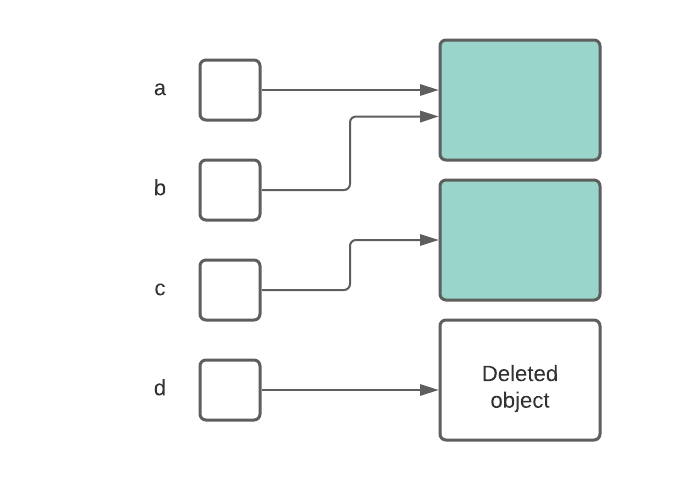

# 자바 개발자를 위한 동시성 살펴보기 (2) - Rust 편

안녕하세요, BE플랫폼개발팀 정찬미입니다.   

1편에서는 자바의 동시성 개념을 복습하며 Rust 동시성을 이해할 준비를 했습니다.
2편에서는 제가 Rust의 동시성 프로그래밍을 살짝 경험하고 받은 그 감동을 함께 나누도록 하겠습니다.

## 0. Rust Ice Breaking

Rust는 몇 년째 개발자가 가장 배우고 싶어하는 언어 중 하나로 유명합니다. 2024년 스택오버플로우 개발자 서베이에서도 1위를 차지했습니다. 

https://survey.stackoverflow.co/2024/technology#most-popular-technologies-language-prof


그런데 주변 시스템 프로그래밍하는 친구들에게 물어보면 현업에서 쓰는 사람은 거의 없더라고요? 

>친구 曰 : Rust는 사치야..C++지옥에서 살고 있어 C++ 코드를 걷어낼수가 없어

가장 배우고 싶어하지만, 현업에서 쓰는 사람은 없는 언어라니! 저도 매우 궁금 했지만 그냥 그런 상태로 몇년이 지나갔습니다. 

그러다 올해 2월에 참석한 K-DEVCON 행사에서 우연찮게 `Introduction to Rust Concurrency`라는 세션을 듣고,  자바와는 다른 매력을 느꼈습니다.
이제는 [rust 도입을 고려](https://www.jetbrains.com/ko-kr/lp/devecosystem-2024/)하고 있는 경우도 꽤 많다고 하고요.

Rust는 `친절한 컴파일러의 안내를 받아 안전하게 동시성 프로그래밍 할 수 있는 언어`입니다. Rust가 안전성을 어떻게 제공할까요.. 지금부터 함께하시죠!


## 1. 메모리 안전성

Rust 안정성의 키워드는 두 가지 입니다.

>   **메모리 안전성**과 **동시성 안전성** 
 
메모리 안전성은 프로그램이 할당되지 않은 메모리 영역에 접근하거나, 이미 해제된 메모리에 접근하는 등의 메모리 관련 오류를 방지하는 것을 의미합니다. C언어 포인터 공부하실때 많이 겪으셨을 문제들입니다.

### **1.1. C/C++의 메모리 문제**

C나 C++과 같은 언어에서는 개발자가 직접 명시적으로 메모리를 할당(`malloc`/`new`)하고 해제(`free`/`delete`)해야 합니다. 

이때 흔히 발생하는 메모리 관련 오류들을 복습해보겠습니다.



- **댕글링 포인터 (Dangling Pointer):** 이미 해제된 메모리 영역을 가리키는 포인터를 사용하는 경우입니다. 댕글링 포인터를 통해 접근하면 이상한 동작이 발생할 수 있습니다 .당연히 디버깅도 어려운 상황이고, Segmentation Fault도 발생할 수 있습니다.

- **메모리 누수 (Memory Leak):** 더 이상 사용하지 않는 메모리를 해제하지 않아 시스템 자원이 낭비되는 현상입니다. 장기적으로 프로그램 성능 저하를 유발할 수 있습니다.

- **버퍼 오버플로우 (Buffer Overflow):** 할당된 메모리 버퍼의 크기를 넘어 데이터를 쓰려고 시도하는 경우입니다. 주변 메모리 영역을 덮어쓰거나 악의적인 코드를 실행하는 데 악용될 수 있기 때문에 대표적인  보안 취약점이라고 볼수 있스빈다.

- **중복 해제 (Double Free):** 이미 해제된 메모리를 다시 해제하려고 시도하는 경우입니다. heap metadata가 영향을 받기 때문에 보안에 취약해질 수 있습니다.

### 1.2. 자바의 메모리 안전성

반면 자바는 가비지 컬렉션 (Garbage Collection, GC)을 통해 자동으로 메모리 관리를 해줍니다. 

현재 가장 많이 사용되는 JDK 17 LTS 버전에서는 G1 GC(Garbage First)가 기본으로 설정되어 있습니다. G1 GC 아이디어는 힙 메모리를 여러 개의 작은 영역으로 나누어 관리하며, 자주 사용되는 객체를 우선적으로 수집하자는 것이빈다. 성능과 예측가능성이 높다는게 장점입니다. 

하지만 자바의 가비지 컬렉션은 완벽하지 않으며, 성능상의 오버헤드를 발생시키거나 예측 불가능한 GC pause도 발생할 수 있습니다.

### 1.3. Rust의 메모리 안전성

Rust는 가비지 컬렉터 없이 **소유권 (Ownership)**, **대여 (Borrowing)**, **라이프타임 (Lifetimes)**이라는 독특한 시스템을 통해 메모리 안전성을 보장합니다.

#### **소유권**
    * 값은 해당 값을 소유하는 변수를 가집니다.
    * 한 번에 하나의 소유자만 존재할 수 있습니다.
    * 소유자가 스코프 밖으로 나가면 값은 자동으로 삭제됩니다.

```rust
    let s1 = String::from("hello");
    let s2 = s1;

    println!("{}, world!", s1);
```
- 위 코드는 컴파일 에러가 발생합니다. `s1`이 소유권을 `s2`에 넘겼기 때문에 `s1`은 더 이상 유효하지 않습니다. (이와중에 에러메세지가 매우 친절합니다.)

```
error[E0382]: borrow of moved value: `s1`
 --> src/main.rs:5:28
  |
2 |     let s1 = String::from("hello");
  |         -- move occurs because `s1` has type `String`, which does not implement the `Copy` trait
3 |     let s2 = s1;
  |              -- value moved here
4 |
5 |     println!("{}, world!", s1);
  |                            ^^ value borrowed here after move
  |
  = note: this error originates in the macro `$crate::format_args_nl` which comes from the expansion of the macro `println` (in Nightly builds, run with -Z macro-backtrace for more info)
help: consider cloning the value if the performance cost is acceptabl
```

#### **Borrowing:**

-  소유권을 넘기지 않고 데이터에 접근할 수 있습니다.
- ` &` 키워드로 대여합니다.
-   한 스코프 내에서 가변 대여(`&mut`)은 오직 하나만 가능합니다.
- 불변 대여(`&`)은 여러 개 존재할 수 있습니다.
- 가변 대여과 불변 대여는 동시에 존재할 수 없습니다.

```rust
fn main() {
    let s = String::from("hello");

    change(&s);
}

fn change(some_string: &String) {
    some_string.push_str(", world");
}
```

- 위 코드도 컴파일 에러가 발생합니다. `some_string`은 불변 대여이기 때문에 원본값을 수정할수 없습니다.

```
error[E0596]: cannot borrow `*some_string` as mutable, as it is behind a `&` reference
 --> src/main.rs:8:5
  |
7 | fn change(some_string: &String) {
  |                        ------- help: consider changing this to be a mutable reference: `&mut String`
8 |     some_string.push_str(", world");
  |     ^^^^^^^^^^^^^^^^^^^^^^^^^^^^^^^ `some_string` is a `&` reference, so the data it refers to cannot be borrowed as mutable

For more information about this error, try `rustc --explain E0596`.
error: could not compile `ownership` due to previous error
```

Rust 컴파일러는 이런 규칙을 다 검사해주기 때문에, 개발자는 프로그램을 돌려보지 않고도 컴파일 시점에 메모리 관련 오류를 발견하고 수정할 수 있습니다. 자바 개발과정과는 굉장히 다릅니다.

발표자분도 이런 측면에서 Rust가 예측 가능한 성능을 제공한다고 여러번 강조하셨스빈다.

### 2. Rust의 동시성 안전성

자바 동시성은 지난번에 언급했으니 동시성은 Rust로 바로 넘어가겠습니다. 

Rust는 메모리 안전성을 기반으로 하여 동시성 안전성을 언어 차원에서 지원합니다.

- **데이터 경합 방지:** Rust의 소유권 및 대여 규칙은 여러 스레드가 동시에 가변적으로 같은 메모리 위치에 접근하는 것을 컴파일 시점에 방지합니다. 위에 보셨듯이, 명시적인 싱크작업 없이도 데이터 경합이 발생하는 코드는 컴파일되지 않습니다.
  
- **메시지 전달 (Message Passing):** Rust는 스레드 간 안전한 통신을 위해 메시지 전달 방식을 권장합니다. `std::sync::mpsc` 모듈을 통해 채널을 생성하고 메시지를 주고받습니다. 공유되는 상태값이 없이 안전하게 데이터를 교환할 수 있는 형태입니다.

-  **안전한 공유 상태 (Safe Shared State):** 공유 상태를 사용해야 하는 경우에는 `Mutex`, `RwLock`, `Atomic` 타입과 같은 다양한 동기화  키워드를 제공합니다.  `Mutex`로 보호되지 않은 공유 데이터에 접근하려고 하면 컴파일 에러가 발생합니다. 아래에서 살펴보겠습니다

### 3. Rust의 데이터 경합 방지

```rust
use std::thread;
use std::sync::{Arc, Mutex};

fn main() {
    let counter = Arc::new(Mutex::new(0));
    let mut handles = vec![];

    for _ in 0..10 {
        let counter = Arc::clone(&counter);
        let handle = thread::spawn(move || {
            let mut num = counter.lock().unwrap();
            *num += 1;
        });
        handles.push(handle);
    }

    for handle in handles {
        handle.join().unwrap();
    }

    println!("Result: {}", *counter.lock().unwrap());
}
```

 10개의 스레드를 생성하여 공유된 `counter` 변수를 증가시키는 프로그램입니다. 여기서 `Arc`와 `Mutex`는 Rust에서 안전하게 공유 상태를 관리하기 위한 도구입니다.

* **`Arc` (Atomic Reference Counting):** 여러 스레드가 소유권을 가질 수 있도록 해주는 스마트 포인터입니다. 참조 카운팅을 통해 마지막 소유자가 사라질 때 자동으로 메모리를 해제해 줍니다. 공용물건에 태그를 붙여 마지막 사람이 사용을 끝내면 정리하는 것과 비슷하다고 생각하시면 됩니다.
* **`Mutex` (Mutual Exclusion):** 공유 데이터에 대한 상호 배타적인 접근을 제공합니다. 특정 시점에는 하나의 스레드만 `Mutex`로 보호된 데이터에 접근할 수 있습니다. 이는 자바의 `synchronized` 키워드와 유사한 역할을 합니다.

만약 `Mutex` 없이 여러 스레드가 `counter`에 직접 접근하려고 하면 Rust 컴파일러는 에러를 발생시킵니다.

### 4. 메시지 전달

Rust는 스레드 간 안전한 통신을 위해 **메시지 전달 (Message Passing)** 방식을 활용하도록 권장합니다. 

공유된 메모리를 직접 조작하는 대신, 스레드 간에 메시지를 주고받으며 상태를 공유하는 방식입니다.


```rust
use std::thread;
use std::sync::mpsc;

fn main() {
    let (tx, rx) = mpsc::channel();

    thread::spawn(move || {
        let val = String::from("Rust 정말 멋지다");
        tx.send(val).unwrap();
        // println!("val은 {}", val); // 에러 발생
    });

    let received = rx.recv().unwrap();
    println!("받은 메시지: {}", received);
}
```

 `mpsc::channel()`은 송신자(`tx`, transmitter)와 수신자(`rx`, receiver) 만들어줍니다 새로운 스레드는 송신자를 통해 메시지를 보내고, 메인 스레드는 수신자를 통해 메시지를 받습니다.

**소유권의 이동**개념이 다시 나옵니다. `tx.send(val)`을 통해 메시지를 보내면 `val`의 소유권이 채널로 이동합니다. 메시지를 보낸 후에는 해당 값을 다시 사용할 수 없습니다.

## 정리하며

이번에는 사실 Rust 동시성 제공 기능을 하나하나 톺아보기보단, Rust가 메모리 안전성과 동시성 안전성을 어떻게 제공하는지에 초점을 맞추어 살펴봤습니다.

Rust의 컴파일러는 개발 단계에서 많은 잠재적인 오류를 잡아내어 런타임에 발생할 수 있는 문제를 크게 줄여줍니다. 개발 생산성도 높이고, 안정적인 소프트웨어를 만들 수 있도록 도와주는 멋진 언어입니다. 

어떻게 Rust 한입 해볼 생각이 조금이라도 드신다면 이번호는 성공했다싶습니다.


## References

- [The Rust Programming Language](https://doc.rust-kr.org/foreword.html)
- https://jaehoney.tistory.com/301
- https://thinkpro.tistory.com/67
- https://docs.oracle.com/en/java/javase/22/gctuning/garbage-first-g1-garbage-collector1.html#GUID-CE6F94B6-71AF-45D5-829E-DEADD9BA929D
- https://docs.oracle.com/javase/8/docs/technotes/guides/troubleshoot/performissues003.html
- https://doc.rust-kr.org/ch04-01-what-is-ownership.html
- https://doc.rust-lang.org/book/ch16-01-threads.html
- https://doc.rust-lang.org/book/ch16-02-message-passing.html
- https://doc.rust-lang.org/book/ch16-03-shared-state.html
