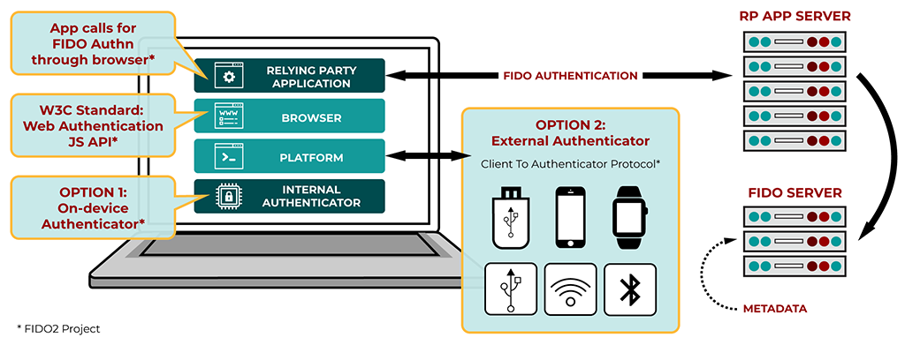
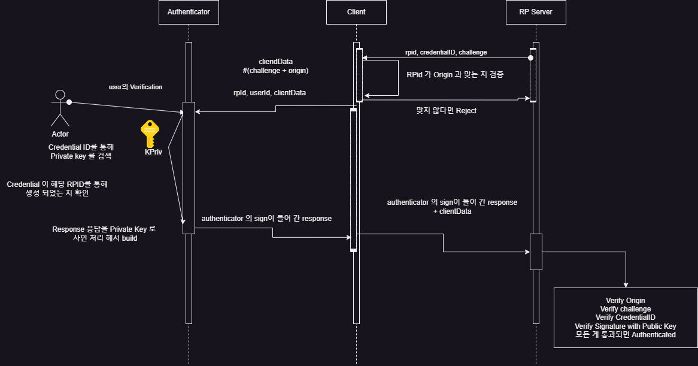
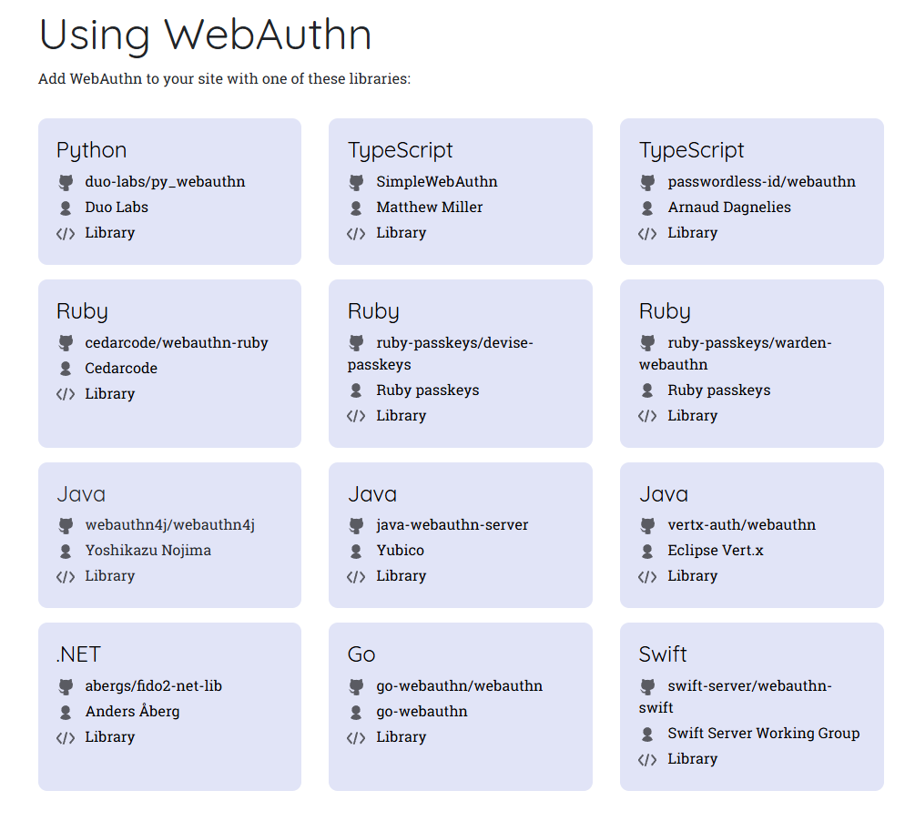

<p>
   
</p>

# Intro

생체인증 기능을 써보셨을거에요. IOS라면 face id, Android 라면 지문인증 등 생체 정보를 통해 신원을 인증하는 기능이죠. 은행 또는 송금앱 등 다양한 금융 애플리케이션에서 이런 기능들을 제공하고 있어요. 

왜 이런 기능들이 제공될까요? 패스워드 인증만으로는 리스크가 존재하기 때문입니다. 패스워드 인증은 휴먼에러가 발생하기 쉽습니다. 우리가 패스워드를 잊을 수도 있고, 패스워드가 너무 쉬우면 해킹을 통해 탈취 당할 수도 있죠. 생체인증은 이런 면에서 이점을 가집니다. 패스워드에 의존하지 않을 수 있죠. 

이번 포스팅에서는 웹 환경에서 생체인증을 구현하는 방법인 WebAuthn 에 대해 알아 보겠습니다. 

# Web Authentication API (WebAuthn)
WebAuthn 에 대해 설명하기 전에 FIDO 에 대해 알아봐야 합니다. 

FIDO(Fast Identity Online) 은 국제 인증 표준입니다. 아이디 + 비밀번호 방식 대신 홍체, 얼굴인식 등 다양한 생체 인식 기반의 인증 시스템입니다. 

FIDO 는 크게 세 가지 방식으로 분류됩니다. 

- UAF
  - 지문, 얼굴 등 사용자 생체정보를 인증하는 모바일 중심의 인증 방식입니다.

- CTAP1 (U2F, Universal 2nd Factor)
  - ID / PW 를 통해 우선 로그인을 합니다.
  - FIDO 인증 시험을 통과한 보안 키를 USB, 블루투스, NFC 등의 외부 기기와 연결해 PIN을 입력하는 추가 인증을 진행합니다.

- CTAP2
  - FIDO 보안 키, 생체 인식 장치 등을 통해 웹 브라우저, OS에서 패스워드 없는 인증을 하는 데 사용합니다. 
  - CTAP1와 유사하지만 PW가 따로 없고 생체인증으로 대체할 수 있습니다. 
  - CTAP2 부터는 WebAuthn 과 통합해서 브라우저, OS 등에서 패스워드를 대체할 수 있습니다. 

WebAuthn 은 2019년 3월 W3C 웹 표준으로 공식 인정받은 웹 기반 API 입니다. 웹 사이트에 FIDO 기반 인증을 추가할 수 있도록 도와주죠. 웹 서비스는 이 기능을 통해 생체인증, 또는 FIDO 보안 키 인증을 제공받을 수 있습니다. 

WebAuthn 은 다양한 브라우저 (Chrome, Firefox, Edge, Safari), 및 OS (Windows 10, Android) 에서 사용 가능합니다. IOS 또한 *passkeys* 기능을 통해 사용할 수 있습니다.

# 패스워드에 비해 개선된 점
가장 결정적으로 유저 입장에서 편리하다는 것 아닐까 싶어요. 

패스워드를 잃어버린 적 많으시죠? 전 정말 많이 까먹고 잃어버립니다. WebAuthn 을 사용하면, 생체인증 등으로 패스워드를 대체할 수 있어요. 

또한 패스워드는 여러 위험성을 가집니다. 작정하고 브루트포스 공격을 하면 웹 서비스에 따라선 유출 될 수 있겠죠 (물론 횟수 제한 기능을 구현 해 두어야겠지요?). 또한 패스워드가 심플하다면 유출되기 쉽겠죠. 

WebAuthn 은 이런 문제점에서 자유롭습니다. 타인이 부정 로그인을 시도하는 게 구조적으로 쉽지 않죠. 

# 동작과정
<p>
  
</p>

WebAuthn 은 FIDO2 사양을 지원합니다. FIDO2 에서는 두가지 Option 의 Authenticatior 를 사용할 수 있습니다. On Device 혹은 External Authenticator 죠. 애플리케이션에서 FIDO Authentication 요청을 RP (Replying Party : 앱을 실행중이고, FIDO 인증을 지원하는 서버) 서버에 요청하고 응답하는 구조입니다. 

좀 더 자세히 FIDO2 인증이 돌아가는 과정을 살펴볼까요?

<p>
  
</p>

FIDO2 인증을 구현하려면 먼저 인증 정보를 등록해야겠죠. 위의 Workflow 를 정리하면 아래와 같습니다. 

- RP Server 에서 등록 된 Client 와 통신하여 CredentialID 생성 요청을 보냅니다. 
  - 이 요청 정보엔 다음 정보가 포함됩니다.
  - RP ID : 서비스 도메인 이름(e.g., example.com).
  - Challenge : 고유하고 임의의 값(보안성을 위해 매번 새로 생성).
  - UserInfo : 사용자 ID 및 이름.
  - Options
    - Authenticator Selection 사용 가능한 인증 장치의 옵션(예: 생체인식 또는 PIN 지원 여부)
    - Public Key Credential Parameters 지원되는 알고리즘(e.g., RSA, ECC)
  - 이 과정에서 RPId 가 Origin 과 맞는 지 확인합니다.
- Authenticator (WebAuthn 이라면 브라우저겠지요?) 에 RPID, UserId, Options, ClientData 등을 전달해서 Credential 생성 요청을 보냅니다. 
- 유저 인증 정보를 확인 합니다 (생체인증 등록 시 얼굴 혹은 지문 스캔 등)
- 이후 KeyPair 를 생성하고, 그 중 Private Key를 RPId, CredentialID와 함께 Authenticator 에 저장합니다. 
- Private Key를 통해 서명 된 Attestation Object 를 생성합니다. RP 서버에는 Public Key와 함께 전달합니다.
- RP 서버는 해당 정보를 전달받은 후 검증합니다. (Origin, Challenge, Signature 등)
- 검증이 성공하면 생성 된 공개 키를 사용자 계정과 연계해서 저장합니다. 아마 관련 된 테이블을 따로 두거나 해야겠죠. 

<p>
  
</p>

인증 정보를 등록했으면 한번 인증을 해 봐야겠죠? 인증 과정은 아래와 같이 이뤄집니다. 

- Client 가 RP Server 에 인증 요청을 보내면 아래의 정보를 리턴합니다. 
  - RPID, CredentialID, Challenge
- Client는 Authenticator 에 해당 정보를 토대로 RPID, UserId, clientData 로 구성 된 요청을 보냅니다. 
- Authenticator 내부의 저장소에서 CredentialID를 기준으로 PrivateKey 를 검색 해 옵니다. 
- CreentialID가 해당 RPID 를 통해 생성 되었는 지 확인한 후, 응답 정보를 Private Key로 서명하여 전달합니다.  
  - ```authenticatorData = RP_ID_HASH + FLAGS + SIGNATURE_COUNTER + [OPTIONAL_DATA]``` 
  - RP_ID_HASH : SHA-256 해시값, RP ID 와 일치하는 지 확인
  - FLAGS : 인증 과정의 상태를 나타내는 비트 필드
  - Bit 0 : User Presence (UP) 사용자가 장치에 직접 액션을 취했는지 여부
  - Bit 2 : User Verified (UV) 사용자가 본인 확인을 수행했는지 여부
  - SIGNATURE_COUNTER : 인증기의 서명 카운터. 이전 요청보다 증가했는지 확인(재사용 공격 방지)
  - ATTESTATION CREDENTIAL DATA (Optional) : 등록 중 인증기에서 제공한 데이터

전달 된 데이터를 바탕으로 RP Server는 검증을 진행합니다. 

# 구현 하는 방법

<p>
  
</p>

[webauthn 공식 홈페이지](https://webauthn.io/)

우리가 사용하는 언어들 마다 WebAuthn 을 쉽게 구현할 수 있도록 제공되는 라이브러리가 존재합니다. 

Java에서는 대표적으로 WebAuthn4j 가 있습니다. 저희 팀도 WebAuthn4j 를 사용했죠. 

물론 직접 구현하셔도 좋습니다. 좋은 공부가 될거에요 🙂!

아마 Java 유저들이 많은 관계로 이번 포스팅에서는 WebAuthn4j 를 기준으로 설명 해볼까 합니다. 

# WebAuthn4j

<p>
  
</p>

WebAuthn4j 는 Java 애플리케이션에서 WebAuthn 인증을 구현할 수 있도록 도와주는 라이브러리입니다. 

Spring Security 와 연동도 가능하죠. 실제로 Spring Security 6.4 부터는 passkey 를 지원합니다. 

```kotlin
@Bean
open fun filterChain(http: HttpSecurity): SecurityFilterChain {
	http {
		webAuthn {
			rpName = "Spring Security Relying Party"
			rpId = "example.com"
			allowedOrigins = setOf("https://example.com")
		}
	}
}

@Bean
open fun userDetailsService(): UserDetailsService {
	val userDetails = User.withDefaultPasswordEncoder()
		.username("user")
		.password("password")
		.roles("USER")
		.build()
	return InMemoryUserDetailsManager(userDetails)
}
```

Webauthn4j 커뮤니티에서 관리중인 WebAuthn4j Spring Security 라는 프로젝트도 존재하는데, Spring Security에 WebAuthn 지원 기능을 확장시킨 형태입니다. 

처음에 공부가 부족했던 상황에서는 WebAuthn4j Spring Security 를 열심히 뜯어고치다가, WebAuthn4j Core 만 가지고 기능을 구현 했었죠.  

WebAuthn4j Spring Security 는 기존의 Spring Security 에 에드온을 추가 한 만큼 기존에 사용중인 Spring Security 셋업에 영향을 끼칠 수 있기에 사용하지 않았습니다. 

## 예제 프로젝트

간단하게 WebAuthn4j 를 통해 Spring Boot 와 React 를 결합한 인증 앱을 개발 해 보겠습니다. 

### Backend
```kotlin
dependencies {
    implementation("org.springframework.boot:spring-boot-starter-web")
    implementation("org.springframework.boot:spring-boot-starter-security")
    implementation("com.fasterxml.jackson.module:jackson-module-kotlin")
    implementation("com.webauthn4j:webauthn4j-core:0.17.0.RELEASE") // 최신 버전 확인 필요
}
```
먼저 WebAuthn4j 를 우리의 Spring Boot 프로젝트에 셋업 합니다. 

```kotlin
@Configuration
@EnableWebSecurity
class SecurityConfig : WebSecurityConfigurerAdapter() {

    override fun configure(http: HttpSecurity) {
        http.csrf().disable()
            .authorizeRequests()
            .antMatchers("/api/webauthn/**").permitAll()
            .anyRequest().authenticated()
    }
}
```
다음으로 Spring Security filterChain 셋업을 합니다. WebAuthn 요청 외에 모든 요청들에 대해 Authenticated 옵션을 줍니다. 

```kotlin
@Configuration
class WebAuthnConfig {

    @Bean
    fun relyingPartyIdentity(): RelyingPartyIdentity {
        return RelyingPartyIdentity.builder()
            .id("localhost")
            .name("My WebAuthn App")
            .build()
    }
}
```
이번 예시에서는 API 서버가 RP 서버 역할 또한 할 예정이므로 `WebAuthnConfig` 또한 작성 합니다. 

```kotlin
import com.webauthn4j.authenticator.Authenticator
import com.webauthn4j.data.*
import com.webauthn4j.data.attestation.authenticator.AuthenticatorAttachment
import com.webauthn4j.data.attestation.authenticator.AuthenticatorSelectionCriteria
import com.webauthn4j.data.client.Origin
import com.webauthn4j.data.client.challenge.Challenge
import com.webauthn4j.data.client.challenge.DefaultChallenge
import com.webauthn4j.validator.WebAuthnRegistrationContext
import com.webauthn4j.WebAuthnManager
import org.springframework.web.bind.annotation.*
import java.security.SecureRandom
import java.util.*

@RestController
class WebAuthnController {

    private val webAuthnManager = WebAuthnManager.createNonStrictWebAuthnManager()
    private val users = mutableMapOf<String, UserEntity>()
    private val challenges = mutableMapOf<String, Challenge>()

    @PostMapping("/api/webauthn/register/options")
    fun startRegistration(@RequestBody username: String): PublicKeyCredentialCreationOptions {
      //Do Something
    }

    @PostMapping("/api/webauthn/register/finish")
    fun finishRegistration(@RequestBody request: AttestationResponseRequest): String {
      //Do Something
    }

   @PostMapping("/api/webauthn/login/options")
    fun startLogin(@RequestBody username: String): PublicKeyCredentialRequestOptions {
      //Do Something
    }

    @PostMapping("/api/webauthn/login/finish")
    fun finishLogin(@RequestBody request: AssertionResponseRequest): String {
      //Do Something
    }

    private fun generateChallenge(): ByteArray {
        return ByteArray(32).apply { SecureRandom().nextBytes(this) }
    }
}

data class AttestationResponseRequest(
    val username: String,
    val id: ByteArray,
    val clientDataJSON: ByteArray,
    val attestationObject: ByteArray,
    val clientExtensionsJSON: String?
)

data class UserEntity(
    val username: String,
    val credentials: MutableList<Authenticator> = mutableListOf()
) {
    fun toUserIdentity(): UserIdentity {
        return UserIdentity.builder()
            .name(username)
            .id(UUID.nameUUIDFromBytes(username.toByteArray()).toString().toByteArray())
            .displayName(username)
            .build()
    }
}
```
다음으로 WebAuthn 사용자 등록 절차를 처리하는 Controller 를 작성합니다.  
여기서 중요한 필드 값들을 한번 짚고 가겠습니다. 

```kotlin
private val webAuthnManager = WebAuthnManager.createNonStrictWebAuthnManager()
```
`WebAuthnManager` 는 WebAuthn 요청을 검증하는 핵심 클래스입니다. 현재는 테스트용이므로 NonStrict 모드를 사용합니다. 

```kotlin
private val users = mutableMapOf<String, UserEntity>()
private val challenges = mutableMapOf<String, Challenge>()
```
현재 따로 DB를 설정하지 않아서 해시맵을 통해 유저 정보와 Challenge 정보를 저장합니다. 실제로는 DB를 사용하시는 것을 권장 드립니다. 

```kotlin
@PostMapping("/api/webauthn/register/options")
fun startRegistration(@RequestBody username: String): PublicKeyCredentialCreationOptions {
    val challenge = DefaultChallenge()
    challenges[username] = challenge

    val userEntity = UserEntity(username)
    users[username] = userEntity

    val options = PublicKeyCredentialCreationOptions(
        rp = RelyingPartyIdentity.builder().id("localhost").name("My WebAuthn App").build(),
        user = userEntity.toUserIdentity(),
        challenge = challenge,
        pubKeyCredParams = listOf(PublicKeyCredentialParameters("public-key", COSEAlgorithmIdentifier.ES256)),
        authenticatorSelection = AuthenticatorSelectionCriteria(AuthenticatorAttachment.CROSS_PLATFORM, false, null),
        timeout = 60000L,
        attestation = AttestationConveyancePreference.DIRECT
    )
    
    return options
}
```
startRegistration 메소드는 사용자가 등록 요청을 보낼 때 호출 되는 메소드입니다. 

등록 요청이 들어왔을 때 사용자 별로 새로운 Challenge 를 생성하고 저장합니다.  
그 후 새로운 사용자 객체를 생성하고 사용자 목록에 추가합니다.  
마지막으로 `PublicKeyCredentialCreationOptions` 를 통해 option 정보를 구성합니다. 

- Relying Party 정보 설정 (ID, Name)
- 사용자 정보 설정 (userEntity 객체)
- pubKeyCredParams: 사용할 알고리즘 지정 (ES256 사용)
- authenticatorSelection: 인증기 선택 기준
- attestation: 인증 장치의 신뢰를 확인할 때 DIRECT 모드를 사용

```kotlin
@PostMapping("/api/webauthn/register/finish")
fun finishRegistration(@RequestBody request: AttestationResponseRequest): String {
    val challenge = challenges[request.username] ?: throw IllegalArgumentException("Challenge not found")

    val context = WebAuthnRegistrationContext(
        credentialId = request.id,
        clientDataJSON = request.clientDataJSON,
        attestationObject = request.attestationObject,
        clientExtensionsJSON = request.clientExtensionsJSON,
        challenge = challenge,
        origin = Origin("http://localhost:3000")
    )

    val response = webAuthnManager.validate(context)

    val userEntity = users[request.username] ?: throw IllegalArgumentException("User not found")
    userEntity.credentials.add(response.attestedCredentialData)

    return "Registration completed"
}
```
finishRegistration 은 등록을 완료하기 위해 호출되는 메소드입니다.  
저장된 Challenge 와 요청에서 전달 된 Challenge 가 일치하는 지 확인합니다. 
그 다음 WebAuthnRegistraionContext 에 검증 할 데이터들을 담습니다.  
마지막으로 webAuthnManager 를 통해 검증을 수행한 후, 검증 된 인증 정보를 사용자 데이터베이스에 저장 함으로써 마무리 합니다. 

중요한 포인트를 다시 집어 보겠습니다. 
- WebAuthnManager 클래스는 등록 요청 검증 을 수행합니다.
- AttestationResponseRequest 클래스는 프론트엔드로부터 전달받은 데이터를 담기 위한 데이터 클래스입니다.
- challenge 값은 요청마다 새로 생성하여 저장하고 비교하는 방식으로 검증합니다.

```kotlin
@PostMapping("/login/options")
fun startLogin(@RequestBody username: String): PublicKeyCredentialRequestOptions {
    val userEntity = users[username] ?: throw IllegalArgumentException("User not found")

    val challenge = DefaultChallenge()
    challenges[username] = challenge

    val allowCredentials = userEntity.credentials.map { credential ->
        PublicKeyCredentialDescriptor(
            PublicKeyCredentialType.PUBLIC_KEY,
            credential.credentialId,
            null
        )
    }

    return PublicKeyCredentialRequestOptions(
        challenge = challenge,
        rpId = "localhost",
        allowCredentials = allowCredentials,
        timeout = 60000L,
        userVerification = UserVerificationRequirement.PREFERRED
    )
}
```
이제 로그인을 해 봐야죠? startLogin 메소드에서는 로그인 명령을 수행합니다.  
요청 받은 유저 정보를 메모리에서 찾습니다. 그 후 challenge 를 생성합니다. 
다음으로 사용자가 등록한 인증기 목록을 추출합니다. 이 과정에서 PublicKeyCredentialDescriptor 를 사용해서 각 인증기의 ID (Credential ID) 를 포함 시킵니다. 

마지막으로 클라이언트가 사용 할 인증 옵션 PublicKeyCredentialRequestOptions 를 생성합니다. 
주요 옵션은 아래와 같습니다. 

- challenge: 클라이언트가 서명할 데이터 (랜덤으로 생성됨)
- rpId: Relying Party의 도메인 (이 경우 localhost)
- allowCredentials: 사용자가 등록한 인증기 목록 (허용된 인증기들)
- timeout: 인증 과정의 최대 허용 시간 (밀리초)
- userVerification: 사용자가 인증 과정에서 생체 인증 또는 PIN 입력을 요구할지 설정 (PREFERRED 로 설정)

```kotlin
@PostMapping("/login/finish")
fun finishLogin(@RequestBody request: AssertionResponseRequest): String {
    val challenge = challenges[request.username] ?: throw IllegalArgumentException("Challenge not found")
    val userEntity = users[request.username] ?: throw IllegalArgumentException("User not found")
    
    val authenticator = userEntity.credentials.find { it.credentialId.contentEquals(request.id) }
        ?: throw IllegalArgumentException("Authenticator not found")

    val context = WebAuthnAuthenticationContext(
        credentialId = request.id,
        clientDataJSON = request.clientDataJSON,
        authenticatorData = request.authenticatorData,
        signature = request.signature,
        clientExtensionsJSON = request.clientExtensionsJSON,
        challenge = challenge,
        origin = Origin("http://localhost:3000"),
        authenticator = authenticator
    )

    webAuthnManager.validate(context)

    return "Login successful"
}
```
마지막으로 로그인 검증입니다. 

사용자가 로그인 요청을 보내면서 생성했던 Challenge 값을 가져옵니다. 만약 해당 Challenge 가 없거나 만료된 경우 예외가 발생합니다. 

다음으로 사용자가 등록한 인증기 (Authenticator) 를 검색합니다. 인증기 ID (request.id) 가 사용자의 인증기 목록에 없으면 예외를 발생시킵니다.

다음으로 인증 요청을 검증하기 위해 필요한 데이터를 포함하는 WebAuthnAuthenticationContext 를 생성합니다. Origin 은 클라이언트 요청의 출처를 의미하며, http://localhost:3000 으로 설정 합니다. 

WebAuthnManager 를 통해 검증을 수행하고 성공하면 인증이 완료됩니다. 

### Frontend
React 에서 @simplewebauthn/browser 라이브러리를 활용해서 WebAuthn 인증을 구현 해 보겠습니다. 설명 편의 상 예제 코드는 Typescript 를 사용합니다. 

```shell
npm install @simplewebauthn/browser
```

```jsx
import React, { useState } from 'react';
import { startRegistration, RegistrationResponseJSON } from '@simplewebauthn/browser';
import axios from 'axios';

interface PublicKeyCredentialCreationOptionsJSON {
  challenge: string;
  rp: {
    name: string;
    id: string;
  };
  user: {
    id: string;
    name: string;
    displayName: string;
  };
  pubKeyCredParams: Array<{ type: string; alg: number }>;
  authenticatorSelection?: {
    authenticatorAttachment?: string;
    requireResidentKey?: boolean;
    userVerification?: string;
  };
  timeout?: number;
  attestation?: string;
}

const App: React.FC = () => {
  const [username, setUsername] = useState<string>('');

  const handleRegister = async () => {
    try {
      // 1. 서버로부터 PublicKeyCredentialCreationOptions 가져오기
      const optionsResponse = await axios.post<PublicKeyCredentialCreationOptionsJSON>(
        '/api/webauthn/register/options', 
        { username }
      );

      const options = optionsResponse.data;

      // 2. 인증기를 호출하여 등록 데이터 생성
      const attestationResponse: RegistrationResponseJSON = await startRegistration(options);

      // 3. 서버로 등록 데이터를 보내서 검증 및 저장 요청
      const result = await axios.post('/api/webauthn/register/finish', {
        username,
        ...attestationResponse,
      });

      alert("Registration completed: " + result.data);
    } catch (error) {
      console.error(error);
      alert("Registration failed");
    }
  };

  return (
    <div>
      <input
        type="text"
        value={username}
        onChange={e => setUsername(e.target.value)}
        placeholder="Enter username"
      />
      <button onClick={handleRegister}>Register</button>
    </div>
  );
};

export default App;
```
먼저 서버에서 반환되는 옵션의 형태를 interface 로 정의합니다. 
서버로 부터 `/api/webauthn/register/options/` 요청을 보냅니다. 그 후 WebAuthn 인증기를 호출해서 등록을 수행하는데, `startRegistration` 함수는 `RegistrationResponseJSON` 타입(라이브러리 제공)의 데이터를 반환합니다. 

마지막으로 인증 정보를 서버로 보내 검증을 요청합니다. 서버에서 해당 데이터를 검증하고 사용자 정보를 저장합니다. 

```jsx
import React, { useState } from 'react';
import { startRegistration, startAuthentication, AuthenticationResponseJSON } from '@simplewebauthn/browser';
import axios from 'axios';

interface PublicKeyCredentialRequestOptionsJSON {
  challenge: string;
  rpId: string;
  allowCredentials?: Array<{
    id: string;
    type: string;
    transports?: string[];
  }>;
  userVerification?: 'required' | 'preferred' | 'discouraged';
  timeout?: number;
}

const App: React.FC = () => {
  const [username, setUsername] = useState<string>('');

  const handleLogin = async () => {
    try {
      // 1. 서버로부터 PublicKeyCredentialRequestOptions 가져오기
      const optionsResponse = await axios.post<PublicKeyCredentialRequestOptionsJSON>(
        '/api/webauthn/login/options',
        { username }
      );
      const options = optionsResponse.data;

      // 2. 인증기를 사용하여 인증 데이터 생성
      const assertionResponse: AuthenticationResponseJSON = await startAuthentication(options);

      // 3. 서버로 인증 데이터를 보내서 검증 요청
      const result = await axios.post('/api/webauthn/login/finish', {
        username,
        ...assertionResponse,
      });

      alert("Login successful: " + result.data);
    } catch (error) {
      console.error(error);
      alert("Login failed");
    }
  };

  return (
    <div>
      <input
        type="text"
        value={username}
        onChange={e => setUsername(e.target.value)}
        placeholder="Enter username"
      />
      <button onClick={handleLogin}>Login</button>
    </div>
  );
};

export default App;
```
PublicKeyCredentialRequestOptionsJSON 은 서버에서 제공하는 로그인 옵션의 타입 정의입니다. 
- allowCredentials: 사용자가 등록한 인증기의 정보 리스트.
- challenge: 무작위로 생성된 바이트 배열을 base64url로 인코딩한 값.
- rpId: Relying Party ID (예: localhost).
- userVerification: 사용자 검증 요구 수준 (preferred, required, discouraged)

사용자가 입력 한 username 을 서버로 보내고 서버는 사용자의 등록된 인증기를 기반으로 로그인 옵션을 반환합니다.

브라우저에서 인증기를 호출하여 인증을 진행합니다. 인증기가 성공하면 `AuthenticationResponseJSON` 타입의 데이터를 반환합니다. 

다음으로 인증 결과를 서버로 보내 검증을 요청합니다. 서버에서 이 데이터를 검증하여 사용자의 인증 성공 여부를 확인합니다. 

# Outro
이번 포스팅에서는 FIDO, WebAuthn 에 대해 최대한 풀어서 정리 해 보았습니다. 

이해가 잘 되셨다면 다행입니다. 추후 웹 애플리케이션에서 생체인증 등을 구현할 때 WebAuthn 을 활용해보시는 게 어떨까요?

# Reference

[FIDO](https://fido.kica.co.kr/)  
[FIDO2: 웹 인증(WebAuthn) - FIDO Alliance](https://fidoalliance.org/fido2-2/fido2-web-authentication-webauthn/?lang=ko)  
[Web Authentication: An API for accessing Public Key Credentials - Level 2](https://www.w3.org/TR/webauthn/)   
[A demonstration of the WebAuthn specification](https://webauthn.io/)