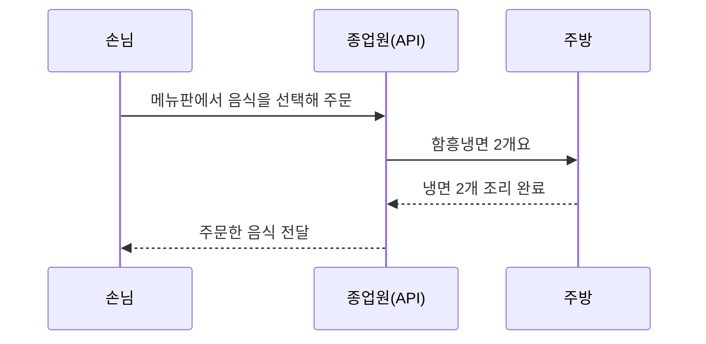
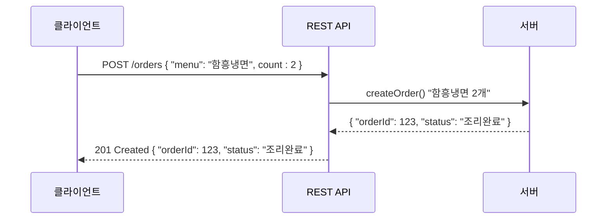
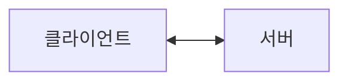
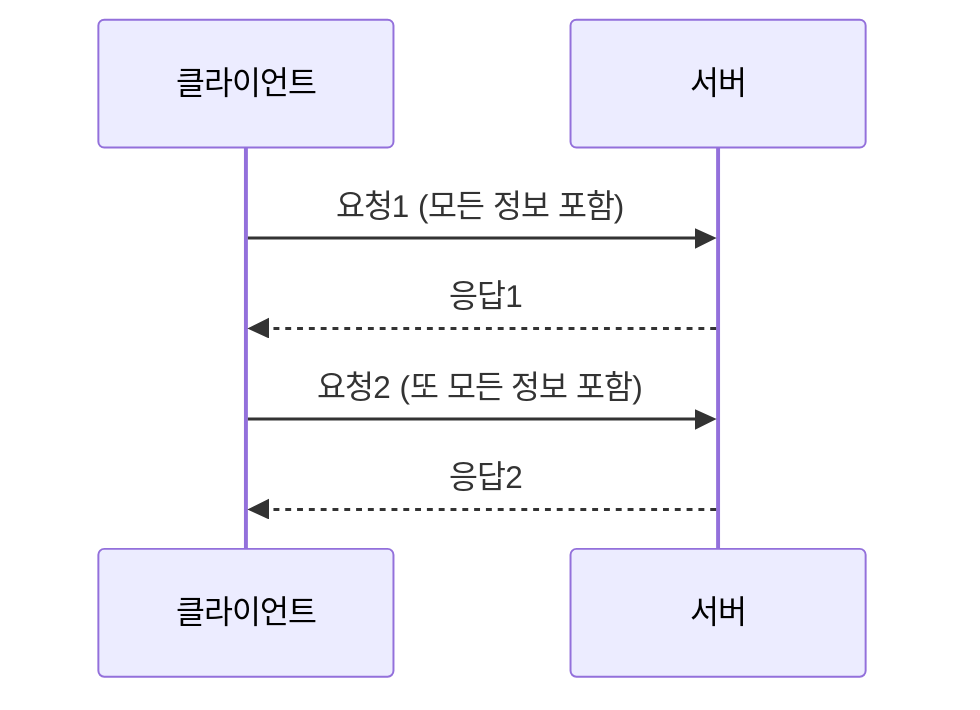
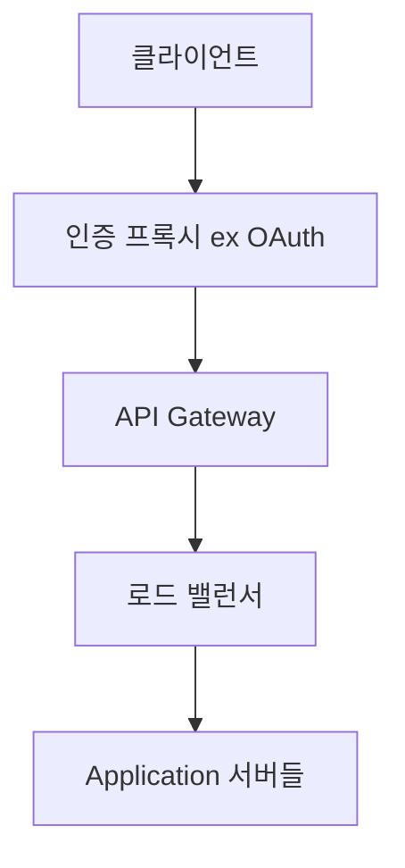

chanmi-2025-04
# REST API란?

안녕하세요,
오늘은 IT업계에서 가장 흔한 단어 중 하나인 REST API에 대해 이야기해보려고 합니다.  

REST API라는 용어를 자주 사용하지만 정작 그게 뭐냐고 물어보면 대답하기가 참 쉽지 않습니다. 질문자가 기획자인지, 마케터인지, 개발자인지, QA인지, 인프라엔지니어인지, 아니면 IT를 처음접하는 사람인지에 따라 대답이 달라질 수 있기 때문입니다.

그래도 포괄할 수 있는 형태의 문장을 고민했더니 이런 문장이 나왔습니다.

> REST API는 web세계에서의 약속으로 필요한 것을 요청하고, 필요한 것을 받는 과정입니다. REST가 일정한 형식을 정해둔 약속이고, API가 그 규칙에 따라 사용하는 방법입니다.

문장을 읽어도 물음표가 남아있으실겁니다. 끝까지 읽으신뒤엔 나만의 정의가 생기실 수 있게 열심히 노력해보겠습니다!

##  REST API는 냉면 주문이다(?)

REST API가 `web 세계의 약속을 통해 원하는 걸 얻는 과정`이라고 했는데, 아무래도 이 말로는 부족한 느낌입니다. 숨겨진 개념이 많아보이실 겁니다. 예시를 하나 들어보겠습니다.

냉면가게에서 음식을 주문하는 상황입니다. 

손님(클라이언트)은 메뉴판(API 문서)을 보고 원하는 음식을 종업원(API)에게 요청합니다. 주방(서버)은 요청받은 음식을 만들어 종업원을 통해 손님에게 전달합니다 이때, 손님과 종업원, 그리고 주방 사이에는 '주문'이라는 약속이 존재합니다. "이 메뉴를 주세요"라고 말하면(요청 형식), 해당 음식이 나오는(응답 형식) 암묵적인 약속입니다.

web 세상도 똑같습니다.  

web 프로그램에서 클라이언트(웹 브라우저나 모바일 앱)가 서버에 있는 자원(데이터, 기능 등)을 요청하고, 서버는 그 요청에 응답하는 방식을 규정한 '약속' 또는 '설계 지침'입니다.  
이 약속을 따르는 API를 REST API라고 부릅니다.

여기서 REST는 'Representational State Transfer'의 약자입니다. **자원(Resource)의 상태(State)를 표현(Representation)하여 주고받는다**는 의미입니다.

##  REST API의 요소들

예시에서 등장한 키워드를  설명해보겠습니다. 

  - **자원 (Resource)**:  API를 통해 얻고 싶은 모든 것을 말합니다. 사용자 정보, 주문 목록 모두 자원의 일종입니다. 이 자원들은 고유한 주소(URI)으로 식별됩니다.
  - **표현 (Representation)**: 자원의 현재 상태를 나타내는 방식입니다. 서버는 자원을 JSON, XML, 텍스트 등 다양한 형태로 표현해서 클라이언트에게 전달할 수 있습니다.
  - **행위**: 자원에 대해 하고 싶은 동작을 의미합니다. HTTP 메서드(GET, POST, PUT, DELETE 등)를 사용해서 이 행위를 표현합니다.

그러면 이제 요소 기준으로 REST API를 또 설명할 수 있습니다.

REST API는  "어떤 자원(URI)에 대해 어떤 행위(HTTP Method)를 할 것인지"를 명확하게 요청하고, 서버는 그 결과를 "어떤 형태(Representation)로 보여줄 것인지"를 약속하는 방식이기도 합니다. 

냉면주문 예시를 일반적인 REST API로 바꿔보면 다음과 같습니다.

  - `GET /orders/123`: " 주문번호 123을 가진 메뉴의 조리상태 정보를 '조회'해줘"
  -  `POST /orders`: "새로운 주문을 '등록'해줘" (등록할 주문 정보는 요청 본문에 담아서)

굉징히 간결한 표현이 되었습니다.  직관적인 주소(URI)와 표준 HTTP 메서드의 조합을 통한 표현, 어떻게 느껴지시나요?

## REST는  철학이다

REST는 단순히 기술 명세가 아니라, 웹의 장점을 최대한 활용하여 잘 동작하는 시스템을 만들기 위한 일종의 '철학' 또는 '설계 원칙'에 가깝습니다. 그래서 다양한 의견과 사례가 존재합니다.

REST라는 개념은 로이 필딩(Roy Fielding)이라는 분의 [2000년 ICU 박사 논문](https://ics.uci.edu/~fielding/pubs/dissertation/rest_arch_style.htm)에서 처음 제시했는데, 웹의 기존 기술과 HTTP 프로토콜을 그대로 활용하면서 몇 가지 제약을 추가하면 시스템 전체의 이점을 극대화할 수 있다는 것이 요지입니다. 이중 중요한 원칙 위주로 정리해보겠습니다.

###  클라이언트-서버 구조  

UI/UX를 담당하는 클라이언트와 데이터를 저장하고 처리하는 서버를 명확하게 분리하는 구조입니다.

각각의 역할이 명확해지므로 독립적으로 개발하고 확장하기 편하다는 장점이 있습니다.  
웹 프론트만 있던 시스템에 서버 변경 없이 새로운 모바일 앱 클라이언트를 추가하는 사례를 쉽게 볼 수 있습니다.

### 무상태성 (Stateless)

각 요청은 서버가 작업을 처리하는 데 필요한 모든 정보를 담고 있어야 합니다. 서버는 이전 요청에 대한 어떠한 정보(세션, 상태 정보)도 저장하거나 기억하지 않습니다. 이전 요청과의 관계없이 독립적으로 처리됩니다.

서버의 부담을 줄이고, 요청마다 독립적으로 처리될 수 있게됩니다. 확장성이 향상됩니다. 어느 서버로 요청이 가든 동일하게 처리될 수 있어 로드 밸런싱에도 유리합니다.

### 계층적인 시스템 (Layered System)

클라이언트는 바로 연결된 서버와만 통신하고, 그 서버가 최종 서버인지, 중간 프록시 서버인지 알 필요가 없습니다. 시스템은 여러 계층(로드 밸런서, 보안 계층 등)으로 구성될 수 있습니다.

시스템의 복잡도를 낮추고, 보안이나 로드 밸런싱 같은 기능을 각 레이어에 추가하기 쉬워서 확장성이 높아집니다. 

### 인터페이스 일관성 (Uniform Interface)

지금까지는 서버 구조도 같은 이야길 했습니다. 인터페이스 일관성도 REST의 핵심 원칙 중 하나입니다. 시스템 아키텍처를 단순화하고 거기서부터 각자 시스템을 발전시킬 수 있도록 하는 원칙입니다. 인터페이스 일관성을 위한 추가적인 제약 조건을 설명하겠습니다. 

이쯤되면 하품 참으시거나 탈주하신 분도 계실거 같은데요.. 여기는 진짜 중요합니다. REST 철학 개론 시험에 나오니 별표세개 치셔야합니다.

  - **자원의 식별 (Identification of Resources)**: 요청에 포함된 URI를 통해 자원을 명확하게 식별해야 합니다. 예를 들어 `/orders`, `/orders/123` 처럼 명사를 사용하고 일관된 네이밍 형태를 유지해야합니다.
  - **표현을 통한 자원 조작 (Manipulation of Resources through Representations)**: 클라이언트는 서버로부터 받은 자원의 표현을 통해 해당 자원의 상태를 변경하거나 삭제할 수 있어야 합니다. 이때, 서버는 클라이언트에게 자원을 조작할 수 있을만큼의 충분한 정보를 제공해야 합니다.
  - **자기 서술적 메시지 (Self-descriptive Messages)**: 요청은 서버가 그 요청을 이해하고 처리하는 데 필요한 모든 정보를 담고 있어야 합니다. 마찬가지로 응답역시 클라이언트가 그 응답을 이해하는 데 필요한 모든 정보를 담고 있어야 합니다. `Content-Type` 헤더를 통해 메시지 본문의 데이터 유형(JSON)을 명시하는 것이 대표적인 예입니다.
  - **애플리케이션 상태의 엔진으로서 하이퍼미디어 (Hypermedia As The Engine Of Application State, HATEOAS)**: 클라이언트는 응답에 포함된 하이퍼미디어 링크를 통해 다음 행동이나 관련된 자원으로 전이될 수 있어야 합니다. 이를 통해 클라이언트는 API의 전체 구조를 미리 알 필요 없이 동적으로 상호작용할 수 있습니다. (조금 어려운 개념일 수 있지만, 이런 게 있다는 정도로 알아두시면 좋습니다.)

## 그래서 REST API를 왜 사용할까요?

이러한 원칙들을 열심히 잘 지켜서 설계된 API를 'RESTful API'라고 부르기도 합니다. 위에 언급한 특성엔 없지만 `Caching`을 핵심기능으로 고려한다는 차이점도 있습니다.  REST API를 사용하면 다음과 같은 장점들을 얻을 수 있습니다:

  - **쉬운 이해**: HTTP 표준 메서드와 직관적인 URI를 사용하므로 API의 의도를 파악하기 쉽습니다.
  * **플랫폼 독립성 및 상호 운용성**: 가장 보편적인 HTTP 기반이니 특정 프로그래밍 언어나 플랫폼에 종속되지 않고 다양한 클라이언트(웹, 모바일, 데스크톱 앱 등)와 서버가 통신할 수 있습니다.
  * **확장성과 유연성**: 무상태성과 계층화 구조 덕분에 시스템을 확장하고 변경하기 용이합니다.
  * **성능 향상**: 캐싱, 로드밸런싱 등의 기능을 활용해 응답 시간을 줄이고 서버 부하를 낮출 수 있습니다.
  * **널리 사용되는 표준**: 웹 표준을 따르기 때문에 많은 개발자와 시스템에서 이미 익숙하게 사용하고 있습니다.

사실 현대 사회의 시스템은 RESTful하더라도 시스템이 복잡하기에 쉽다고 말할 수 만은 없습니다. 

좋은 API 문서가 필요한 이유이기도 하고요, REST API 가 모든 상황의 솔루션도 아닙니다. 그래서 GraphQL이나 gRPC가 등장한것 같습니다. 

##  마치며

지금까지 REST API의 기본적인 개념과 철학, 그리고 주요 원칙들에 대해 살펴보았습니다. 

처음에는 용어들이 낯설 수 있지만, 결국 REST는 **"웹에서 정보를 주고받는 가장 자연스럽고 효율적인 약속은 무엇일까?"** 라는 고민에서 출발했다고 생각하면 좋은 시작점이 될 수 있을것 같습니다.

모든 '약속'이 그렇듯, REST API도 본질을 이해하고 상황에 맞게 잘 활용하는 것이 중요하다고 생각합니다. 
이에 대한 용례도 굉장히 많은데요, 여유가 된다면 REST API 2탄으로 써보겠습니다.  

### References

- [AppMaster - REST API의 6가지 규칙](https://appmaster.io/ko/blog/nameoji-apiyi-6gaji-gyucig)
- [Apidog - REST API란? 만드는 방법](https://apidog.com/kr/blog/what-is-rest-api-4/)
- [Apidog - REST API vs RESTful API](https://apidog.com/kr/blog/restful-api-vs-rest-api-2/)
- [Blog Injunweb - REST API: 원칙부터 고려 사항까지](https://blog.injunweb.com/post/42/)
- [J Story - REST vs GraphQL 개념 정리](https://aiday.tistory.com/84)
- [Naver Blog - REST API 비전문가 설명](https://blog.naver.com/htk1019/223692054553?viewType=pc)
- [CodingBarbie - REST vs RESTful 차이](https://m.blog.naver.com/codingbarbie/223233477242)
- [PoiemaWeb - REST API 설명](https://poiemaweb.com/js-rest-api)
- [Sharplee7 - REST API 설계 가이드](https://sharplee7.tistory.com/49)
- [Adevel Story - RESTful 정의와 적용](https://adeveloperstory.tistory.com/entry/RESTful-API%EC%9D%98-%EC%A0%95%EC%9D%98%EC%99%80-%EC%82%AC%EC%9A%A9%ED%95%98%EB%8A%94-%EC%9D%B4%EC%9C%A0%EC%99%80-%EC%A0%81%EC%9A%A9-%EB%B0%A9%EB%B2%95)
- [코딩 기록소 - REST API 개념 잡기](https://seungyong20.tistory.com/m/entry/REST-API-%ED%99%95%EC%8B%A4%ED%9E%88-%EA%B0%9C%EB%85%90-%EC%9E%A1%EA%B8%B0)
- [Jibinary - RESTful API 개념 정리](https://jibinary.tistory.com/188)
- [Toss Payments - API 응답 처리](https://www.tosspayments.com/blog/articles/dev-5)
- [Velog - balparang의 REST API 설명](https://velog.io/@balparang/REST-API%EB%9E%80-%EB%AC%B4%EC%97%87%EC%9D%B4%EA%B3%A0-%EC%99%9C-%EC%82%AC%EC%9A%A9%ED%95%98%EB%8A%94-%EA%B1%B8%EA%B9%8C)
- [Velog - gimminjae의 REST API 글](https://velog.io/@gimminjae/REST-API%EB%9E%80-%EB%AC%B4%EC%97%87%EC%9D%B8%EA%B0%80-%EC%99%9C-%EC%82%AC%EC%9A%A9%ED%95%98%EB%8A%94%EA%B0%80)
- [Velog - hyerin0930의 REST 정리](https://velog.io/@hyerin0930/REST-API)
- [Wallees WordPress - REST API 장단점](https://wallees.wordpress.com/2018/04/19/rest-api-%EC%9E%A5%EB%8B%A8%EC%A0%90/)
- [Inpa Tistory - REST API 요약](https://inpa.tistory.com/entry/WEB-%F0%9F%8C%90-REST-API-%EC%A0%95%EB%A6%AC)
- [Stripe API 문서](https://docs.stripe.com/api)