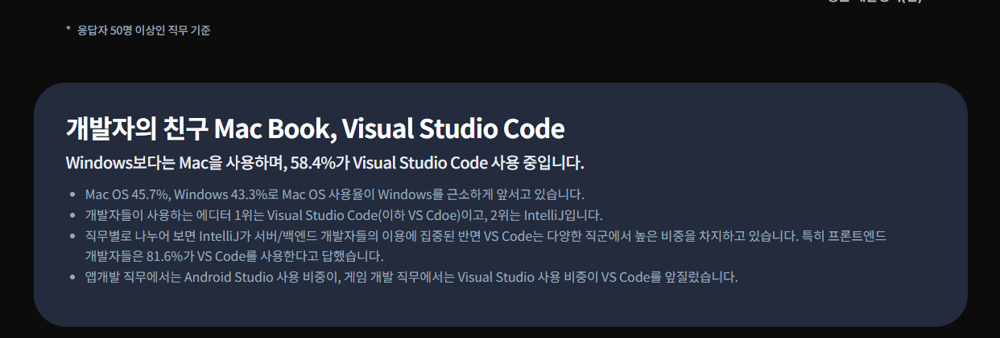

# 🪟 Intro 

안녕하세요. 오늘도 글을 쓰느라 주말 내도록 피자🍕를 먹으며 집에서 나오지 못 하고 있는 손우진입니다. 

이번 포스팅은 상당히 가볍게 작성 해 보았습니다. **개발자를 위한 Windows 셋업**이라는 주제입니다.  
많은 개발자들이 여러가지 이유로 Windows 를 개발 환경으로 사용하고 있습니다. 

> 아니요? 저는 Mac 쓰는데요?

물론 Mac 좋습니다. 저도 좋아합니다. 한 2년 전 까지만 해도 Mac 을 꼭 쓰고 싶었고 사고 싶었죠.  
2022년에 제가 인턴십을 할 때 19년도 Mac 으로 개발을 했었죠. 아직도 잊을 수 없습니다 그 **빠릿함**을 말이죠.  
당시에도 Spring 개발 했었습니다. 키보드 배열이 헷갈려서 정신이 없었던 기억이 아직도 납니다. 게다가 그 편리한 터미널 창이란...

> 물론 Mac의 단점은 존재합니다. 당시 x86 프로세서를 쓰던 Mac 은 결국 Windows 랑 별 다를 게 없더군요.  
> 그 웅장한 비행기 이륙 소리란...

잠시 내려놓고 취업 준비를 다시 시작할 때 Ubuntu 를 노트북에 설치 했었습니다. 여러가지 불필요한 애플리케이션(예를 들면 카톡)을 배제하려는 목적도 있었지만, Bash Shell 에 익숙했던 저는 Windows + WSL2 조합이 살짝 불편하다고 느꼈습니다. 어차피 Linux 를 쓸 거 굳이 Windows 를 쓸 필요가 있는가? 라는 생각에 Windows 를 모두 밀어버리고 Ubuntu 를 1년 가까이 사용했었습니다. 

Ubuntu 정말 좋습니다. Windows 에서 빌드 할 때에 비해 빌드 속도가 훨씬 빨랐죠. Windows 에서 2분 정도 걸릴 게 있다면 Ubuntu 에서는 1분 초반 대 정도가 나왔습니다. 그 만큼 Windows 에서 돌아가는 소프트웨어가 많아서가 좀 더 영향이 컸다고 봅니다. 

하지만 현실에 굴복했습니다. 관공서 서류를 쓸 일이 있을 때 Hwp 파일의 벽에 부딪치고 말았죠. 그리고 Explorer 모드가 필요한 웹에서는 정말 정신을 잃고 말았습니다. 사실 Ubuntu 에서 문서작업을 하는 데 큰 지장은 없었습니다. 생각보다 문서를 쓸 방법은 다양하게 있으니까요. 문제는 MS Office 와 Hwp 였죠. 죽어도 Ubuntu 에서는 넘기 힘들었던 문서의 벽으로 인해 다시 Windows 를 설치 했습니다. 

사실 Windows 는 많은 개발자들이 사용하는 OS 입니다. 인턴십을 제외하고 겪었던 모든 회사에서 Windows 를 사용했네요. 

<p>
   
</p>

2023년 프로그래머스의 조사에 따르면 Windows 의 점유율이 절대 무시할 수 없다는 것을 알 수 있습니다. 사실 우리가 컴퓨터로 개발만 하는 건 아니잖아요? 특히 전 요즘 **발더스 게이트 3** 에 빠져있습니다. TRPG 장르가 이렇게 재밌다니...

여튼 다시 주제로 돌아와서...*돈을 많이 들여서 Mac 을 살 게 아니라면 우리는 Windows 와 친해져야 합니다.* 

> 😱 타지에서 자취하며 사는 남정네는 Mac 을 살 돈을 생각하다가 그돈이면 스탠바이미와 스팀 덱, 그리고 적당한 소파 하나를 질러서 하루종일 게임을 할 수 있다는 사실을 깨닫고 다시는 쿠팡에서 Mac 을 검색하지 않기로 했습니다. 

사실 Windows 는 개발자에게 많은 기능을 제공하는 OS 입니다. 사실 멀리 복잡하게 생각할 것도 없이 과거라고 해서 Windows 로 개발을 안 했던 건 아니니까요. 우리가 2010년 초중반 대에 기억하던 Windows 와 다르게 현재는 Windows Subsystem for linux 기능을 가지고 있어서 공식적으로 Linux 를 지원합니다. 

<p align='center'>
   
</p>

WSL2 는 Windows 11 을 쓰고 계시다면 버전에 구애받지 않고 사용하실 수 있습니다. WSL2 를 도입하게 된다면 Windows 는 2개의 커널을 가지게 됩니다. 기존의 Windows NT 커널과 함께 Linux 커널을 가지게 되죠. 이 Linux 커널은 사진에서 보시다시피 경량 Linux Utility VM 으로 돌아가게 됩니다. 사진에서 보시다시피 GUI 도 제한적이지만 가능합니다. 실제로 Chrome 을 설치해서 돌려보면 Windows 위에서 돌아가는 것 처럼 보이지만 WSL 에서 돌아가는 Chrome 을 써 보실 수 있습니다. 

완벽하게 Windows 가 Linux 를 모두 지원하는 것은 아닙니다. 결국 메인은 Windows 이고 Linux 는 VM 에서 돌아가니까요. WSL 내부에서 Wayland (Linux 데스크톱 환경을 구현하기 위한 프로토콜) 서버에 전달 된 렌더링 요청을 WSLg (Windows Subsystem for Linux GUI) 가 Windows 로 포워딩 해 주는 형태로 GUI 를 구현합니다. Windows 에서는 RDP 기반 윈도우로 보여주게 되는데 Direct X 를 통한 OpenGL 호환 레이어가 포함 되어있어서 3D GUI 또한 일부 동작합니다. 

서론이 길었습니다. 이번 포스팅의 주제는 제 개인적인 Windows 셋업 방법을 공유드리려는 목적입니다. Windows 로도 불편함 없는는 개발 환경을 구성하고 싶은 분들에게 도움이 되지 않을까 싶어서 글을 작성 해 보려고 합니다. 

# 패키지매니저

[Winget Github](https://github.com/microsoft/winget-cli)

사실 Windows 는 꽤 오래 전 부터 자체적인 패키지매니저 **Winget** 를 지원하고 있습니다. 언오피셜로 Chocolately 라는 소프트웨어가 존재하지만, MS 가 직접적으로 관리하는 소프트웨어는 아닙니다. 

아마 2020년대 초반, 혹은 그 이전에 Windows 로 Frontend 를 개발하던 분이시라면 Chocolately 에 익숙하실 수도 있을 겁니다. 그 당시에 React 개발을 공부할 때 Yarn, NVM 등의 툴을 다운받을 때 Chocolately 를 썼던 기억이 있습니다. 대학생 때는 사실 지금 보다도 더 터미널에 익숙하지 않던 시기라 일일히 소프트웨어들을 공식 홈페이지에서 인스톨 했었는데, 처음 접했을 땐 신세계 처럼 느껴졌죠. 

어쨌든 중요한 건 MS 가 공식적으로 관리하지 않는다는 것은 MS 의 관리 통제 범위의 밖이라는 이야기죠. 보안 관점에서는 그다지 좋지 않은 접근입니다. 

Winget 은 2020년 MS 의 개발자 컨퍼런스에서 처음 발표 되었습니다. 기존에 Chocolately, Scoop, Ninite 등 여러가지 써드파티 패키지매니저를 조사하였고, 2021년 5월 27일 오피셜로 공개 되었습니다. 기억이 맞다면 그 때 쯤에 Windows 11 과 함께 쓸 수 있었던 것으로 기억합니다. 

Winget 은 exe, msix, msi 기반 설치 프로그램들을 지원합니다. 게다가 MS 가 직접 패키지들을 관리합니다. 커뮤니티 리포지토리 또한 MS 의 검수 조치를 반드시 거치게 되어있습니다. 즉 보안 관점에서 유리합니다. 

게다가 다양한 애플리케이션을 명령어들로 관리할 수 있습니다. 마치 우리가 Ubuntu 에서 `apt install` 을 하는 것과 매한가지죠. 

```shell
winget install Microsoft.WindowsTerminal Microsoft.PowerToys Microsoft.VisualStudioCode
```
우리가 애플리케이션의 배포 채널로도 Winget 을 사용할 수 있습니다. 아마 대부분의 DBeaver, VSCode 와 같은 우리가 주로 사용하는 소프트웨어는 이렇게 Winget 에 등록 되어있죠. 자세한 내용은 [리포지토리에 매니페스트 제출](https://learn.microsoft.com/ko-kr/windows/package-manager/package/repository) 가이드에 작성 되어있습니다. 

또한 공식 문서에서 볼 수 있지만, 기업 입장에서 보안 담당자가 여러 컴퓨터에 애플리케이션을 설치하고 관리하는 데 사용 할 수도 있습니다. 아무래도 회사 입장에선 기본적으로 셋업 해야 하는 소프트웨어들이 명확히 정해져있다면 편하겠죠? 제가 IT 인프라 담당자는 아니라 정확히 감은 잘 오지는 않지만, 만약 개발자들의 PC를 처음 셋업할 때 이 기능을 사용한다면 더욱 편리하게 초기 셋업을 할 수 있을 것이라 생각이 듭니다. 

요약하면 Winget 은 사내에 Windows 를 기반으로 하는 개발자용 PC의 소프트웨어들을 관리 통제하는 데 이점이 있을 수 있고, 그 외에도 개발자 개개인에게는 마치 Linux나 Mac 에서 처럼 애플리케이션들을 명령어 몇 개로 빠르게 업데이트하고 설치할 수 있도록 도와줍니다. 

# WSL

[Windows 공식 WSL 가이드문서](https://learn.microsoft.com/ko-kr/windows/wsl/)

서론에서 WSL 에 대한 이야기를 좀 많이 했었죠. 사실 JVM 환경에서는 크게 의미가 없을 수도 있습니다. 어쨌든 JVM 기반 소프트웨어는 크게 차이는 없을 수도 있으니까요. 하지만 WSL 의 의의는 마냥 개발환경 만은 아닙니다. Windows 에서 컨테이너 환경을 구성하는 데 큰 역할을 하기 때문이죠. 

그 외에도 Frontend 애플리케이션 개발자 입장에서는 Windows PowerShell 명령어를 기준으로 작성 되어있지 않은 모듈의 문서들을 보고있자면 아마 화가 많이 나실 수도 있습니다. 게다가 Node.js 애플리케이션의 경우 가끔 환경변수를 직접 건드는 빌드 스크립트가 존재하면 Windows 에서는 동작하지 않는 경우가 발생합니다. 이런 상황 때문에 `cross-env` 라는 모듈이 존재하지만 근본적인 해결책이라고 생각하지는 않습니다. 서드파티에 너무 의존하는 것이라 생각이 들어요. 

사실 `cross-env` 와 관해서 유명한 사건이 있습니다. 바로 crossenv 사건 ([참고링크](https://www.apple-economy.com/news/articleView.html?idxno=69814)) 이라고, 비슷한 이름의 악성 패키지가 배포되어서 여러 사람들의 PC에 백도어가 설치 된 사건이 있었죠. 아마 회사에서 이런 일이 벌어졌다면 시말서를 쓰는 두 손이 벌벌 떨렸을 것입니다. 

이 경우 개발 환경 자체를 WSL 영역에 셋업해두면 많은 도움이 됩니다. 여기서 WSL 영역이란 얘기가 나왔는데, WSL2 부터는 자체적인 스토리지 영역을 가지게 됩니다. WSL2 입장에서 윈도우즈 영역은 마운트 된 또 다른 디스크 처럼 취급 됩니다. 반대도 마찬가지입니다. 그래서 개발환경은 WSL 에도 마찬가지로 셋업 되어야 합니다. 

예를 들면 Windows 에서 설치한 IntelliJ 에서 WSL 영역의 프로젝트에 접근하고 싶다면, 접근할 수 있습니다. 하지만 WSL 레이어를 거치면서 상당히 IO가 느려지는 것을 확인할 수 있습니다. 그러므로 WSL 영역에 VSCode 를 설치하거나, Windows 에 설치 된 IDE 에서 Remote Develop 기능을 사용해야 하죠. 

만약 WSL 를 셋업하게 된다면, [공식 설치 가이드 문서](https://learn.microsoft.com/ko-kr/windows/wsl/install) 를 최대한 따르면서 현재 Windows 의 빌드 버전을 반드시 확인해야 합니다. 과거 빌드의 경우 WSL2 를 설치하기 위해 커널 업데이트 파일을 수동으로 설치 해 주어야 했는데, 현재 최신 빌드 기준으론 그럴 필요는 없습니다. 개인 PC에는 Ubuntu LTS 를 설치해서 사용중인데, `Netcat` 등 윈도우에서 괜히 복잡하게 사용해야 하는 툴을 사용할 때 자주 써먹고 있죠. 

만약 Ubuntu LTS 를 설치했다고 가정 하면 반드시 처음 해야 할 일이 있습니다. 패키지 미러 주소를 한국 카카오 서버로 지정 해 주어야 하죠. 패키지 설치 및 업데이트 시 더욱 빠른 속도로 통신할 수 있습니다. 

```bash
sudo sed -i 's/archive.ubuntu.com/mirror.kakao.com/g' /etc/apt/sources.list
```
또한 OS 를 처음 셋업 했으니 패키지들을 업데이트 해 주어야죠. 

```bash
sudo apt update && sudo apt -y upgrade && sudo apt -y autoremove
```
그 외에는 자유롭게 하시면 됩니다. zsh + ohmyzsh 를 셋업 하는 등 말이죠. 

> 개인적으로는 요즘 귀찮아서 zsh 만 설치하고 치웁니다. 튜닝의 끝은 항상 순정이더군요. 

하지만 WSL 를 사용하게 되면 반드시 신경써야 할 게 있습니다. Hyper-v 와 동시에 동작할 수 없는 애플리케이션들에 영향이 갈 수 있죠. WSL 는 Hyper-v 기반으로 동작하는데, 그 외에 혹시 Hyper-v 와 동시에 쓸 수 없는 애플리케이션 (VMWare 는 워크스테이션 16버전 이상을 사용해야 한다고 합니다.) 이 있다면 반드시 확인해야 합니다. 

또한 사내에서 사용한다면 문제가 복잡해질 수 있는 게 PC를 재부팅 하는 경우 매번 IP 주소를 새로 할당받는다는 것입니다. 결국 Windows PC에서 메인 OS는 Windows 고 WSL2는 아무리 Linux 커널을 직접 사용한다고 해도 VM 기반이다보니 이런 문제가 발생합니다. 그냥 로컬에서 혼자 쓴다면 상관이 없는데 외부 서버와 통신하는 경우에는 이게 문제가 될 수 있죠. 

넷마블 기술블로그에서 마침 이 문제를 해결 할 방법에 대해 가이드가 나와있습니다. [참고링크](https://netmarble.engineering/wsl2-static-ip-scheduler-settings/)

> 사실 혼자 쓸 때는 잘 몰랐는데, 글을 쓰면서 사내에 도입해야할 때의 관점으로 생각해보니 마냥 가볍지는 않습니다 하하...

보안 관점에서는 WSL 이 마냥 달갑지 않을 수도 있습니다. VM 영역이다보니 마냥 통제할 수 없는 것 아닌가? 라는 생각이 들 수도 있죠. 이런 상황을 대비해서 MS에서도 공식 가이드 문서 ([참고링크](https://learn.microsoft.com/ko-kr/windows/wsl/enterprise)) 를 작성 해 두었습니다. 제가 보안 담당자는 아닌지라 모든 관점을 다 이해할 수는 없겠지만, 마냥 블랙박스로 내버려두지 못하도록 여러 방법들이 존재하는 것으로 보입니다. 

보안 담당자 관점에서 WSL 사용 가이드라인을 어떻게 쓸 수있을 지 궁금해서 챗지피티에게 물어봤습니다. 만약 글을 보고 계신 분 중 보안 담당자가 계시다면 참고하시면 좋을 것 같습니다. 

<details>
<summary>ChatGPT가 제시한 WSL2 사용 보안 가이드라인 예시</summary>

## ChatGPT 가 제시한 WSL2 사용 보안 가이드라인 예시

### 1. WSL2 사용 목적 명확화
- 사내 개발, 빌드, 테스트 환경 용도로만 제한
- 일반 사용자의 업무 환경에서는 사용 금지
- 사용자는 사전 승인 절차를 거쳐야 함

---

### 2. WSL2 설치 및 환경 설정 기준

#### 설치 조건
- Windows 10 21H2 이상 또는 Windows 11 환경
- Hyper-V, Virtual Machine Platform 활성화 여부 점검

#### 설정 권장사항
- 기본 Linux 배포판은 보안 업데이트 지원되는 Ubuntu LTS 버전으로 제한
- WSL2의 root 사용자로 로그인 금지
- `~/.bashrc`, `~/.profile`에 의심스러운 alias나 함수 정의 금지

---

### 3. 보안 설정 및 접근 제어

#### 파일 접근 제한
- `/mnt/c`, `/mnt/d` 등 Windows 디스크 마운트 제한 (읽기 전용 권장)
```ini
[automount]
enabled = true
options = "ro"
```
- `~/.wslconfig` 또는 `/etc/wsl.conf`에 위 설정 강제

#### Windows ↔ WSL2 간 경로 접근 관리
- `\\wsl$\` 경로에 접근하는 사용은 관리자 승인 하에 제한
- VHDX 파일 (`%USERPROFILE%\AppData\Local\Packages\...\ext4.vhdx`) 임의 복사/이동 금지

---

### 4. 프로세스 및 네트워크 모니터링

- `vmmem.exe` 리소스 사용량 과다 시 관리자 알림
- 내부에서 `curl`, `wget`, `ssh`, `scp` 사용 시 허용된 대상 외 통신 차단
- 특정 포트 (`22`, `80`, `443`, `3000~4000`) 외 사용 금지

---

### 5. 패키지 설치 및 실행 제한

- `apt install` 시 관리자 승인 없이 설치 가능한 패키지 목록 제한
- 다음과 같은 도구는 원칙적으로 설치 금지:
  - `nmap`, `hydra`, `john`, `metasploit`, `sqlmap` 등 보안 테스트 도구
- 사용자 정의 서비스(systemd 등) 실행 제한

---

### 6. 감사 및 점검

- 월 1회 이상 사용자 WSL2 환경 점검
  - 설치된 패키지 목록 제출 (`dpkg -l`)
  - `.bash_history` 파일 무작위 샘플 점검
- 보안 이상 행위 발견 시 WSL2 사용 권한 회수 및 징계

---

### 7. 사용자 교육 및 동의서

- 최초 사용 시 아래 항목에 동의해야 함:
  - 업무 외 목적 사용 금지
  - 보안 정책 위반 시 징계 가능성 인지
  - 모든 명령 실행 내역은 점검 대상이 될 수 있음
- 연 1회 보안 교육 및 WSL2 사용 지침 숙지 필수
</details>

> 역시 ChatGPT 는 좋은 선생님이다 싶습니다 하하...전 귀찮은 코딩을 떠넘길 때도 쓰긴 하지만, 좋은 선생님으로 쓰고 있습니다. 참 좋은 세상이에요. 하루종일 질문해도 귀찮아 하지 않는 AI 와 함께 일 하다니... 😊🤟

# Container

아마 개발 하시면서 컨테이너 환경 많이 써보셨을 겁니다. 여러가지 사유로 컨테이너를 사용하지만, 로컬에서는 테스트 목적으로 소프트웨어를 띄울 때 자주 사용합니다. 아니면 로컬에 설치하기 애매한 소프트웨어 **(예를 들면 Prometheus 나 Grafana 가 있겠죠. 로컬에서 간단히 매트릭 한번 보고싶은데 Windows 파일시스템에 셋업하고 지지고 볶다보면 귀찮음 스택이 꽤 올라갑니다.)** 를 간단하게 셋업해서 올릴 때 많이 사용하죠. 

Windows 에서 WSL2 를 설치하게 된다면 아마 WSL2 그 자체 보다는 이 컨테이너 때문에 더 많이 사용하는 것 같습니다. 제가 원하는 환경을 편하게 구성할 수 있으니까요. 특히 레거시 소프트웨어를 유지보수할 때 상당히 유용합니다. 앞서 말씀드렸다시피 WSL2 에 IP 대역 문제만 어찌 해결한다면, 오래 유지보수 되었으나, 환경 문제로 골머리 썩고있는 소프트웨어를 유지보수할 때 매우 큰 도움이 되죠. 

그 뿐만이 아닙니다. Spring Batch 애플리케이션을 로컬에서 테스트할 때 H2 가 아닌 실제 테스트 DB 환경을 구성하고 싶다면 컨테이너가 매우 편리한 환경이 될 수 있습니다. 로컬에서 간단하게 더미 데이터를 집어넣고 테스트 할 수 있으니 부담이 없죠. 

흔히들 사용하시는 Docker Desktop 의 경우 Windows WSL2 커널을 백엔드로 사용할 수 있습니다. Docker Engine 을 돌리려면 Linux 커널이 필요하죠. 이전에는 Hyper-V 를 통해 Docker 를 실행 시켰는데, 굳이 그렇게 하지 않더라도 WSL2 영역의 리소스를 사용할 수 있습니다. 

VSCode 에서는 Docker Container 에 대한 Remote Develop 기능을 제공합니다. 개발과 운영 환경의 조화를 감안해서 개발해야 하는 경우엔 많은 도움이 되죠. 최근에 실제로 이렇게 구성해서 유지보수 하기 어렵던 레거시 소프트웨어를 업데이트헀던 경험이 있습니다. 

# Windows Terminal

[공식 리포지토리](https://github.com/microsoft/terminal)

Windows 에서 꽤 오래전에 (아마 Windows 11 업데이트 이후 언젠가였던 것으로 기억합니다.) cmd 애플리케이션을 대체할 수 있는 Windows Terminal 을 출시했었죠. 

Windows 내에서는 cmd, powershell 등 다양한 CLI 를 지원합니다. WSL 도 포함이라면 포함이겠죠. Windows Terminal 이 없을 땐 이런 CLI 들을 모두 각자 관리해야 했습니다. 

Windows Terminal 에서는 이런 CLI 들을 모두 통합해서 사용할 수 있습니다. 각각 프로필에 대해 커스터마이징도 가능하죠. 

Windows 11 빌드에서는 기본 애플리케이션으로 설치 되어 있습니다. 만약 Windows 10 (이제 지원종료죠 흑흑) 를 사용중이시다면, MS Store나 Github 에서 설치하실 수 있습니다. 

# Outro

크게 패키지 매니저, WSL2, 컨테이너, Terminal 까지 셋업 했다면, 그 이후부터는 각자의 개발환경에 따라 셋업하시면 됩니다.  
이제 winget 명령어를 통해 vscode, dbeaver, intelliJ, chrome 뿐만 아니라 OpenJDK 까지도 커맨드 창에서 설치하고 관리할 수 있죠. 

> 더이상 이것저것 설치하려고 웹 사이트 뒤질 필요 없습니다. 명령어 하나 만들어놓고 돌려버리면 그만이죠 🤟

포스팅에는 따로 담지 않았지만 pyenv 와 같이 여러 Python 환경들을 관리할 수 있는 툴도 존재합니다. 하지만 포스팅의 주제가 Windows 셋업이니...이 부분은 패스하겠습니다. 
Windows 충분히 좋은 OS 고 개발하는 데 크게 어려움이 없는 OS 입니다. 물론 Mac 을 살 수 있다면 쓰는 게 좋습니다. 꼭 OS의 문제라기보단 x86 이 아니라 ARM 아키텍처를 사용함에서 생기는 장점도 있으니까요. 

> 최근에 궁금해서 Windows on ARM 에 대해 개발자 커뮤니티 글 들을 찾아봤는데...음 여전히 갈 길이 먼 것 같군요 😭

물론 상황에 따라 Windows 를 사용하는 게 불리할 수 있습니다. 모바일 앱 네이티브 개발자라면 특히 그럴 수 있죠. 그런 경우가 아니라면 개발 환경을 Windows 로 가져가는 것이 딱히 불리한 선택지는 아니라고 생각합니다. 결국 검은 고양이든 흰 고양이든 쥐를 잡는 게 중요하니까요. 

# Reference

[https://programmers.co.kr/pages/2023-dev-survey](https://programmers.co.kr/pages/2023-dev-survey)
[https://ko.wikipedia.org/wiki/%EC%9C%88%EB%8F%84%EC%9A%B0_%ED%8C%A8%ED%82%A4%EC%A7%80_%EA%B4%80%EB%A6%AC%EC%9E%90](https://ko.wikipedia.org/wiki/%EC%9C%88%EB%8F%84%EC%9A%B0_%ED%8C%A8%ED%82%A4%EC%A7%80_%EA%B4%80%EB%A6%AC%EC%9E%90)