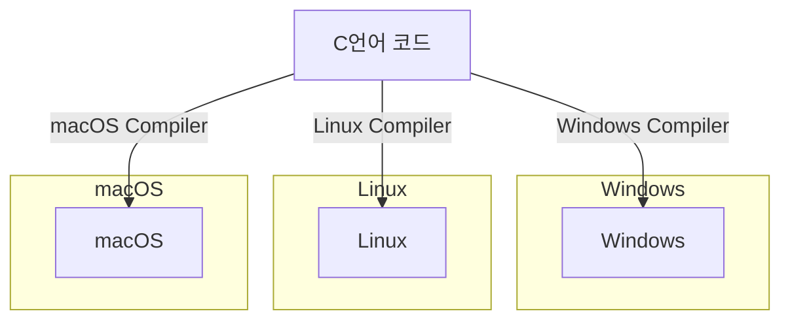
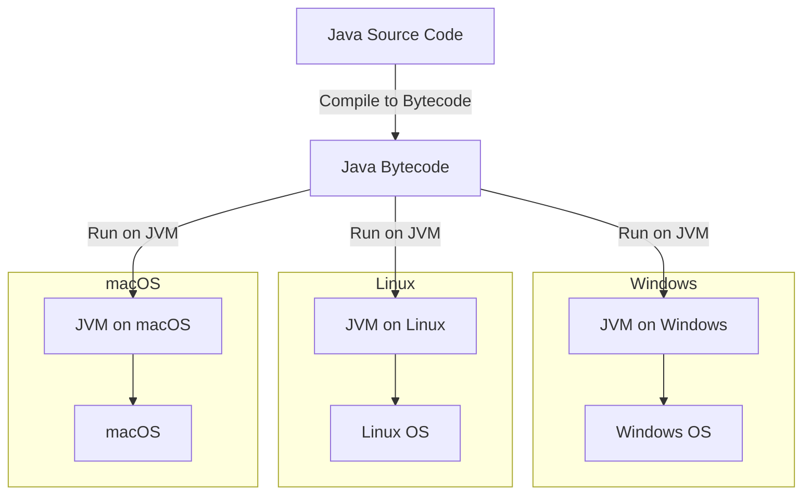

# build와 친해지기
> 매번 발목을 잡는 build. 우리가 자연스럽게 쓰는 코드가 어떻게 받아지고 흘러가는지 알아봅니다.
### 👤 대상 독자
- 개발하고 싶은데 build에 발목잡히는 개발자

### ⏳ 읽는 데 걸리는 시간 
 - 10 ~ 15분

### 🔍 목차 (TOC)

- [1. Intro] ()
- [2. build 툴](#2-JVM은-무엇인가요)
    - [2-1. gradle은 무엇인가요?](#2-1-JVM의-정의)
- [3. gradle의 기능 ](#3-ai-없이도-경쟁력이-있을까)
- [4. gradle 사용시 이슈 ](#3-ai-없이도-경쟁력이-있을까)
    
- [4. Outro](#4-outro)

---

# 1. 왜 나만 빌드가 안될까

안녕하세요. 이원석입니다  
나는 개발을 얼른 하고 싶은데, build가 안되고, 의존성이 안받아져서 지장을 받으면 그것만큼 막막하고 답답할 때가 없었습니다
build에 대한 개념과 기능을 알아봅니다.

---

# 2. build 

## 2-1. build 정의
build는 소스코드를 실행할 수 있는 application으로 변환하는 과정을 의미합니다.
build툴은 이 build를 자동으로 할 수 잇게 지원해주는 도구라고 할 수 있습니다.

- 소스코드를 컴파일하고, 실행파일이나 라이브러리 형태로 패키징합니다.
- 외부 라이브러리나 모듈 버전, 종속성을 자동으로 관리합니다.
- 테스트를 자동으로 실행합니다.


## 2-2. build의 과정
gradle 기준으로 설명을 하면 크게 3가지를 이야기 합니다.


### 1 초기화
1. init.gradle. 가장먼저 실행되어 사용자정보 및 실행환경을 초기화합니다.
2. settings.gradle 파일을 감지하여 Settings 객체를 생성합니다.(gradle 프로젝트의 구조와 설정을 담당합니다.)


### 2 구성 

1. 빌드에 참여하는 모든 프로젝트의 build.gradle을 실행합니다.
2. 정의된 프로젝트의 플러그인, 의존성등을 실행합니다.


### 3 실행
구성단계에서 생성하고 설정된 task단위로 실행합니다.

compileJava
processResources
test
jar
assemble
check

## 2-3. build 툴을 사용해서 build하는 이유

build는 앞의 과정처럼 다양한 작업들로 이루어져 있습니다. 이것을 수동으로 하게 된다면(여러 라이브러리 묶기 등등) 

- 개인마다 각각 따로 하게 되므로 실수가 나오기 쉽습니다.
- 모든 과정을 일일히 손으로 해야하므로 시간이 오래걸릴 것입니다.


### c언어와 java의 비교
C언어의 경우, 컴파일러가 소스코드를 기계어(바이너리 코드)로 변환하여 실행파일을 만들어내는 방식이었습니다.<br/>
그러나 바이너리 코드는 특정 OS(ex : 리눅스, mac등)나 CPU구조에 따라서 컴파일이 다르게 된다는 특징이 있었습니다.<br/>
그래서 OS에 따라서 프로그램을 따로 만들어야 하는 문제가 있죠.(ex: 리눅스용, 윈도우용)<br/>


이렇게 컴파일러가 OS마다 달라서 일일이 프로그램을 만들어야 하는 문제를 해결하기 위해 JVM이 등장합니다.<br/>

`java`의 경우, OS로 바로 실행하는 것이 아닌, `JVM`을 통해서 OS와 상호작용합니다.<br/>
`JVM`의 존재만으로 OS를 고려하지 않고도 프로그램을 실행시킬 수 있게 된 것이죠.<br/>
그래서 C언어처럼 다양한 OS에 맞춰진 컴파일러가 이해할 수 있게 코드수정을 하지 않아도 됩니다.


단, JVM 자체는 **OS에 종속적입니다.** 그래서 OS에 맞는 JVM 설치는 필요합니다.  
그러면 java도 OS에 의존적인건 다름 없지 않느냐 라고 생각할 수도 있습니다만,  
`한번만 코드를 작성하고 OS에 맞는 JVM 각각설치하기` vs `OS마다 코드 작성하기`를 생각해본다면 전자가 더 효율적이다고 볼 수 있는 것이죠.




### JVM 동작 과정

>    1. 자바 컴파일러가 자바로 작성된 파일을 `자바 바이트 코드` (JVM이 이해할 수 있는 코드)로 컴파일합니다.


> 2. JVM은 이 바이트 코드를 `기계어`(바이너리 코드)로 변환합니다.

> 3. jvm에 의해 컴파일된 기계어는 OS별 CPU에서 실행되어 사용자에게 서비스를 제공해줍니다.


     

# 3. JVM의 구조는 어떻게 되어있을까요?

`JVM`의 구조는 `java` 버전이 변경되면서 변화해왔습니다.  
우선 가장 기본적인 `java 7`에서의 `JVM` 구조를 알아보겠습니다.


### 구성
1. 클래스 로더(`Class Loader`)
2. 실행 엔진(`Execution Engine`)
   - 인터프리터
   - `JIT` 컴파일러
   - 가비지 컬렉터
3. 런타임 데이터 영역(`Runtime Data Area`)
    - 메서드 영역(`Method Area`)
    - 힙 영역(`Heap Area`)
    - 스택 영역(`Stack Area`)
    - `PC Register`
    - 네이티브 메서드 영역(`Native Method Stack`)


## 3-2. 실행 엔진
## 3-2-1. 인터프리터
자바 바이트 코드를 한줄씩 읽고 한줄씩 기계어로 해석하는 역할을 합니다.

> 📝 인터프리터 vs 컴파일러 차이점
> 
>| 구분        | **인터프리터 (Interpreter)** | **컴파일러 (Compiler)**         |
>|------------|-------------------------|-----------------------------|
>| **실행 방식** | 한 줄씩 해석하며 즉시 실행됩니다.     | 전체 코드를 한 번에 기계어로 변환 후 실행합니다 |
>| **속도**    | 시작은 빠르지만 실행 속도는 느립니다.   | 시작은 느리지만 실행 속도가 빠릅니다.       |
>| **오류 처리** | 오류 발생 시 즉시 중단 후 알려줍니다.  | 모든 코드 분석 후 오류를 한 번에 알려줍니다.  |
> 📌 정리
>- **인터프리터**: 실행 속도보다 **빠른 실행 시작**이 중요할 때 사용합니다.
>- **컴파일러**: 실행 속도를 높이고 싶을 때 사용합니다.
>- **Java**는 **JVM에서 인터프리터 + JIT 컴파일러**를 함께 사용하여 장점을 조합합니다.

> ### 왜 JVM에서는 굳이 인터프리터를 사용했을까요?
> 1. java는 `wora(Write Once, Run Anywhere)`라는 플랫폼에 독립적으로 동작하려는 패러다임을 가지고 있습니다. 이때 인터프리터를 사용하면 플랫폼에 독립적인 장점을 가져갈 수 있습니다. 
> 2. 한줄씩 실행하므로 메모리 사용량이 적습니다.


## 3-2-2. JIT 컴파일러
* 실행중에 **자바 바이트 코드**를 **네이티브 코드**로 변환하여 성능을 최적화하는 기술입니다.  
* 프로그램의 실행패턴을 분석해서 **자주 실행되는 메서드**(`HotSpot`)을 중심으로 최적화합니다.  
* 처음 호출되었을 때는 바로 컴파일 되지는 않고, 호출 횟수를 체크하여 컴파일합니다.
그 후, 동일한 메서드가 컴파일되면 이 컴파일된 메서드를 해석하지 않고 네이티브코드 그대로 실행되도록 하여 성능을 최적화합니다.

> ### 왜 사용했을까요?
> 인터프리터는 처음 실행되는 속도는 빠르지만, 이후 동작할때 동일한 메서드들을 계속 호출하므로 느립니다.  
> 그에 반해 동적컴파일을 진행하는 JIT는 반복되는 코드를 읽지 않고 바로 사용할 수 있어 성능을 높일 수 있습니다.  
> 즉, **느린** 성능을 가진 인터프리터의 단점을 보완함으로써 인터프리터의 빠른 초기 실행속도와 JIT 컴파일러의 성능의
> 이점을 동시에 가져가는 것이죠.

## 3-2-3. 가비지 컬렉터
아마 많이 보셨을 가비지 컬렉터(GC)입니다. Heap 영역에서 사용되지 않는 메모리를 회수해주는 역할을 합니다.  
C언어와는 다르게 메모리 관리에 신경쓰지 않아도 되는 장점이 있습니다.  
종류로는 아래와 같이 있습니다. 해당 내용은 방대하기 때문에 이 글에서는 종류만 정리해 볼게요.  


### 3-3-1. method 영역(class영역 또는 static영역)
 jvm시작시 자바 바이트 코드(.class)가 클래스 로딩되는 곳입니다.  
jvm 동작후 적재가 되면 프로그램 종료시까지 저장됩니다.  
클래스에 대한 모든 정보가 저장된다고 생각하면 됩니다.
#### 저장되는 정보
```java
class Car {
    static int count = 0; // 정적 변수
    final int MAX_SPEED = 200; // 상수
    String model; // 인스턴스 변수

    // 생성자
    public Car(String model) {
        this.model = model;
        count++; // 생성될 때마다 count 증가
    }

    public void drive() { // 메서드
        System.out.println("Driving " + model + " at max speed: " + MAX_SPEED);
    }

    public static void startEngine() { // 정적 메서드
        System.out.println("Engine started");
    }
}
```
1. 메서드 코드 : Car(), drive(), startEngine()의 바이트 코드가 저장됩니다.
2. 인스턴스 변수 : model의 이름, 접근제어자, 데이터 타입등이 저장됩니다.
3. 클래스 : Car의 메타데이터도 저장됩니다.(이름, 상속관계, 인터페이스 정보)
#### 3-3-1-1. runtime constant pool 영역
메서드 영역 내부에 있는 데이터 영역입니다. 클래스나 인터페이스별로 자신만의 runtime constant pool
영역을 가집니다.  
클래스에서 사용되는 상수, 리터럴, 메서드/필드 참조들을 저장합니다.

> ## *Constant pool*, *Runtime Constant pool*, *String Constant pool*의 차이는?
> 
> ### String Constant pool
> heap영역의 문자열 리터럴을 저장하는 공간이고, GC의 대상이 되지는 않습니다.  
> String은 불변객체여서 문자열 생성시에 이 공간에 저장된 리터럴을 재사용할 수 있습니다.  
> -  소스코드에 문자열 선언
```java 
String str = "hello"; // String constant pool 저장
String ss = new String("hello"); // new로 생성해서 heap에 저장
```
> ### Constant pool
> 컴파일시 클래스 파일 내부에 존재합니다.  
> 클래스 로더를 통해 메모리에 로드됩니다.  
> 상수, 문자열, 클래스/인터페이스 참조를 가지고 있습니다.
> 
> ### Runtime constant pool 
> 쉽게 생각해서 Constant pool에 저장되어 있던 상수나 메서드, 클래스등이 저장됩니다.  
> method 영역에 저장되며, 문자열 리터럴은 String Constant pool에 저장됩니다.  


# 4. Outro
사실 JVM의 경우, 기본적이라고 할 수도 있지만 내용자체가 방대하다고 많이 느꼈습니다.  
그래서 회차를 이어서 전달드리지 못했던 내용을 이어가려고 합니다. 
다음 편에는
1. 그래서 JVM을 생각해서 어떻게 코드에 반영할 수 있을까
2. 전체적인 흐름
을 생각하고 있습니다.

JVM에 대해 좀 더 알게 되면 메모리를 생각하는 코드에 대해서도 조금 더 가까워지지 않을까
생각합니다.  
다음 글에서 뵙겠습니다 긴글 읽어주셔서 감사합니다. (_ _)


---
reference
- https://ggop-n.tistory.com/41
- https://shin-e-dog.tistory.com/75
- https://everyday-develop-myself.tistory.com/300
---

[//]: # ()
[//]: # (|Profile| Link                                                                                        | Bio                       |)

[//]: # (|--|---------------------------------------------------------------------------------------------|---------------------------|)

[//]: # (| | [github]&#40;https://github.com/bk100km&#41; <br/> [LinkedIn]&#40;https://www.linkedin.com/in/bk100km/&#41; | **"모든 것은 변한다. 그러니 우리는"** |)

[//]: # ()

