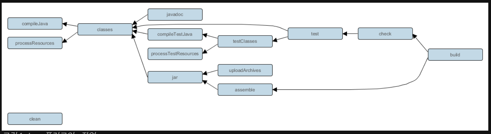
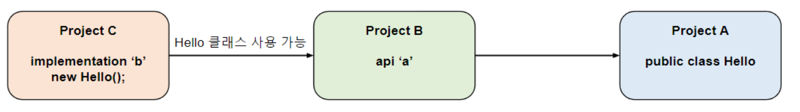
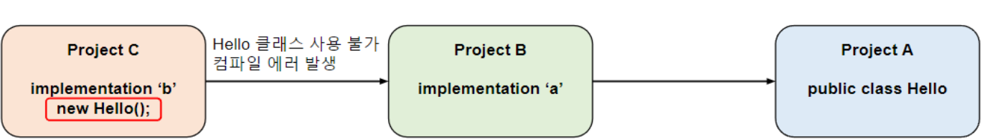

# gradle와 친해지기 - (build, 의존성, 저장소 이해하기)
> 매번 발목을 잡는 gradle. <br/>
> 우리가 자연스럽게 쓰는 코드가 어떻게 받아지고 흘러가는지 알아봅니다. <br/>
> 
### 👤 대상 독자
- 개발하고 싶은데 gradle에 발목 잡히는 개발자

### ⏳ 읽는 데 걸리는 시간 
 - 5 ~ 10분

### 🔍 목차 (TOC)

- [1. Intro] 
- [2. build 툴]
    - [2-1. gradle은 무엇인가요?]
- [3. gradle의 기능]
    - [3-1. build]
    - [3-2. 의존성]
    - [3-3. 저장소]
- [4. Outro]

---

# 1. 왜 나만 빌드가 안될까

안녕하세요. 이원석입니다  
나는 개발을 얼른 하고 싶은데 build가 안되고, 의존성이 안받아져서 개발을 못할때 답답하고 짜증났던 상황은 개발자라면
다 공감가실 내용이라고 생각합니다. <br/>
그만큼 gradle과 같은 build툴은 자주 사용을 하면서도 단순히 jar파일등을 생성하고 sync할때만 사용을 해왔던 것 같습니다. <br/>
그래서 이번에는 gradle과 같은 build툴의 기본적인 내용에 대해 조금 더 알아보는 시간을 가지고 싶습니다. <br/>
추후에는 공통적으로 어떤 문제들이 발생해왔는지 알아보면 좋겠습니다.


---

# 2. build 

## 2-1. build 정의
build는 소스코드를 실행할 수 있는 application으로 변환하는 과정을 의미합니다.
build툴은 이 build를 자동으로 할 수 있게 지원해주는 도구라고 할 수 있습니다.

- 소스코드를 컴파일하고, 실행파일이나 라이브러리 형태로 패키징합니다.
- 외부 라이브러리나 모듈 버전, 종속성을 자동으로 관리합니다.
- 테스트를 자동으로 실행합니다.


## 2-2. build의 과정
gradle 기준으로 설명을 하면 크게 3가지를 이야기 합니다.


### 1 초기화
1. init.gradle. 가장먼저 실행되어 사용자정보 및 실행환경을 초기화합니다.
2. settings.gradle 파일을 감지하여 Settings 객체를 생성합니다.(gradle 프로젝트의 구조와 설정을 담당합니다.)


### 2 구성 

1. 빌드에 참여하는 모든 프로젝트의 build.gradle을 실행합니다.
2. 정의된 프로젝트의 플러그인, 의존성등을 실행합니다.


### 3 실행
구성단계에서 생성하고 설정된 task단위로 실행합니다.

java 프로젝트 gradle 기준으로 기본적으로 실행되는 task들을 보면, 아래와 같이 수많은 단계들로 이루어져 있는 것을 볼 수 있습니다.


## 2-3. build 툴을 사용해서 build하는 이유

build는 앞의 과정처럼 다양한 작업들로 이루어져 있습니다. 이것을 수동으로 하게 된다면(여러 라이브러리 묶기 등등) 

- 개인마다 각각 따로 하게 되므로 실수가 나오기 쉽습니다.
- 모든 과정을 일일히 손으로 해야하므로 시간이 오래걸릴 것입니다.


## 2-4. build task

의식하지 못했던 `task`들에 대해서 하나씩 알아보겠습니다.

### 1. compileJava
직관적으로 `jdk` 컴파일러로 `java` 소스코드를 컴파일합니다.

### 2. processResources
`resources` 아래 모든파일을 `build/resources/main` 디렉토리에 복사합니다. <br/>
리소스 파일을 `build`의 결과물에 포함시키기 위해서 복사하는 작업입니다.

### 3. classes
`compileJava`와 `processResources`를 진행하고 두 단계가 성공하면 완료처리만 진행합니다. <br/>
불필요한 단계라고 생각할 수도 있지만, 하나의 중간지점을 제공하는 역할을 합니다. `test`는 `classes`에 의존하고 있는데요,
테스트 전에 컴파일이 완료되어 있어야 하기 때문입니다.<br/>
또한, 언어가 다양할 경우 `compileTask`(kotlin으로 치면 compileKotlin)도 포함해줍니다.

### 4. jar
`build/classes/java/main`에 있는 모든 파일(class와 resources)을 `jar`파일로 묶어줍니다. <br/>
실행기능이 없고, 실행하려면 `Main-Class`를 `MANIFEST.MF`에 직접 지정해줘야 합니다.


> ### bootJar와 jar는 무엇이 다를까요?
> `bootJar`는 `spring-boot`에서 제공하는 `jar`파일로, `jar`파일을 실행할 수 있는 기능을 제공합니다. <br/>
내부에 코드, 라이브러리 'jar', 실행 가능한 bootloader를 포함하고 있어서 `java -jar`로 바로 실행이
> 가능합니다. <br/>
> 그러면 굳이 `jar`를 만들 필요가 없지 않냐고 물어보실 수 있습니다. <br/>
`spring-boot`를 사용하지 않는 경우에 당연히 사용되고, D1 프로젝트와 같은 멀티모듈 구조일 경우,
> core 모듈을 제외한 공통모듈등에는 `jar`만 사용하고 실행진입점인 `core`모듈에만 `bootJar`를 사용합니다. <br/>
> 왜냐하면 실행을 위한 `core`모듈이 아니면 굳이 실행가능한 `bootJar`로 패키징할 필요가 없기 때문입니다.

### 5. assemble
`jar`와 `bootjar`등을 내부적으로 실행해서 산출물을 만들어냅니다.
test없이 컴파일 및 리소스처리후 바로 실행파일만 만들어낼 수 있는 장점이 있습니다.<br/>
앞의 단계 compileJava, processResources, classes, jar나 bootJar를 포함하고 있어서 앞단계에서 실행이 되지 않았을 경우
 재실행하거나 건너뜁니다.

### 6. compileTestJava

1번째 단계와 비슷하게 jdk 컴파일러로 `test` 소스코드를 컴파일합니다. <br/>

### 7. processTestResources
2번째 단계와 유사하게 `test` 리소스 파일을 `build/resources/test` 디렉토리에 복사합니다. <br/>

### 8. testClasses
3번째 단계와 유사하게 `compileTestJava`와 `processTestResources`를 진행하고 두 단계가 성공하면 완료처리만 진행합니다. <br/>

### 9. test

`test` 소스코드에 대한 테스트를 진행합니다. <br/>
`Junit`이나 `TestNG`등 프레임워크를 사용해서 단위테스트를 실행합니다. <br/>
`test`실패시 `build`가 실패합니다. <br/>

### 10. check
`test`를 포함한 모든 검증을 진행합니다. <br/>

### 11. build
앞선  프로젝트의 전체 `build`를 진행하는 집계작업입니다. <br/>
크게 `assemble`, `check` 2개의 핵심 tak를 포함하고 있습니다. <br/>


전체적인 다이어그램을 보자면 아래와 같이 볼 수 있습니다.




# 3. 의존성

의존성이란 프로젝트가 컴파일,실행, 테스트등에 필요한 외부 코드(라이브러리,FW, 모듈등)을 말합니다.<br/>
이 라이브러리들은 동일빌드의 다른 프로젝트나 외부 저장소에서 가져올 수 있습니다.


## 3-1. 의존성 구성
의존성은 configuaration을 사용해서 의존성의 범위를 정할 수 있습니다.<br/>

| 구성명              | 설명                                                                 |
|-------------------|----------------------------------------------------------------------|
| `api`             | 컴파일과 런타임 모두에 필요한 종속성이며, 게시된 API에 포함됨               |
| `implementation`  | 컴파일과 런타임 모두에 필요한 종속성이지만, 외부에는 노출되지 않음           |
| `compileOnly`     | 컴파일에만 필요한 종속성, 런타임이나 게시에는 포함되지 않음                  |
| `compileOnlyApi`  | 컴파일에만 필요하지만, 게시된 API에는 포함되는 종속성                        |
| `runtimeOnly`     | 런타임에만 필요한 종속성, 컴파일 클래스 경로에는 포함되지 않음               |
| `testImplementation` | 테스트 코드의 컴파일과 실행 모두에 필요한 종속성                            |
| `testCompileOnly` | 테스트 컴파일에만 필요한 종속성                                             |
| `testRuntimeOnly` | 테스트 실행에만 필요한 종속성                                               |


> ### api랑 implementation의 차이는 무엇인가요?
> 전이 의존성의 차이가 있습니다. <br/>
> 전이 의존성이란, C project가 B project를 의존하고, B project가 A project를 의존할 때, C project가 A project를 사용할 수 있는지 여부입니다. <br/><br/>
> api는 전이 의존성을 허용합니다. 그래서 C project에서도  A project의 Hello 클래스를 사용할 수 있는 것입니다.
> 
> <br/>
> 반면에 implementation은 전이 의존성을 허용하지 않으므로, A project의 Hello 클래스를 사용할 수 없습니다.
> 
> <br/>
> 그러면 무조건 api가 좋지 않냐고 생각할 수도 있는데요, 
> implementation을 사용할 경우
> 1. 특정 라이브러리를 직접 참조하는 코드에서만 컴파일되서 모듈간 의존성이 단순화되고 빌드 속도도 빨라질 수 있습니다.
> 2. 내부 구현 라이브러리가 변경되도 외부에는 영향을 주지 않습니다.
> 3. `pom.xml`이라는 파일이 있는데, 이파일은 의존성에 대한 정보를 담고 있고 배포시 올라가는 파일입니다.<br/>
> `gradle5` 이전에는 `implementation`, `api` 구분 없이 모든 의존성이 `POM`안으로 들어가서 불필요하게 의존성이 전파되거나 내부 구현 라이브러리도 외부에서 접근되는 문제가 있었습니다.<br/>
> ``gradle``의 새로운 `maven-publish` 플러그인은 `api`, `implementation`등의 구성을 정확히 반영하므로,
> 배포시 좀 더 깔끔한 `POM` 파일을 생성할 수 있습니다.


### 3-2. 저장소
gradle은 프로젝트에 사용된 의존성을 어디서 다운로드할 수 있을지 알고 있어야 합니다.

저장소의 종류에는 크게 4가지가 있습니다.

#### 1. 공개 저장소
많이 사용되는 익숙한 공개 바이너리 저장소입니다. MavenCentral, Google Android 저장소 등이 있습니다.
```kotlin
repositories {
    mavenCentral()
    google()
    gradlePluginPortal()
}
```

### 2. 개인/사용자 정의 저장소
기업에서 사용하는 폐쇄망의 경우, 사내에서만 사용가능한 바이너리 저장소가 존재합니다. 이럴 경우 직접 사용자 지정 URL을
작성하여 저장소를 선언하게 됩니다.
```kotlin
repositories {
    maven {
        url = uri("https://maven-central.storage.apis.com")
    }
    ivy {
        url = uri("https://github.com/ivy-rep/")
    }
}
```

### 3. 로컬 저장소
사용자의 로컬환경을 저장소로 사용하는 방법도 존재하는데요, <br/>
자체개발 라이브러리테스트나, 내부 프로젝트간 연동, 배포전 검증할때 사용하면 유용합니다.<br/>
mavenLocal)은 로컬에 설치된 Maven 저장소인 `~/.m2/repository`를 의미합니다. <br/>
보통 `mvn install` 혹은 `gradle publishToMavenLocal`로 라이브러리 설치시 사용됩니다.
```kotlin
repositories {
    mavenLocal()
}
```

### 4. 파일 위치
내부 프로젝트안에 jar 파일을 넣어서 의존성을 추가하는 방법도 있습니다. <br/>
아래는 프로젝트 루트의 libs/폴더를 가리킵니다.<br/>
배포가 불가능하거나 빠르게 테스트할 경우 유용하게 사용할 수 있습니다.
```
my-project/
├── build.gradle
├── libs/
│   └── mylib-1.0.jar
```

```kotlin
repositories {
    flatDir {
        dirs("libs")
    }
}
```

# 4. Outro
gradle의 build에 대한 간단한 얘기와 의존성, 저장소등에 대해서 다뤄보았습니다. <br/>
사실 build 툴을 다루면서 정말 답답한 상황은 의존성이 안받아진다거나, build가 안되는 문제상황일 경우가 많습니다.<br/>
나는 개발을 빨리 하고 싶은데, 엄한데 발목이 잡혀서 시간이 낭비된다고 생각이 들기 때문입니다. <br/>
다음에는 자주 발생하는 문제 상황이나 좀 더 깊은 내용에 대해 다뤄보는 글이 될 것 같습니다. <br/>
감사합니다.


---
reference
- https://ggop-n.tistory.com/41
- https://shin-e-dog.tistory.com/75
- https://everyday-develop-myself.tistory.com/300
- https://docs.gradle.org/current/userguide/java_plugin.html?utm_source=chatgpt.com
- https://mangkyu.tistory.com/296
---

[//]: # ()
[//]: # (|Profile| Link                                                                                        | Bio                       |)

[//]: # (|--|---------------------------------------------------------------------------------------------|---------------------------|)

[//]: # (| | [github]&#40;https://github.com/bk100km&#41; <br/> [LinkedIn]&#40;https://www.linkedin.com/in/bk100km/&#41; | **"모든 것은 변한다. 그러니 우리는"** |)

[//]: # ()

