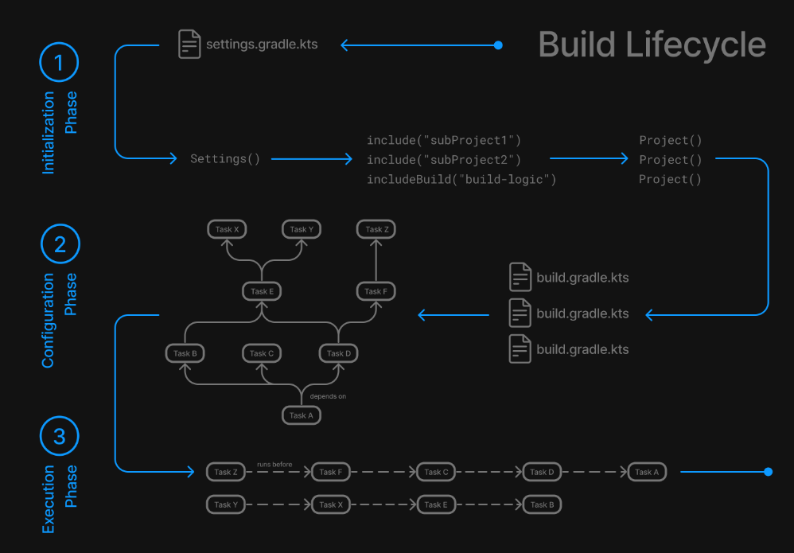
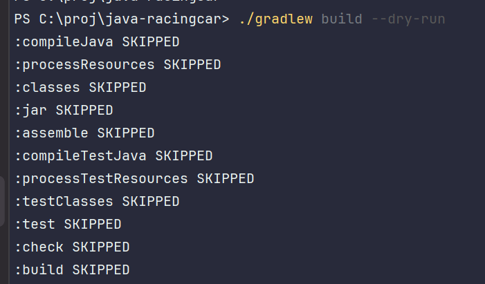

# gradle와 친해지기
> 매번 발목을 잡는 build. 우리가 자연스럽게 쓰는 코드가 어떻게 받아지고 흘러가는지 알아봅니다.
### 👤 대상 독자
- 개발하고 싶은데 gradle에 발목 잡히는 개발자

### ⏳ 읽는 데 걸리는 시간 
 - 10 ~ 15분

### 🔍 목차 (TOC)

- [1. Intro] ()
- [2. build 툴](#2-JVM은-무엇인가요)
    - [2-1. gradle은 무엇인가요?](#2-1-JVM의-정의)
- [3. gradle의 기능 ](#3-ai-없이도-경쟁력이-있을까)
- [4. gradle 사용시 이슈 ](#3-ai-없이도-경쟁력이-있을까)
    
- [4. Outro](#4-outro)

---

# 1. 왜 나만 빌드가 안될까

안녕하세요. 이원석입니다  
나는 개발을 얼른 하고 싶은데, build가 안되고, 의존성이 안받아져서 지장을 받으면 그것만큼 막막하고 답답할 때가 없었습니다
우선 build툴인 gradle에 대한 개념과 기능을 알아봅니다.

---

# 2. build 

## 2-1. build 정의
build는 소스코드를 실행할 수 있는 application으로 변환하는 과정을 의미합니다.
build툴은 이 build를 자동으로 할 수 있게 지원해주는 도구라고 할 수 있습니다.

- 소스코드를 컴파일하고, 실행파일이나 라이브러리 형태로 패키징합니다.
- 외부 라이브러리나 모듈 버전, 종속성을 자동으로 관리합니다.
- 테스트를 자동으로 실행합니다.

## 2-2. build의 과정
gradle 기준으로 설명을 하면 크게 3가지를 이야기 합니다.

### 1 초기화
1. init.gradle. 가장먼저 실행되어 사용자정보 및 실행환경을 초기화합니다.
2. settings.gradle 파일을 감지하여 Settings 객체를 생성합니다.(gradle 프로젝트의 구조와 설정을 담당합니다.)

### 2 구성 

1. 빌드에 참여하는 모든 프로젝트의 build.gradle을 실행합니다.
2. 정의된 프로젝트의 플러그인, 의존성등을 실행합니다.

### 3 실행
구성단계에서 생성하고 설정된 task단위로 실행합니다.

java 프로젝트 gradle 기준으로 기본적으로 실행되는 task들을 보면, 아래와 같이 수많은 단계들로 이루어져 있는 것을 볼 수 있습니다.

## 2-3. build 툴을 사용해서 build하는 이유

build는 앞의 과정처럼 다양한 작업들로 이루어져 있습니다. 이것을 수동으로 하게 된다면(여러 라이브러리 묶기 등등) 

- 개인마다 각각 따로 하게 되므로 실수가 나오기 쉽습니다.
- 모든 과정을 일일히 손으로 해야하므로 시간이 오래걸릴 것입니다.

## 2-4. build task

의식하지 못했던 `task`들에 대해서 하나씩 알아보겠습니다.

### 1. compileJava
직관적으로 `jdk` 컴파일러로 `java` 소스코드를 컴파일합니다.

### 2. processResources
`resources` 아래 모든파일을 `build/resources/main` 디렉토리에 복사합니다.  
리소스 파일을 `build`의 결과물에 포함시키기 위해서 복사하는 작업입니다.

### 3. classes
`compileJava`와 `processResources`를 진행하고 두 단계가 성공하면 완료처리만 진행합니다.  
불필요한 단계라고 생각할 수도 있지만, 하나의 중간지점을 제공하는 역할을 합니다. `test`는 `classes`에 의존하고 있는데요,
테스트 전에 컴파일이 완료되어 있어야 하기 때문입니다. 
또한, 언어가 다양할 경우 `compileTask`(kotlin으로 치면 compileKotlin)도 포함해줍니다.

### 4. jar
`build/classes/java/main`에 있는 모든 파일(class와 resources)을 `jar`파일로 묶어줍니다.  
실행기능이 없고, 실행하려면 `Main-Class`를 `MANIFEST.MF`에 직접 지정해줘야 합니다.

> ### bootJar와 jar는 무엇이 다를까요?
> `bootJar`는 `spring-boot`에서 제공하는 `jar`파일로, `jar`파일을 실행할 수 있는 기능을 제공합니다.  
내부에 코드, 라이브러리 'jar', 실행 가능한 bootloader를 포함하고 있어서 `java -jar`로 바로 실행이
> 가능합니다.  
> 그러면 굳이 `jar`를 만들 필요가 없지 않냐고 물어보실 수 있습니다.  
`spring-boot`를 사용하지 않는 경우에 당연히 사용되고, D1 프로젝트와 같은 멀티모듈 구조일 경우,
> core 모듈을 제외한 공통모듈등에는 `jar`만 사용하고 실행진입점인 `core`모듈에만 `bootJar`를 사용합니다.  
> 왜냐하면 실행을 위한 `core`모듈이 아니면 굳이 실행가능한 bootJar로 패키징할 필요가 없기 때문입니다.

### 5. assemble
`jar`와 `bootjar`등을 내부적으로 실행해서 산출물을 만들어냅니다.
test없이 컴파일 및 리소스처리후 바로 실행파일만 만들어낼 수 있는 장점이 있습니다. 
앞의 단계 compileJava, processResources, classes, jar나 bootJar를 포함하고 있어서 앞단계에서 실행이 되지 않았을 경우
 재실행하거나 건너뜁니다.

### 6. compileTestJava

1번째 단계와 비슷하게 jdk 컴파일러로 `test` 소스코드를 컴파일합니다.  

### 7. processTestResources
2번째 단계와 유사하게 `test` 리소스 파일을 `build/resources/test` 디렉토리에 복사합니다.  

### 8. testClasses
3번째 단계와 유사하게 `compileTestJava`와 `processTestResources`를 진행하고 두 단계가 성공하면 완료처리만 진행합니다.  

### 9. test

`test` 소스코드에 대한 테스트를 진행합니다.  
`Junit`이나 `TestNG`등 프레임워크를 사용해서 단위테스트를 실행합니다.  
`test`실패시 `build`가 실패합니다.  

### 10. check
`test`를 포함한 모든 검증을 진행합니다.  

### 11. build
앞선  프로젝트의 전체 `build`를 진행하는 집계작업입니다.  
크게 `assemble`, `check` 2개의 핵심 tak를 포함하고 있습니다.  

전체적인 다이어그램을 보자면 아래와 같이 볼 수 있습니다.

# 3. 의존성

# 4. Outro
사실 JVM의 경우, 기본적이라고 할 수도 있지만 내용자체가 방대하다고 많이 느꼈습니다.  
그래서 회차를 이어서 전달드리지 못했던 내용을 이어가려고 합니다. 
다음 편에는
1. 그래서 JVM을 생각해서 어떻게 코드에 반영할 수 있을까
2. 전체적인 흐름
을 생각하고 있습니다.

JVM에 대해 좀 더 알게 되면 메모리를 생각하는 코드에 대해서도 조금 더 가까워지지 않을까
생각합니다.  
다음 글에서 뵙겠습니다 긴글 읽어주셔서 감사합니다. (_ _)

---
reference
- https://ggop-n.tistory.com/41
- https://shin-e-dog.tistory.com/75
- https://everyday-develop-myself.tistory.com/300
- https://docs.gradle.org/current/userguide/java_plugin.html?utm_source=chatgpt.com
---

[//]: # ()
[//]: # (|Profile| Link                                                                                        | Bio                       |)

[//]: # (|--|---------------------------------------------------------------------------------------------|---------------------------|)

[//]: # (| | [github]&#40;https://github.com/bk100km&#41;   [LinkedIn]&#40;https://www.linkedin.com/in/bk100km/&#41; | **"모든 것은 변한다. 그러니 우리는"** |)

[//]: # ()

