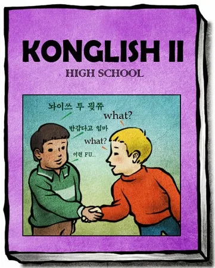
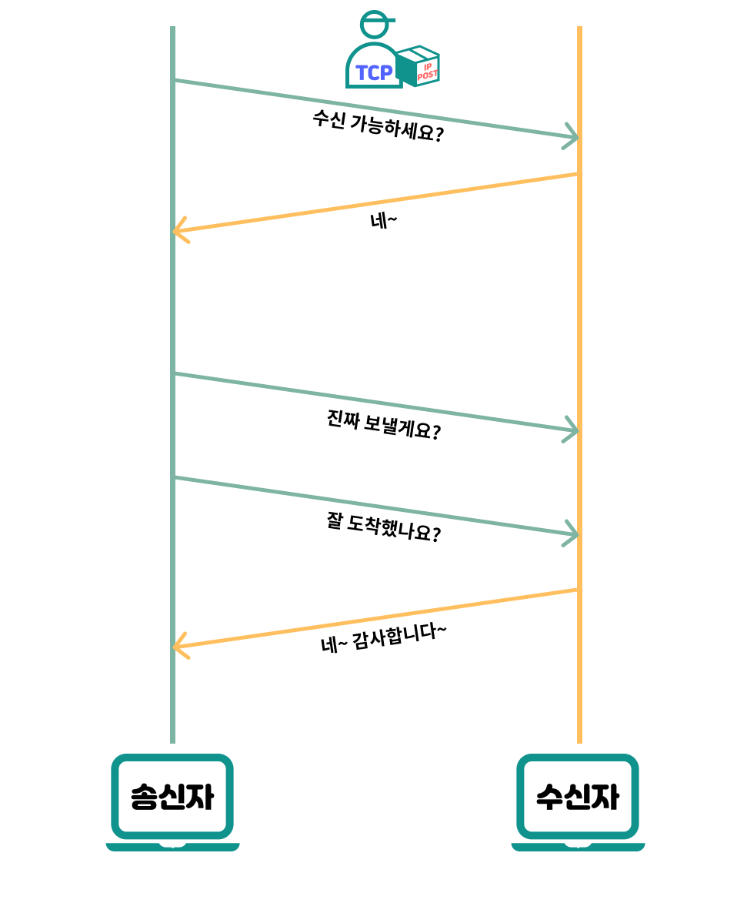
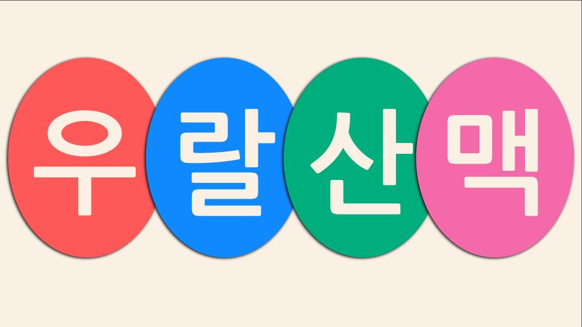
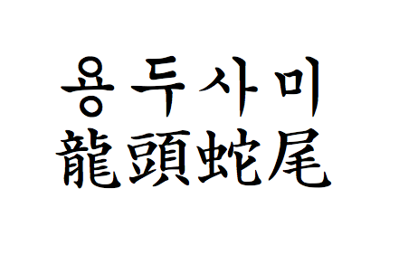

# 컴퓨터의 대화를 이해해보자: TCP Socket


저번 주제에서는 우리가 가장 잘 아는 영역인 HTTP에 대해서 알아보았습니다.

이 통신 업계는 HTTP와 TCP 통신이 양대 산맥으로 존재하고 있는데

HTTP를 했으면 TCP 통신에 대해서도 한 번 알아봐야겠죠?

TCP가 더 서운해하기 전에, 한 번 시작해보겠습니다.

## 그 전에, TCP 라고 하는게 맞을까?
저도 여태 이렇게 불러왔고, 

통상적으로 사용되고 있으므로 사실 이렇게 불러도 모두가 이해하긴 합니다.

하지만, 정확한 단어는 아닙니다.

간단한 예시를 통해 알아보도록 하겠습니다.


```
배가 고픈 상민이는 오늘도 어김없이 맥도날드에 찾아가
"빅맥 세트 하나 주세요"라고 점원에게 요청합니다.
점원도 한국인이니 제 말을 인식하고 "ㅇㅋㅇㅋ"와 함께 햄버거를 줍니다.
이후, 영어를 사용하는 외국인이 찾아와 영어로 주문하지만
아쉽게도 토종 한국인인 점원은 알아듣지 못하고 
알아들을 수 있는 똑똑한 점원을 불러옵니다.
```
이제, 컴퓨터의 세계로 번역해보도록 하겠습니다. 

애국심 불타오르게 한국어를 "HTTP"라고 비유한다면

사람끼리 내는 소리 자체를 "TCP"라고 칭할 수 있습니다.

HTTP 또한, TCP를 이용해 통신을 하므로

TCP 통신이라고 하면 "소리 통신"이라고 하는 것과 비슷합니다.

TCP는 전송 계층의 프로토콜로,

데이터를 전송하기 위한 기본 연결 방식을 제공할 뿐,

데이터가 어떻게 구성되었고 어떤 의미를 가지는지에 대한 정의는 없습니다.

TCP 그 자체는 연결 지향적인 바이너리 데이터의 스트림을 제공할 뿐이기 때문입니다.

정확한 용어는 "TCP Socket 통신", "TCP 스트림 통신", "소켓 프로그래밍", "TCP 기반 프로토콜 통신" 등이 있는데

이번 글에서는 가장 널리 알려져있는 "TCP Socket 통신"으로 칭하도록 하겠습니다.



## 부제 : TCP

TCP는 데이터를 보낼 때 상대가 확실히 받았는지 확인하는 기능을 포함하고 있습니다.

이로 인해, 신뢰성과 안정성이 높은 수준으로 평가되고 있습니다.

주요 특징을 간단히 정리하면
- 연결 지향: 데이터를 보내기 전에 먼저 연결을 수립해야 합니다. 
- 신뢰성 보장: 보낸 데이터가 손실되지 않도록 보장하고, 손실되면 자동으로 재전송합니다. 
- 순서 보장: 보낸 순서대로 데이터를 받을 수 있도록 보장합니다. 
- 흐름 제어: 너무 많은 데이터를 한 번에 보내지 않도록 조절합니다.

쉽게 생각하면, 전화 통화와 비슷합니다.
```
전화를 걸고, 상대방이 전화를 받으면 통화가 시작됩니다.
통화가 유지되는동안 서로 원하는 만큼의 대화를 주고 받습니다.
대화가 끝나면 "이제 끊을게" 하고 상대방도 동의를 한 후 끊습니다.
```
이제, TCP 버전으로 번역한다면

3-Way Handshaking을 통해 연결을 수립하고

터널링된 연결 안에서 자유롭게 통신한 후

4-Way Handshaking을 통해 연결을 종료합니다.

이번 게시글에서 TCP에 대한 모든 이야기를 할 순 없으니

TCP에 대한 이야기는 다른 게시글에서 볼 수 있도록 하겠습니다.


# TCP Socket 통신이란?
위의 사례에서는, 외국인이 사용하는 "영어"와 같이

client와 server간 통신하는 하나의 수단입니다.

```
1110110010110001100011011110110010111101100000000100000011101100101101001010110011101101100010101011100001000000111011011001010110011000111010111000001010011000100000011101100101101110100100111011001011010010101100111011001000010010011100
```
"빅맥 세트 하나 주세요"를 변환했습니다.

TCP 통신은 이와 같은 바이너리 데이터를 주고 받으며

위와 같은 이진수 형태의 데이터가 도착하게 됩니다.

난 분명 빅맥 세트 하나 달라고 했는데, 저걸 상대 컴퓨터는 어떻게 인식했을까요?

## 인코딩과 디코딩
인코딩과 디코딩은 TCP 소켓 통신에서 

바이너리 데이터를 우리가 이해할 수 있는 형태로 변환하는 

핵심적인 과정입니다.

위의 바이너리 문자열은

"빅맥 세트 하나 주세요"를 UTF-8 형식으로 Decode한 예시입니다.

| 문자 | UTF-8 (16진수) | 이진수 (Binary)                    |
|------|----------------|------------------------------------|
| 빅   | EB B9 85       | 11101011 10111001 10000101         |
| 맥   | EB A7 A5       | 11101011 10100111 10100101         |
| (공백) | 20             | 00100000                           |
| 세   | EC 84 B8       | 11101100 10000100 10111000         |
| 트   | ED 8A B8       | 11101101 10001010 10111000         |
| (공백) | 20             | 00100000                           |
| 하   | ED 95 98       | 11101101 10010101 10011000         |
| 나   | EB 82 98       | 11101011 10000010 10011000         |
| (공백) | 20             | 00100000                           |
| 주   | EC A3 BC       | 11101100 10100011 10111100         |
| 세   | EC 84 B8       | 11101100 10000100 10111000         |
| 요   | EC 9A 94       | 11101100 10011010 10010100         |
이런 식으로요.

인코딩과 디코딩은 이와 같이, 이진수로 구성된 어마어마한 양의 문자열을

상호 간 약속된 방법으로 쪼개고 변환하여 

끝으로는 인간이나 컴퓨터가 볼 수 있는 형태로 변환하는 행위라고 칭합니다.

## 상호 간 약속된 방법?
저 많은 0과 1을 해석하는 방법을 칭합니다.

UTF-8의 경우, 주어진 2진수를 8개 단위로 쪼개어 분석하고, 

몇 가지의 기준에 맞게 나누어 변환합니다.

이 외에도, EUC-KR(MS949), UTF-16, ASCII 등 많은 인코딩 방식이 있어서,

서로 같은 인코딩 방식으로 통신하면, 누가 바꾸지 않는 이상 

보냈을 때와 동일한 문자열을 볼 수 있게 됩니다.

### 서로 다른 인코딩 타입을 사용하면 어떻게 될까?
해볼까요.

"빅맥 세트 하나 주세요" 를 다른 인코딩 방식으로 한 번 해보겠습니다.

우선, UTF-8로 인코딩 된 값은
```
1110110010110001100011011110110010111101100000000100000011101100101101001010110011101101100010101011100001000000111011011001010110011000111010111000001010011000100000011101100101101110100100111011001011010010101100111011001000010010011100
```
이렇게 준비되어 있습니다.

흔히 아는, EUC-KR로 강제로 바꿔보겠습니다.
```
梨�肄�@珥ы��@��������n�꾀남
```
일단, 제 빅맥 세트는 글렀다고 봅니다.

이처럼, 서로 약속해놓고 이상한 방식으로 바꿔서 해석하려 하면, 많은 문제가 발생합니다.

저한테 불어로 대화를 시도하는 것 처럼요.



### 누가 바꾸지 않는 이상?
나와 상대방이 한국인이라, 한국어로 계좌번호와 그 비밀번호에 대해 이야기하면,

아마 중간에 껴있는 한국인들은 모두 제 계좌 잔고를 볼 수 있을 것입니다.

또한, 말하는 중간에 껴서 이구동성 게임을 하게 되면

상대방은 '내가 들은게 맞나..' 하면서 의구심을 가지게 될 것 같습니다.

이를 방지하기 위해서는 
- 비밀 이야기를 할 수 있도록 터널을 만들던가
- 한국인도 알아들을 수 없는 언어로 이야기하던가
- 한국어긴 한데 계좌번호를 암호화해서 말하던가
- 계좌번호를 쪽지에 적어서 보내던가

등등, 다른 방법으로 이야기해야할 것 같습니다.

전문용어로 암호화 통신이라고 하는데요,

이 또한 이야기하기 시작하면 끝도 없으니, 

다른 게시글에서 만날 수 있도록 하겠습니다.



# 이게 끝이야?
네, 끝입니다.

통신하는 방법 자체는 진짜 이게 끝입니다. 뭔가 김이 팍 샌 느낌인데요.

이 통신방법으로, 상대는 나에게 "빅맥 세트 하나 주세요" 라는 메시지를 성공적으로 보냈습니다.

이에 대한 응답으로 ""(무시), "ㅇㅋㅇㅋ", "For here or to go?" 등, 상대방의 답변 또한

위와 같은 과정으로 나가게 됩니다. 여기서부턴 상호 간 약속으로 이루어집니다.

사실, 암호화 통신이나 인코딩, TCP 계층에 대해 더 남겨야하나 도 고민했지만

주제와는 살짝 벗어나는 내용이 즐비하게 될 것 같고,

BSD 소켓부터 WebSocket 같은 역사 쪽은 또 여기 범위는 아닌 것 같고

해서.. 짧은 글이 된 것 같습니다.

다음 게시글이 뭐가 될지는 잘 모르겠는데, 아마 WebSocket이나 gRPC쪽을 하게 될 것 같습니다.

내가 공부하고싶진 않은데, 궁금은 한 영역이 있다면 언제든 알려주세요.

"대신 공부해드립니다."