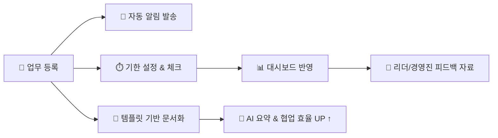

안녕하세요, PG개발팀의 이원석입니다. 
오늘 들고 온 것은 jvm의 option인데요, 현재 D1 프로젝트에서 사용되는 jvm option이 무엇인지, 어떤 역할을
하고 있는지 얘기해보려고 합니다. jvm option을 알아두면 메모리 사용, 로깅 방식, 성능 튜닝등 시스템의 운영
에 많은 도움을 받을 수 있을 것입니다.

---
## 1. JVM option은 무엇일까?

java 어플리케이션의 실행, 성능 조정을 위해 사용되는 매개변수들입니다.
여러 옵션들이 존재하고, 성능 튜닝, 메모리 및 시스템 안정성 확보, 디버깅등을 가능하게 합니다.

---
### 💬 그동안 우리는 어떻게 일해왔을까?

> - 업무 요청은 메일, 메신저, 혹은 구두로 흘러갔습니다.
> - 히스토리는 문서가 아니라 ‘기억’에 저장됐습니다.
> - "이거 어디서 확인해요?"라고 묻기 전까진 그 정보가 어디 있는지 몰랐습니다.

문제를 파악하려면 삼만리를 떠나,
사람들에게 직접 하나하나 물어봐야 했습니다.
하지만 I성향이 많은 우리 구성원들에겐 그마저도 쉬운 일이 아니었죠.

설령 물어봤다 해도, 누군가 알고 있는 건 전체의 '일부분'에 불과했고
업무의 ‘전체 그림’을 파악하는 건 늘 어려운 일이었습니다.

---
### 💡 우리는 질문을 바꿔야 했습니다.

> *“이 일을 누가, 언제, 왜, 어떻게 처리했지?”*
> *“시스템 안에서 바로 알 수 있으면 좋지 않을까?”*

문제는 시스템의 부재였고,
정확히 말하면 흐름을 기록하고 연결해주는 도구의 부재였습니다.

그래서 우리는 ‘일의 흐름 자체를 바꾸는 구조’를 도입하기로 한거죠.

---
## 2. JIRA & Confluence, 왜 좋을까?

> “JIRA 및 Confluence를 활용한 협업 경험이 있으신 분”

많은 IT 기업들이 채용 공고에 적어 놓고는 합니다.
이제는 일하는 방식의 ‘기본값’이 되어가고 있는 도구입니다.  
도대체 이 도구가 뭐길래 그렇게 좋다고 하는 걸까요?

---
### 🔧 도구가 어떻게 협업을 바꿔내는가?

도구 하나가 협업을 바꾼다고 하면 좀 거창하게 들릴 수도 있습니다.  
하지만 시작은 의외로 단순합니다.

업무를 "이슈"로 등록하세요!

> 🎯 **일 하나만 등록하면**
> 	1. 알림은 자동,
> 	2. 문서는 정리되고,
> 	3. 기한은 체크되고,
> 	4. 성과는 눈에 보이고,
> 	5. 보고는 필요 없고,

이 모든 과정이 물 흐르듯 이어집니다.
 
---
### 🤖 협업도구 + 자동화 + 알람 + AI = ?

조직의 협업 구조는 '일을 굴러가게 만드는 엔진'과도 같습니다.  
엔진이 좋아야 빠르게, 안정적으로 달릴 수 있겠죠.

JIRA & Confluence를 활용하면, 하나의 플랫폼으로 업무가 모이게 만들 수 있습니다.
그러고 나면 이 모든 것들이 가능해집니다.

> *“업무 요청이 발생하면 누락 없이 모바일로 알림 전송”*  
> *“이슈가 3일 이상 ‘요청됨’에 머물면 자동으로 리마인드”*  
> *“특정 키워드 포함 이슈는 자동으로 템플릿 문서 생성”*  
> *“부서별 업무 마일스톤 진행률 시각화”*  
> *“다날 가이드 문서 기반 AI 챗봇 운영”*

정보가 쌓이고 흐르고 활용되는 순환 구조는,
플랫폼을 하나로 정리하는 것에서부터 시작됩니다.

---
## 3. 일단 활용해보기

우리는 종종, 새로운 도구를 보면 어렵게 느낍니다.  
복잡해 보이고, 전문가만 쓰는 것 같고요.

그런데 막상 써보면
의외로 어디든 잘 어울리는 도구라는 걸 알게 됩니다.
예를 들면… 집안일에도요.

> 🧹 “청소기 돌리기”  
> 🛒 “장보기 (우유, 달걀, 생수)”  
> 🧾 “공과금 납부 리마인드”

이런 일들을 JIRA에 이슈로 적어두면 하나씩 처리할 때마다 ✅ 체크할 수 있고,
기한 지나면 자동 알림도 오고, 누가 했는지도 기록에 남습니다.

Confluence에는 “우리집 생필품 리스트”나 “가족여행 준비 체크리스트”
같은 걸 만들어두면 다음번엔 그냥 꺼내 쓰기만 하면 되죠.

---
### 📚 실무 사례는 어떤 것들이 있을까?

아주 가벼운 예시로 시작했지만,
JIRA와 Confluence는 국내외 IT 기업들도 실무에 깊이 녹여 쓰고 있는 협업 플랫폼입니다.

우리가 겪었던 고민들을, 이미 많은 기업이 같은 방식으로 해결해 나가고 있어요.
일 잘하기로 알려진 기업들도 아래와 같이 활발하게 쓰고 있죠.

| 기업     | 어떻게 사용하고 있을까요?        | 참고 링크                                                                                                       |
| ------ | --------------------- | ----------------------------------------------------------------------------------------------------------- |
| 카카오    | 카카오 JIRA 활용 일하는 방식 소개 | [카카오 테크블로그](https://tech.kakao.com/posts/446)                                                               |
| 라인     | 라인 장애 보고 시 JIRA 활용    | [LINE 테크블로그](https://engineering.linecorp.com/ko/blog/line-failure-reporting-and-follow-up-process-culture) |
| 우아한형제들 | 우아한형제들 JIRA 도입기       | [우아한 기술블로그](https://techblog.woowahan.com/2501/?utm_source=chatgpt.com)                                     |
| 토스     | JIRA 티켓 자동화 언급        | [토스 엔지니어링 블로그](https://toss.tech/article/spark-analyzer)                                                    |
일이든 집안일이든, 결국 중요한 건  
누락 없이, 흘러가도록, 스트레스 덜 받게 해내는 거잖아요?  
어렵게 생각이 들 때는 가볍게 써보는 것부터 시작해보세요.

생각보다 훨씬, 잘 맞을지도 모릅니다.

---
### 🕒 지금 시작해도 늦지 않습니다

> *"어떻게 시작해야 할까요?"*
> *"처음이라 잘 몰라서…"*

그게 너무 당연한 출발입니다.

어렵게 생각하지 않아도 괜찮아요.  
작은 것부터 하나씩 해보면, 금방 익숙해지고 흐름 위에 올라타 있을거에요.

- ✅ 회의 끝나고 회의록을 Confluence에 한줄 남겨보기
- ✅ 이번 주 업무 중 하나를 JIRA에 이슈로 등록해보기
- ✅ 알림 하나 자동으로 오게 설정해보기 (Jira Automation)
- ✅ 내가 맡은 일만 보여주는 대시보드 만들어보기

너무 완벽하려고 하지 마세요.  
처음은, 그냥 한번 써보는 데서 시작해도 충분합니다.

---
## 4. 마무리 : 기록은 자산이 된다

일은 매일 쏟아지고, 그때그때 해결은 되지만,
조금만 지나면 누가 뭘 했는지, 왜 그렇게 했는지 흐릿해집니다.

문서는 여기저기 흩어지고,
비슷한 자료를 다시 만드는 일도 생깁니다.
그래서 이제는 기억이 아니라, 기록이 필요하다고 느낍니다.

JIRA와 Confluence는
그 기록이 자연스럽게 쌓이게 해주는 도구입니다.
조금씩 쓰다 보면 일이 흐르고 있다는 걸,
흐름이 남고 있다는 걸 알게 될 거에요.

ref.
https://velog.io/@mirrorkyh/JVM%EC%9D%98-%EC%98%B5%EC%85%98